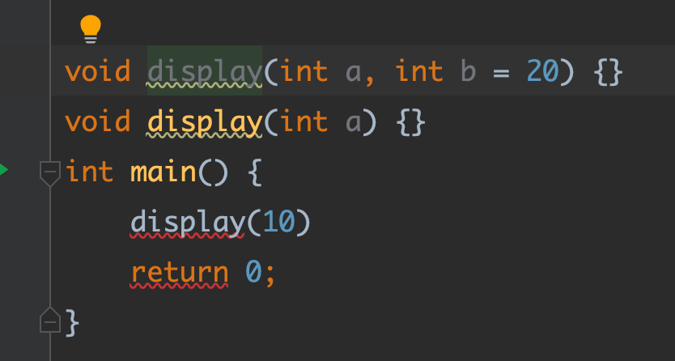

**① 基础语法第一天**

> C++完全兼容C语言的语法，很久以前，C++叫做 C with classes

- <font color=#F00>函数重载(Overload)</font>

  <font color=#FF00FF>函数的名称相同，但参数个数、类型或顺序不同。</font>
  
  ```c++
  int sum(int v1, int v2) {
      return v1 + v2;
  }
  int sum(int v1, int v2, int v3) {
      return v1 + v2 + v3;
  }
  int sum(int v1, double v2) {
      return v1 + v2;
  }
  int sum(double v1, int v2) {
      return v1 + v2;
  }
  ```
  
  注意:
  
  (1)返回值类型和函数重载无关
  
  ```c++
  // 报错，产生二义性
  int func() {} 
  double func() {}
  ```
  
  (2)函数调用时，实参的隐式类型转换可能产生二义性
  
  ```c++
  void display(long a) {}
  void display(double a) {}
  int main() {
      // 10能被隐式转换为long 或者 double类型
      display(10);
      return 0;
  }
  ```
  
  函数重载的本质
  
  > C++采用了name mangling或者叫name decoration技术
  >
  > C++编译器默认会对符号名(比如函数名)进行改编、修饰
  >
  > 重载时会生成多个不同的函数名，不同编译器(MSVC、g++)有不同的生成规则

- <font color=#F00>默认参数</font>

  C++运行函数设置默认参数，在调用时可以根据情况省略。规则如下:

  > 1.默认参数只能按照从右到左的顺序
  >
  > 2.如果函数同时有声明、实现，默认参数只能放在函数声明中
  >
  > 3.默认参数的值可以是常量、全局符号(全局变量、函数名)

  ```c++
  int sum(int v1 = 5, int v2 = 6) {
      return v1 + v2;
  }
  int add(int v1 = 10, int v2 = 20);
  int main() {
  
      cout << sum() << endl;
      cout << sum(10) << endl;
      cout << sum(10, 20) << endl;
      return 0;
  }
  int add(int v1, int v2) {
      return v1 + v2;
  }
  
  // 默认值是函数指针
  void test(int a) {
      cout << "a = "<< a << endl;
  }
  int func(int v1, void(*p)(int) = test) {
       p(10);
      return v1;
  }
  ```

  函数重载、默认参数可能会产生冲突、二义性(建议优先使用默认参数)
  
  
  
  

