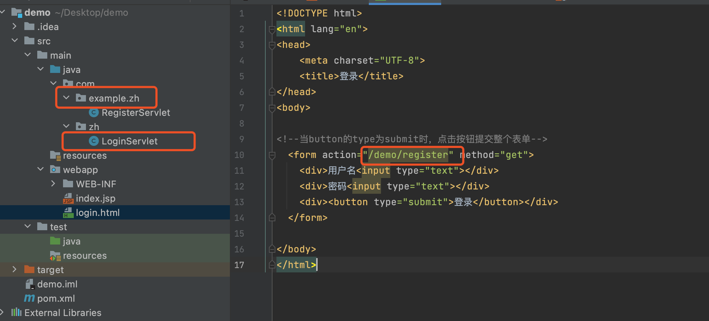
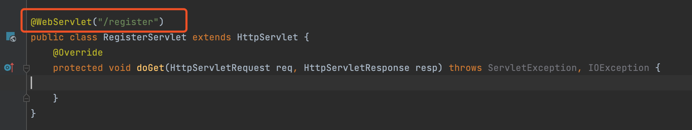

# 小码哥后台学习笔记

- 第一天

  form表单

  ```html
  <!--当button的type为submit时，点击按钮提交整个表单--> 
  <form action="">
      <div>用户名<input type="text"></div>
      <div>密码<input type="text"></div>
      <di><button type="submit">登录</button></di>
    </form>
  ```

  form表单提交的路径问题

  如下图所示: 

  

​       

不管`Servlet`嵌套在哪个文件夹下，form表单的action路径都是一样的。都是`/项目名称/注解的名称`，不过要注意给Servlet添加注解时注解的每次问题。

登录的表单

```html
<!--当button的type为submit时，点击按钮提交整个表单-->
  <form action="/demo/login" method="post">
    <div>用户名<input type="text" name="username"></div>
    <div>密码<input type="text" name="password"></div>
    <div><button type="submit">登录</button></div>
  </form>
```

`LoginServlet`

```java
@WebServlet("/login")
public class LoginServlet extends HttpServlet {

    @Override
    protected void doGet(HttpServletRequest request, HttpServletResponse response) throws ServletException, IOException {

        // 1.获取到客服端发送而来的数据
        String username = request.getParameter("username");
        String password = request.getParameter("password");

        // System.out.println(username +"====" +  password);
        // 2.判断用户名、密码是否正确
        // 设置响应内容的编码格式
        response.setContentType("text/plain;charset=UTF-8");
        PrintWriter out = response.getWriter();
        if ("123".equals(username) && "456".equals(password)) {
            out.write("登录成功");
        } else {
            out.write("登录失败");
        }
    }

    @Override
    protected void doPost(HttpServletRequest request, HttpServletResponse response) throws ServletException, IOException {

        // 0.设置解析数据的编码格式
        request.setCharacterEncoding("UTF-8");
        // 1.获取到客服端发送而来的数据
        String username = request.getParameter("username");
        String password = request.getParameter("password");

        // System.out.println(username +"====" +  password);
        // 2.判断用户名、密码是否正确
        // 设置响应内容的编码格式
        response.setContentType("text/plain;charset=UTF-8");
        PrintWriter out = response.getWriter();
        if ("123".equals(username) && "456".equals(password)) {
            out.write("登录成功");
        } else {
            out.write("登录失败");
        }
    }
}
```

