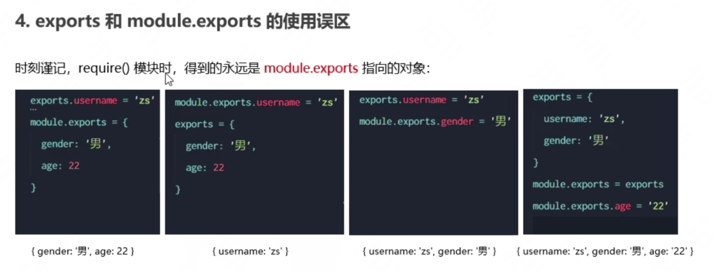

**①fs文件系统模块**

> fs模块是Node.js官方提供的用于操作文件的模块。
>
> fs.readFile()方法 => 读取指定文件的内容
>
> fs.writeFile()方法 => 用于给指定文件写入内容

读取

```javascript
// 安装了Node
const fs = require("fs");
fs.readFile("./1.txt", "utf8", (err, dataStr) => {
  console.log(err);// err为null 表示读取文件内容成功，否则表示读取失败
  console.log(dataStr);
});
```

写入

> fs.writeFile(filePath, data[,  options],  callback)

```javascript
const fs = require("fs");
// 这种方式会把文件以前的内容清空
// 没有文件会自动创建
fs.writeFile("./1.txt", "我是被写入的内容", "utf8", (error) => {
  if (error) {
    return console.log("文件写入失败" + error.message);
  }
  console.log("文件写入成功");
});
```

**②创建基本的Web服务器**

```javascript
// 1.导入http模块
const http = require("http");
// 2.创建server实例
const server = http.createServer();
// 3.为服务器绑定request事件，监听客户端的请求
server.on("request", (req, res) => {
  // req: 请求对象，包含了与客户端相关的数据和属性，例如
  // req.url: URL地址
  // req.method: 请求类型
  console.log("Someone visit out web server");
  // 设置编码格式，否则乱码
  res.setHeader("Content-Type", "text/html;charset=utf-8");
  // 数据响应给客户端，并结束当前请求
  res.end("我是响应数据");
});
// 4.启动服务器
server.listen(8080, () => {
  console.log("server running at http://127.0.0.1:8080");
});
```

**③Module.exports对象**

每个js文件都有一个`module`属性，且每个js文件之间默认是屏蔽的。可以使用`module`属性对外暴露一些属性


```javascript
// moduleA.js中
// 在一个自定义模块中，默认情况下，module.exports = {}
// 私有常量
const age = 20;
// 向module.exports对象上挂载 username属性
module.exports.username = "张三";
// 向module.exports对象上挂载 函数
module.exports.salHello = function () {
  console.log("Hello");
};

module.exports.age = age;
```


注意点: 使用require()方法导入模块时，导入的结果永远以`module.exports`指向的结果为准(开始module.exports指向一个对象，后来又指向另一个对象，以后来的对象为准)

**④exports对象**

> 由于`module.exports`单词写起来比较麻烦，Node提供了`exports`对象。默认情况下，`module.exports`和`exports`指向同一个对象。

```javascript
console.log(module.exports);
console.log(exports);
console.log(module.exports === exports); // true
```

两者使用误区



分析：

> exports和module.exports最开始指向的是同一个对象:
>
> 第一个案例中，给exports指向的对象挂载了一个username属性，module.exports对象则是指向了另外一个对象。
>
> 第二个案例中，给module.exports指向的对象挂载了一个username属性，exports则是指向了其他对象
>
> 第三个案例中，module.exports和exports指向的对象都没发生改变，只是分别挂载了username和gender属性而已
>
> 第四个案例同理

**⑤CommonJS模块化规范**

> CommonJS规定
>
> ①每个模块内部，module变量代表当前模块
>
> ②module变量是一个对象，它的exports属性(即module.exports)是对外的接口
>
> ③加载某个模块，其实是加载该模块的module.exports属性，require()方法用于加载模块


**npm**

npm: Node Package Manager(包管理工具)  [npm官网](https://www.npmjs.com/)

```shell
# npm安装包命令
npm install 包的完整名称
# 简写命令
npm i 包的完整名称
```

<font color=#F00>P28 ~ P37 讲解的是npm关于包的概念，记个To do</font>

#### express

> Express: 一个三方包，提供了快速创建Web服务器的便捷方法
>
> NodeJS内置的http模块也能创建Web服务器，但是http模块用起来复杂，开发效率低；Express是基于内置的http模块的进一步封装

**①安装和使用**

```shell
npm install express@version
```

基本使用

```javascript
// 1. 导入express模块
const express = require("express");

// 2. 创建 Web 服务器
const app = express();

// 3. 监听客户端发来的 GET 和 POST 请求，并向客服端响应具体的内容
// 使用PostMan 发送请求: http://127.0.0.1/user
app.get("/user", (req, res) => {
  res.send({ name: "黄先生", gender: "man" });
});
app.post("/user", (req, res) => {
  res.send("请求成功");
});
// 4. 启动Web服务器并监听端口
app.listen(80, () => {
  // 服务器启动成功会来到这里
  console.log("服务器启动成功了");
});
```

获取URL中携带的参数

> 通过req.query对象，可以访问到客户端通过查询字符串的形式，发送到服务器的参数

```java
app.get("/user", (req, res) => {
  // req.query 默认是一个空对象
  // 客户端使用在URL后面拼接: ?name=黄先生&age=30 这种查询字符串的形式，发送到服务器的参数
  // 可以通过 req.query 对象访问到，譬如: req.query.name,req.query.age
  console.log(req.query.name, req.query.age);
  res.send("接收到了");
});
```

获取URL中的动态参数

> 通过req.params对象，可以访问到URL中 ，通过`:`匹配到的<font color=#F00>动态参数</font>

```javascript
// Postman 发送的请求: http://127.0.0.1/user/一个变量，譬如: 10
app.get("/user/:id", (req, res) => { 
  // req.params 默认是一个空对象
  // 里面存放这通过 : 动态匹配到的参数值
  console.log(req.params); // { id: '10' }
  res.send("接收到了");
});
```

备注: 

>   1.上诉代码中的`id`只是一个别名而已，任意都行
>
> 2. 可以有多个动态参数: /user/:ids/:username (http://127.0.0.1/user/10/黄先生  => { ids: '10', username: '黄先生' })

**②托管静态资源**

> express提供了一个非常好用的函数，叫<font color=#F00>express.static()</font>，通过它，我们可以非常方便的创建一个静态资源服务器。

譬如: 通过如下代码就可以将public目录下的图片、CSS文件、JavaScript文件对外开放访问了:

```javascript
app.use(express.static('public')) // 指定public文件夹为静态资源文件夹
```

现在，就可以访问public目录中的所有文件了

>http://localhost:3000/images/bg.jpg
>
>http://localhost:3000/css/style.css
>
>http://localhost:3000/js/login.js

注意: Express在指定的静态目录中查找文件， 并对外提供资源的访问路径。因此，<font color=#F00>存放静态文件的目录名不会出现在URL中。</font>

在js文件同级目录下新建一个`images`文件夹，拖入一张图片。


```javascript
const express = require("express");
const app = express();

// 对外提供静态资源
app.use(express.static("./images"));

// 默认是80端口
app.listen(80, () => {
  console.log("服务器启动成功了");
});
```

可以通过路径访问到`images`文件夹下的资源(默认是80端口，可以不写): http://127.0.0.1/Radio.png  

<font color=#F00>注意: 访问路径中不会包含文件夹的名称(这里指`images`)</font>

如果想托管多个静态资源目录，多次调用express.static()函数

```javascript
app.use(express.static('public'))
app.use(express.static('file'))
```

*挂载路径前缀*

> 如果希望在托管的静态资源访问路径之前挂载前缀，则可以使用如下的方式
>
> ```javascript
> // 第一个是文件夹的路径
> // 不需要移动images文件夹的位置，只是修改的访问路径，访问路径: http://127.0.0.1/src/Radio.png
> app.use("/src", express.static("./images"));
> ```

**③使用nodemon**

> 在编写调试Node.js项目时，如果修改了项目的代码，则需要频繁的手动close掉，然后再重新启动，非常繁琐。
>
> 可以使用nodemon这个工具，监听项目文件的变动，当代码被修改后，nodemon会自动重启项目，便于开发和调试。

在Terminal中，运行下列命令，即可将nodemon安装为全局可用的工具

```shell
npm install -g nodemon
```

使用: <font color=#F00>运行项目时将node 命令替换为nodemon命令即可</font>

#### Express路由

> Express中的路由是由3部分组成，分别是<font color=#F00>请求的类型、请求的URL地址、处理函数</font>，格式如下
>
> ```javascript
> app.METHOD(PATH, HANDLER)
> ```
>
> 路由的匹配注意点
>
> - 按照先后顺序进行匹配
> - 请求类型和请求的URL同时匹配成功，才会调用对应的处理函数

在Express中使用路由最简单的方式就是把路由挂载到app上(很少使用)，示例代码如下:

```javascript
app.get("/", (res) => {
  res.send({"hello world"});
});
```

**①模块化路由**

步骤如下:

> 1. 创建路由模块对应的.js文件
>
> 2. 调用<font color=#F00>express.Router()</font>函数创建路由对象
> 3. 向路由对象上挂载具体的路由
> 4. 使用<font color=#F00>module.exports</font>向外共享路由对象
> 5. 使用<font color=#F00>app.use()</font>函数注册路由模块

Router.js文件中

```javascript
const express = require("express");

// 1.创建router对象
const router = express.Router();

// 2.挂载具体的路由
router.get("/user/list", (req, res) => {
  res.send([{ name: "黄先生" }, { name: "张先生" }]);
});

router.post("/user/add", (req, res) => {
  res.send("调用了add接口");
});

// 3. 向外导出
module.exports = router;
```

测试文件中

```javascript
const express = require("express");
const userRouter = require("./03_Router"); // 就是Router.js文件
const app = express();

app.use(userRouter); // app.use()函数的作用，就是用来注册全局中间件

app.listen(80, () => {
  console.log("服务器启动成功");
});
```

为路由模块添加统一的前缀

```javascript
app.use('/api', userRouter);
```

访问地址变为： http://127.0.0.1/user/list =>  http://127.0.0.1/api/user/list

#### Express中间件

> 中间件(Middleware)，特指业务流程的中间处理环节。
>
> Express的中间件，本质上就是一个function处理函数，Express中间件的格式如下
>
> 
>
> <font color=#F00>中间件函数的形参列表中，必须包含next参数。而路由处理函数只包含req和res。</font>

**next函数的作用**

> next函数是实现多个中间件连续调用的关键，它表示把流转关系转交给下一个中间件或路由

**①全局生效的中间件**

定义中间件函数。

可以通过如下方式，定义一个最简单的中间件函数:

```javascript
const mw = (req, res, next) => {
    console.log("这是一个中间件函数");
    // 注意: 在当前中间件的业务处理完毕后，必须调用 next() 函数
    // 表示把流转关系转交给下一个中间件或路由
    next();
}
```

```javascript
const express = require("express");
const app = express();

const mw = (req, res, next) => {
  console.log("这是一个中间件函数");
  // 注意: 在当前中间件的业务处理完毕后，必须调用 next() 函数
  // 表示把流转关系转交给下一个中间件或路由
  next();
};

// 将mw注册为全局生效的中间件 => 提前拦截的作用(挂载路由之前)
//app.use(mw);
// 可以像下面这样
app.use((req, res, next) => {
    next();
})

app.get("/user/list", (req, res) => {
  res.send("list");
});

app.get("/user/add", (req, res) => {
  res.send("add");
});

app.listen(80, () => {
  console.log("服务器启动成功");
});
```

中间件的作用

> 多个中间件之间，共享同一份req和res。基于这样的特性，我们可以在上游的中间件中，统一为req或res对象添加自定义的属性或者方法，供下游的中间件或路由使用。

**②局部生效的中间件**

> 不使用app.use()定义的中间件，就叫局部生效的中间件。示例代码如下
>
> ```javascript
> const mw = (req, res, next) => {
>   console.log("这是一个中间件函数");
>   // 注意: 在当前中间件的业务处理完毕后，必须调用 next() 函数
>   // 表示把流转关系转交给下一个中间件或路由
>   next();
> };
> 
> // 局部生效的中间件
> app.get("/user/list", mw, (req, res) => {
>   res.send("list");
> });
> ```

#### Express编写接口

**①编写GET请求**

```javascript
// 路由
const express = require("express");
const router = express.Router();

router.get("/get", (req, res) => {
  const query = req.query;
  res.send({
    status: 0,
    msg: "请求成功",
    data: query,
  });
});

module.exports = router;

// 业务
const express = require("express");
const app = express();

const router = require("./apiRouter");

// 添加前缀
app.use("/api", router);

app.listen(80, (req, res) => {
  console.log("服务器启动了");
});
```

可以通过Postman发送请求即可: http://127.0.0.1/api/get?username=黄先生

**②编写POST请求**

```javascript
// 路由
router.post("/post", (req, res) => {
  const body = req.body;
  res.send({
    status: 0,
    msg: "请求成功",
    data: body,
  });
});

// POST 请求需要配置解析表
// 业务
const express = require("express");
const app = express();

const router = require("./apiRouter");

// 配置解析表单数据的中间件
app.use(express.urlencoded({ extended: false }));

// 添加前缀
app.use("/api", router);

app.listen(80, (req, res) => {
  console.log("服务器启动了");
});
```

在用Postman发送请求时，参数需要配置在body中，并选择响应的编码格式


*enterprise*: 企业

