#### View组件

React Native中的组件View,等同于iOS中的UIView，Android中的andriod.view，网页中的div标签，是所有组件的父组件

常见属性:

> Flexbox:弹性布局
>
> Transforms:动画属性
>
> backfaceVisibility:定义界面翻转的时候是否可见

#### Flexbox布局(弹性布局)

**flexDirection**

该属性决定了主轴的方向:

<font color=#F00>row</font>:主轴为水平方向，起点在左端

<font color=#F00>row-reverse</font>:主轴为水平方向，起点在右端

<font color=#F00>column(默认值)</font>:主轴为垂直方向，起点在上沿

<font color=#F00>column-reverse</font>:主轴为垂直方向，起点在下沿

```jsx
  container:{
    padding:50,
    backgroundColor:'#FF0000',
    height:300,
    // 垂直排列
    flexDirection:'column'// flexDirection:'row' 水平排列
  },
```

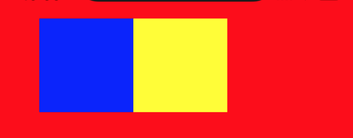

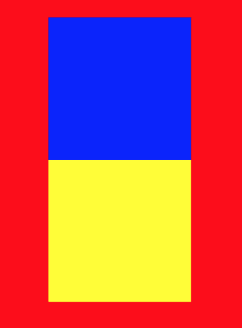


**justifyContent**

该属性定义了伸缩Item在主轴的对齐方式

<font color=#F00>flex-start</font>:默认方式，伸缩Item向一行的起始位置对齐

<font color=#F00>flex-end</font>:伸缩Item向一行的结束位置对齐

<font color=#F00>center</font>:伸缩Item向一行的中间位置对齐

<font color=#F00>space-between</font>:Item两端对齐，其余的Item之间的间隔相等

<font color=#F00>space-around</font>:Item会平均地分布，两端保留一般的空间

```jsx

  container:{
    marginTop:25,
    paddingTop:100,
    backgroundColor:'#FF0000',
    height:300,
    flexDirection:'row',
    justifyContent:'xxx'
  },

1.justifyContent:'flex-start'
2.justifyContent:'flex-end'
3.justifyContent:'center'
4.justifyContent:'space-between'
5.justifyContent:'space-around'

```


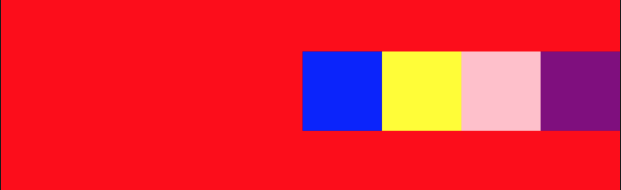


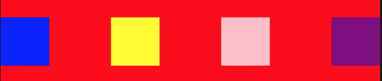

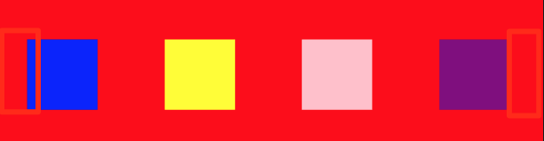

在space-around中，两端Item距离边的间距是Item与Item之间间距的一半。

**alignItems**

定义Item在交叉轴上如何对齐。

<font color=#32CD32>flex-start</font>:交叉轴的起点对齐

<font color=#32CD32>flex-end</font>:交叉轴的终点对齐

<font color=#32CD32>center</font>:交叉轴的中点对齐

<font color=#32CD32>baseline</font>:以第一行文字的基线对齐

<font color=#32CD32>stretch</font>:如果Item未设置高度或设为auto，将占满整个容器的高度

```jsx
container:{
    marginTop:25,
    paddingTop:100,
    backgroundColor:'#FF0000',
    height:300,
    flexDirection:'row',
    justifyContent:'space-around',
    alignItems:'xxxx'
  },
    
 1.alignItems:'flex-start'
 2.alignItems:'flex-end'
 3.alignItems:'center'
 4.alignItems:'stretch'  没有设置高度
 5.alignItems:'baseline' 不常用 这里不贴出效果
```

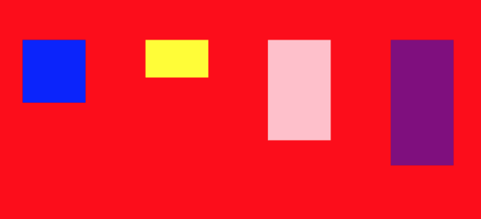

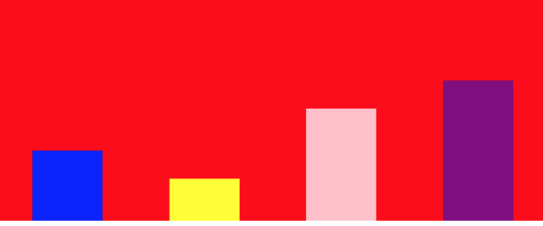

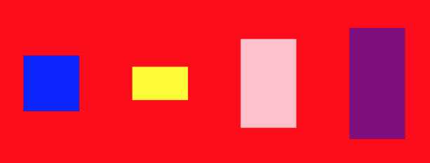

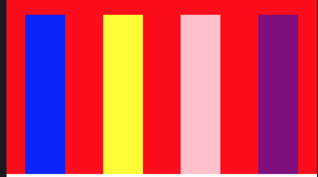

**flexWrap**

默认情况下，项目都排在一条线（又称"轴线"）上。flex-wrap属性定义，如果一条轴线排不下，如何换行。

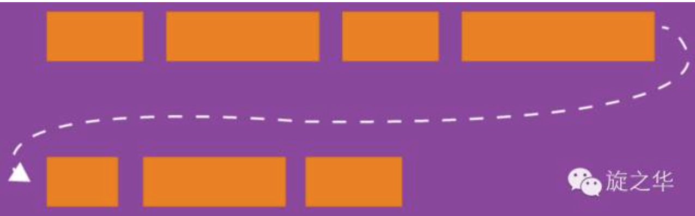

<font color=#F00>nowrap(默认值)</font>:不换行

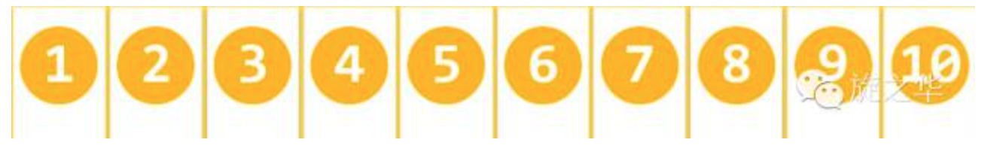

<font color=#F00>wrap</font>:换行，第一行在上方

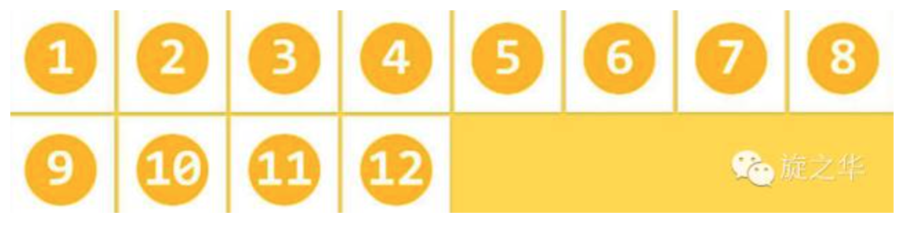

<font color=#F00>wrap-reverse</font>:换行，第一行在下方

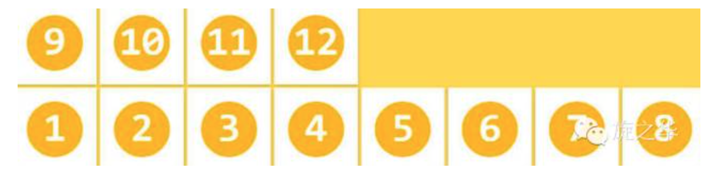

**flex**

“flex-grow”、“flex-shrink”和“flex-basis”三个属性的缩写， 其中第二个和第三个参数（flex-shrink、flex-basis）是可选参数。

  默认值为“0 1 auto”。

  宽度 ＝ 弹性宽度 * ( flexGrow / sum( flexGorw ) )

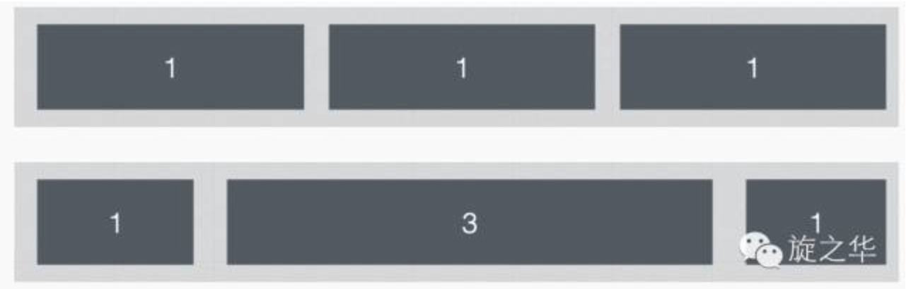

**alignSelf**

align-self属性允许<font color=#F00>单个项目</font>有与其他项目不一样的对齐方式，可覆盖align-items属性。默认值为auto，表示继承父元素的align-items属性，如果没有父元素，则等同于stretch。

>auto | flex-start | flex-end | center | baseline | stretch

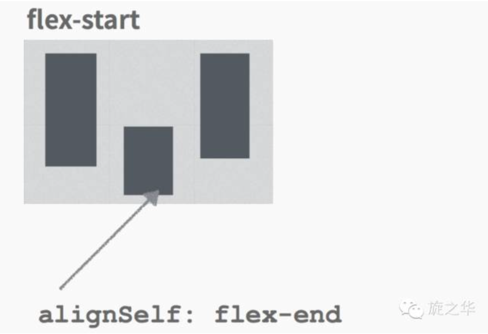

