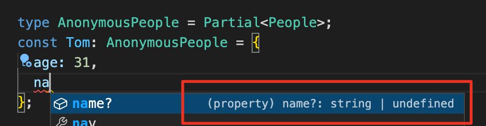
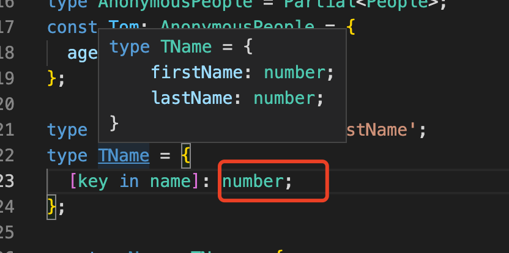

#### custom文件阅读笔记

- **工具类型Partial的用法**

  声明一个interface，包含name和age属性:

  ```typescript
  interface People {
    age: number;
    name: string;
  }
  ```

  如果对象遵守这个接口:

  ```typescript
  // 正确
  const Jerry: People = {
    age: 30,
    name: '黄先生',
  };
  // 报错，因为age和name都是必要存在的
  const Tom: People = {
    age: 31,
  };
  ```

  此时，如果要做到Tom对象不报错，需要把接口People中字段的声明修改为可选类型:

  ```typescript
  interface People { 
    age?: number;
    name?: string;
  }
  ```

  但是这样做显然不可取。Partial 可以快速把某个接口类型中定义的属性变成可选的(Optional)。

  ```typescript
  type AnonymousPeople = Partial<People>;  // anonymous: 匿名的
  const Tom: AnonymousPeople = {
    age: 31,
  };
  ```

  

  

  

  **泛型**

  ```typescript
  // 泛型函数
  function fn<T>(a: T): T {
    return a;
  }
  
  let result = fn(10); // 不指定泛型，TS会自动对类型进行推断
  let result2 = fn<stirng>('hello'); // 指定泛型
  
  // 泛型可以同时指定多个
  function fn2<T, K>(a: T, b: K): T {
    console.log(b);
    return a;
  }
  
  fn2<number, string>(123, 'hello');
  
  // 限定T必须继承于String
  function fn3<T extends String>(a: T): number {
    return a.length;
  }
  
  // 泛型类
  class MyClass<T> {
    name: T;
    constructor(name: T) {
      this.name = name;
    }
  }
  ```

  

  **Keyof**关键字

  keyof 是取 interface 的键**，**而且 keyof 取到键后会保存为联合类型。

  ```tsx
  interface UserInfo { // 声明一个interface
    name: string;
    age: number;
  }
  
  const UserObj = {  // 定义一个对象
    name: '黄先生',
    age: 30,
  };
  
  // typeof 是针对对象
  // keyof 是针对接口 ?
  
  type MyType = keyof UserInfo; // 'name' | 'age'
  const n: MyType = 'name';
  
  type dd = typeof UserObj;
  ```

  **in**关键字

  in用于取联合类型的值。主要用于数组和对象的构造。

  <font color= #FF0000>切记不要用于interface，否则会出错。</font>

  ```tsx
  type name = 'firstName' | 'lastName';
  type TName = {
    [key in name]: string;
  };
  
  const myName: TName = {
    firstName: '黄先生',
    lastName: '哈哈',
  };
  ```

  

  

  

  **Partial**的定义

  ```typescript
  /**
   * Make all properties in T optional
   */
  type Partial<T> = {
      [P in keyof T]?: T[P];
  };
  ```

  有了上面的知识后，理解Partial变得很简单了。补充:

  ```tsx
  const obj = {
    age: 30,
    name: 'huang',
  };
  type Customer = Partial<typeof obj>;
  const mer: Customer = {
    name: '黄先生',
  };
  // Customer的属性变为了Optional
  console.log(mer.name);
  ```

