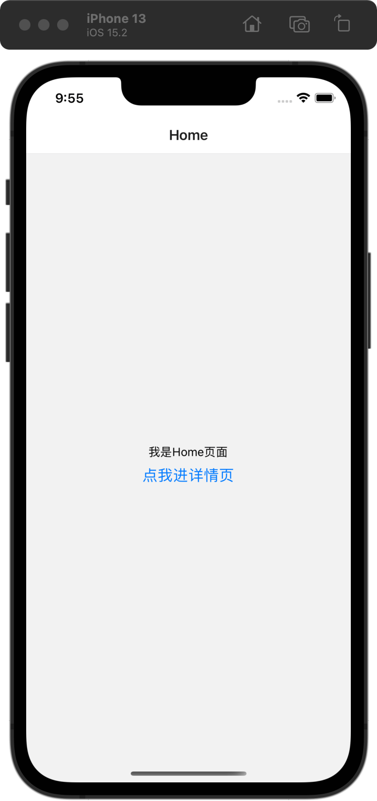
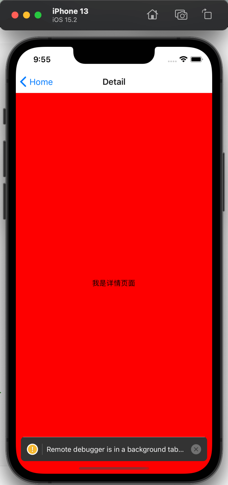
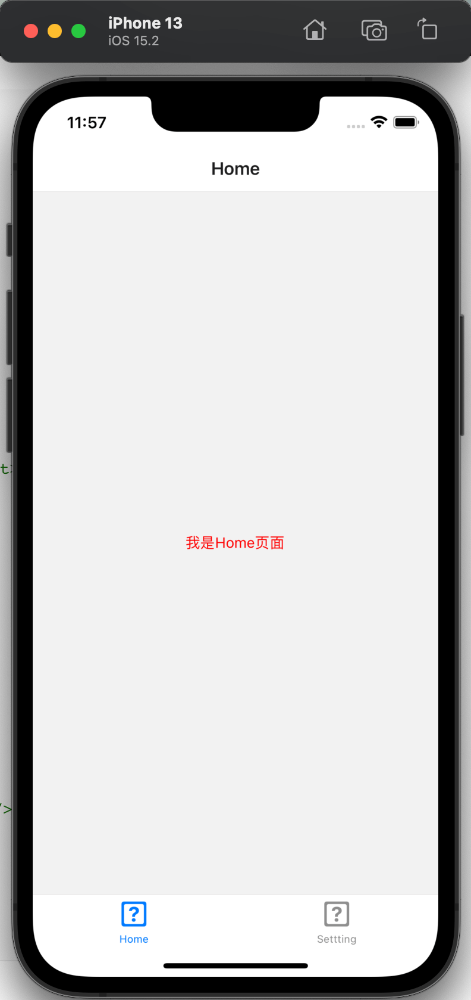

**前言**:

学习使用React-Navigation 6.x

#### 导航条

**①安装**

```yacas
# 安装 navigation
yarn add @react-navigation/native
# 一些依赖
yarn add react-native-screens react-native-safe-area-context react-native-gesture-handler
# 安装Stack Navigation，用于页面之间跳转
yarn add @react-navigation/stack
```

**②使用**

```jsx
import React from 'react';
import {Button, Text, View} from 'react-native';
// 导入所需的组件
import {NavigationContainer} from '@react-navigation/native';
import {
  createStackNavigator,
  StackNavigationProp,
} from '@react-navigation/stack';

// 注册表，导出类型，Home是key...
export type RootStackParamList = {
  Home: undefined;
  Detail: undefined;
};

export type RootStackNavigation = StackNavigationProp<RootStackParamList>;
const Stack = createStackNavigator<RootStackParamList>();

// Home页面
interface IProps {
  navigation: RootStackNavigation;
}
class Home extends React.Component<IProps> {
  render() {
    const {navigation} = this.props;
    return (
      <View style={{flex: 1, alignItems: 'center', justifyContent: 'center'}}>
        <Text>我是Home页面</Text>
        <Button
          title="点我进详情页"
          onPress={() => navigation.navigate('Detail')}
        />
      </View>
    );
  }
}
// 详情页面
class Detail extends React.Component {
  render() {
    return (
      <View
        style={{
          flex: 1,
          alignItems: 'center',
          justifyContent: 'center',
          backgroundColor: 'red',
        }}>
        <Text>我是详情页面</Text>
      </View>
    );
  }
}

export default class App extends React.Component {
  render() {
    return (
      <NavigationContainer>
        <Stack.Navigator initialRouteName="Home">
          <Stack.Screen name="Home" component={Home} />
          <Stack.Screen name="Detail" component={Detail} />
        </Stack.Navigator>
      </NavigationContainer>
    );
  }
}
```

 

#### 标签+导航条

**①安装**

```yacas
yarn add @react-navigation/bottom-tabs
```

**②使用**

```tsx
import React from 'react';
// 导入组件
import {NavigationContainer} from '@react-navigation/native';
import {createBottomTabNavigator} from '@react-navigation/bottom-tabs';
import {View, Text} from 'react-native';

class Home extends React.Component {
  render() {
    return (
      <View
        style={{
          flex: 1,
          justifyContent: 'center',
          alignItems: 'center',
        }}>
        <Text style={{color: 'red'}}>我是Home页面</Text>
      </View>
    );
  }
}

class Setting extends React.Component {
  render() {
    return (
      <View
        style={{
          flex: 1,
          justifyContent: 'center',
          alignItems: 'center',
        }}>
        <Text style={{color: 'orange'}}>我是Setting页面</Text>
      </View>
    );
  }
}

const Tab = createBottomTabNavigator();
export default class App extends React.Component {
  render() {
    return (
      <NavigationContainer>
        <Tab.Navigator>
          <Tab.Screen name="Home" component={Home} />
          <Tab.Screen name="Settting" component={Setting} />
        </Tab.Navigator>
      </NavigationContainer>
    );
  }
}
```




