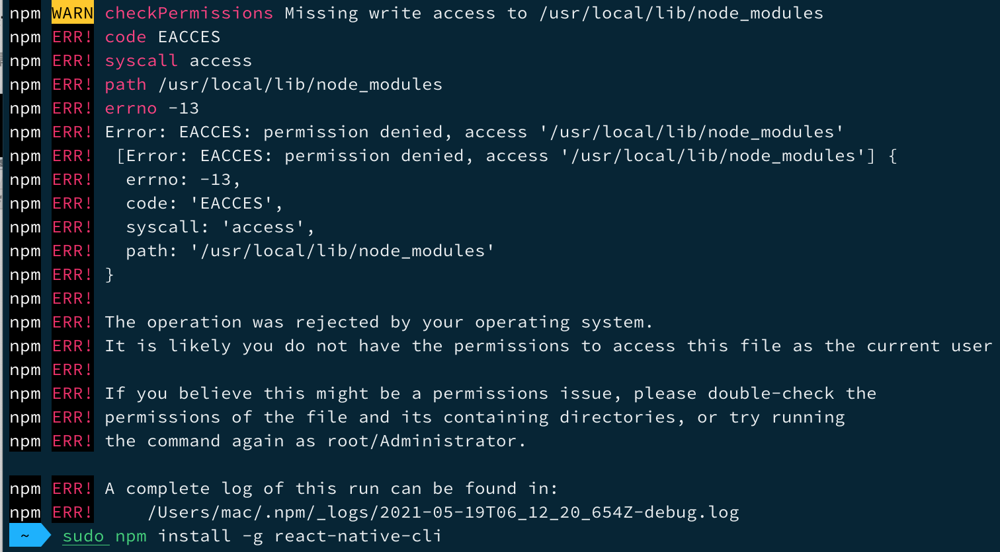
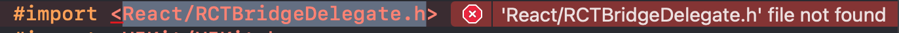
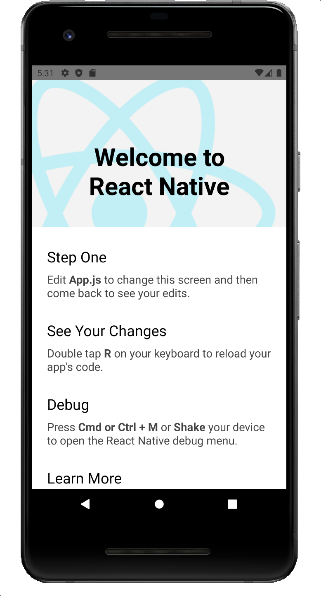
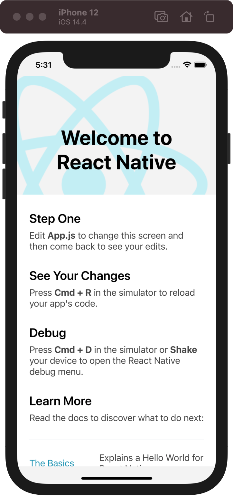

#### React Native环境搭建

**1.1安装Homebrew**

```ruby
ruby -e "$(curl -fsSL https://raw.githubusercontent.com/Homebrew/install/master/install)"
```

查看已经安装的Homebrew版本

```ruby
brew -v
```

**1.2安装npm和Node.js**

[Node.js](https://nodejs.org/en/)直接下载安装即可。Node.js安装成功后，npm自动也会安装好了。查看Node.js和npm版本

```ruby
node -v
npm -v
```

**1.3安装WatchMan**

改插件用于监控bug文件和文件变化，并且可以触发制定的操作

安装watchman

```ruby
brew install watchman
```

**1.4安装Flow**

  flow是一个JavaScript的静态类型检查器，建议安装。

 ```ruby
 brew install flow
 ```


**2.安装React Native**

```ruby
npm install -g react-native-cli
```

如果出现权限不够被拒绝的情况，在命令前面添加*sudo*即可。



```ruby
sudo npm install -g react-native-cli
```

至此，React Native环境就算搭建好了。

#### 开发环境搭建

**1.1创建一个React Native工程**

进入到存放工程的目录，然后执行命令:

```ruby
react-native init 工程名称
```


**1.2 使用Xcode打开工程**

使用Xcode打开ios项目，可能出现下面的情况:



此时要使用pod命令安装一下

```ruby
pod install
```

**1.3 使用Android studio打开工程**

使用Android studio打开如果出现 *Invalid Gradle JDK configuration found*的情况，找到.idea路径下的gradle.xml文件，并删除该文件，再点击*try again*按钮即可。

运行成功截图:



 


- tips

  **查看本地React Native版本**

  ```ruby
  react-native --version
  ```

  **更新本地React Native版本**

  ```ruby
  npm update -g react-native-cli
  ```

  pm:Node Package Manager

  **查询React native版本信息**

  ```ruby
  npm info react-native
  ```

- 运行工程

  使用Visual Studio Code 打开项目，并使用快捷键打开VS控制台: Command + J

  ```ruby
  # 使用iOS模拟器运行工程
  yarn ios

​       使用Android模拟器运行工程

         ```ruby
           yarn android
         ```


- 添加三方依赖

  ```ruby
  yarn add 三方依赖的名称
  ```

- 创建默认使用TS语言的RN项目

  ```shell
  react-native init MyApp --template react-native-template-typescript
  ```

  Error总结:
  
  1. pod install的时候执行到Installing Flipper-Glog (0.3.6)会报错
  
     解决办法: Xcode --> Preferences --> Locations --> Command Line Tools，配置(选择)对于的版本
  
  2. 创建RN项目时: *error This module isn't specified in a package.json file.*
  
     
