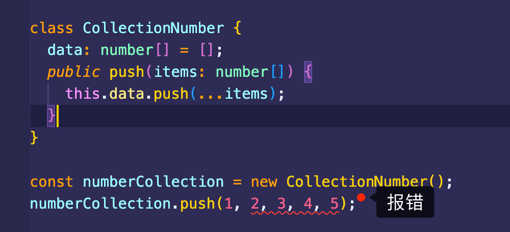
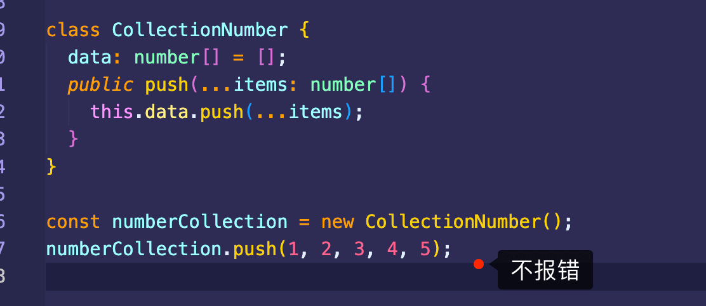
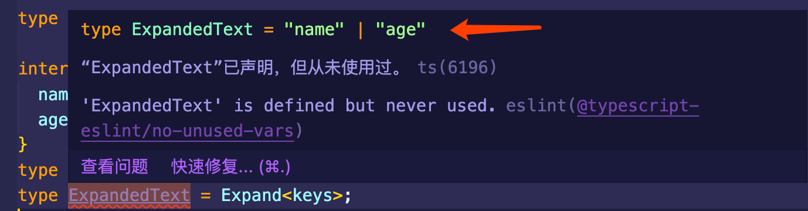
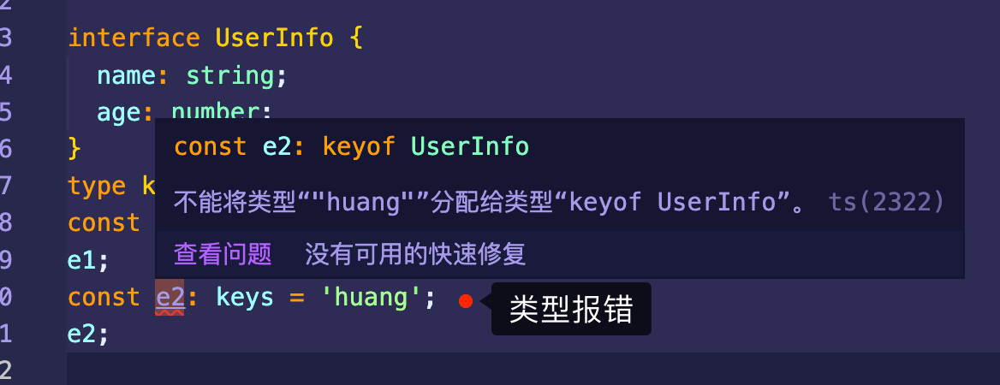
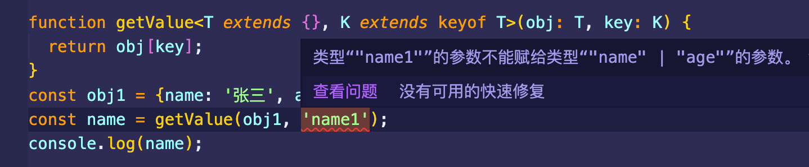
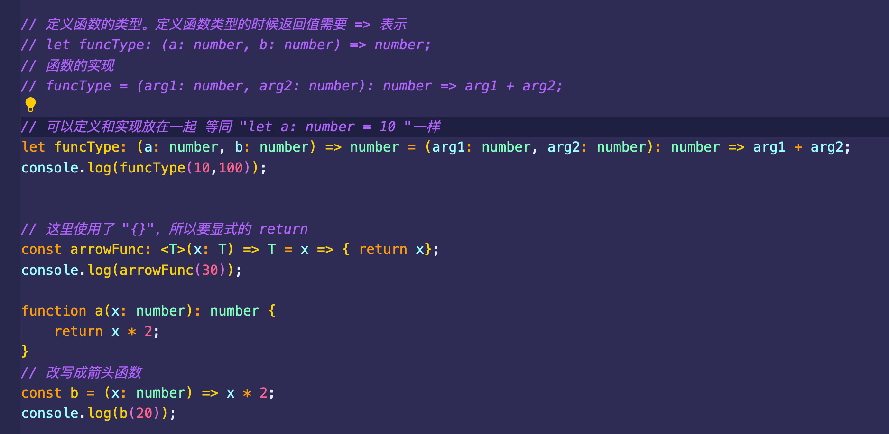
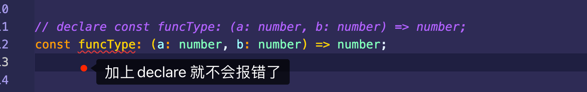
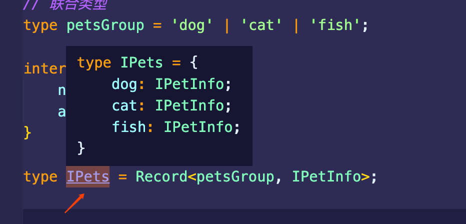
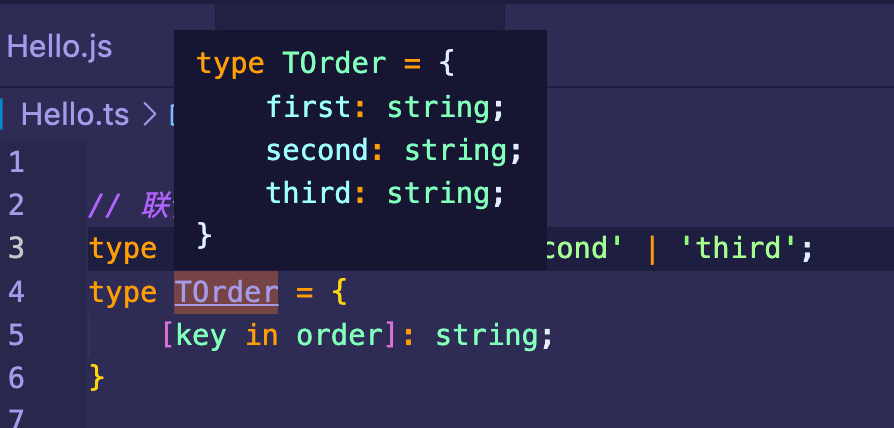

#### 泛型

**①入门**

```tsx
function dumpString(arg: string): string {
    return arg;
}

function dumpBoolean(arg: boolean): boolean {
     return arg;
}

// generic: 泛型，通用的
function dump<T>(arg: T): T {
     return arg;
}

let res1 = dump<string>('123'); // res1会被识别成string类型
let res2 = dump<boolean>(true); // res2会被识别成boolean类型
```

**②类型约束**

```tsx
// T[] 泛型数组
// 对T进行类型约束
function getLength<T extends {length: number}>(arg: T): number {
  return arg.length;
}

function getLength<T extends string | any[]>(arg: T): number {
  return arg.length;
}

type Stype = {length: number};
let a: Stype = '1235'; // 不会报错
let b: Stype = 1234; // 报错,不存在length属性
```

**③类中使用泛型**





```tsx
class CollectionNumber<T> {
  data: T[] = [];
  public push(...items: T[]) {
    this.data.push(...items);
  }
  public shift(): T | undefined {
    return this.data.shift();
  }
}

const numberCollection = new CollectionNumber<number | string>();
numberCollection.push(1, 2, 3, 4, 5);
numberCollection.push('1', '2', '3', '4', '5');
```

**④构造函数中使用泛型**

```tsx
class User<T> {
  public constructor(private _user: T) {}

  public get() {
    return this._user;
  }
}

interface UserInterface {
  name: string;
  age: number;
}
const obj = new User<UserInterface>({name: 'Mr黄先生', age: 31});
console.log(obj.get().name);
```

**⑤接口中使用泛型与泛型的多类型定义**

```tsx
// 文章接口
interface ArticleInterface<B, C> {
  title: string;
  isLock: B;
  comments: C[]; // 评论
}
// 评论类型
type CommentType = {
  content: string;
  author?: string;
};

const hd: ArticleInterface<boolean, CommentType> = {
  title: '文章标题',
  isLock: false,
  comments: [
    {content: '第一条评论'},
    {content: '第二条评论', author: '黄先生'},
  ],
};
```

#### VSCode中查看类型展开信息(暂时的解决方案)

在需要查看信息的地方输入以下代码:

```typescript
type Expand<T> = T extends infer O ? {[K in keyof O]: O[K]} : never;
type ExpandRecursively<T> = T extends object
  ? T extends infer O
    ? {[K in keyof O]: ExpandRecursively<O[K]>}
    : never
  : T;

interface UserInfo {
  name: string;
  age: number;
}

type t = keyof UserInfo;

type ExpandedText = Expand<t>; 
type ExpandRecursivelyText = ExpandRecursively<t>;
// 鼠标放在 ExpandedText 或 ExpandRecursivelyText 上即可查看类型<t>的定义信息了
```

**①keyof**

keyof 是取 interface 的键**，**而且 keyof 取到键后会保存为联合类型。

```typescript
type Expand<T> = T extends infer O ? {[K in keyof O]: O[K]} : never;

interface UserInfo {
  name: string;
  age: number;
}
type keys = keyof UserInfo;
type ExpandedText = Expand<keys>;
```



可以看到，`keys`是一种联合类型`"name"|"age"`。即把接口的`key`定义成了类型。

我们来看下面的代码:

```typescript
interface UserInfo {
  name: string;
  age: number;
}
type keys = keyof UserInfo;
const e1: keys = 'name'; // 不会报错
e1;
const e2: keys = 'huang'; // 报错
e2;
```



keyof实际应用例子:

我们有这样一个需求，实现一个函数 getValue 取得对象的 value。在未接触 keyof 时，我们一般会这样写：

```typescript
function getValue(obj: object, key: string) {
  return obj[key];
}
const obj1 = {name: '张三', age: 18};
const name = getValue(obj1, 'name');
console.log(name);
```

但是，这样写就丧失了 ts 的优势：

> - 无法确定返回值类型
> - 无法对 key 进行约束，可能会犯拼写的错误

这时我们可以使用 keyof 来增强 getValue 函数的类型功能。

```typescript
function getValue<T extends {}, K extends keyof T>(obj: T, key: K) {
  return obj[key];
}
const obj1 = {name: '张三', age: 18};
const name = getValue(obj1, 'name');
console.log(name);
```

如果此时把`key`写错了，则编译器会给出警告



**②Extract**

```typescript
type t1 = Extract<'a' | 'b', 'a'>; //  'a'
type t2 = Extract<'a' | 'b' | 'c', 'a' | 'b'>; // 'a' | 'b'
type T3 = Extract<string | number | (() => void), Function>; // () => void
type T4 = Extract<'a' | 'b' | 'c', 'a' | 'f'>; // 'a'
```

可以看到 `Extract` 需要接受兩個參數 `Type` 和 `Union`，但它會做的是把 `Type` 中滿足 `Union` 的取出，其餘不滿足的摒除掉，所以在：

>- 第一個例子中，從型別 `'a' | 'b' | 'c'` 中留下滿足 `'a'` 的，所以最後得到 `a`
>- 第二個例子中，從型別 `'a' | 'b' | 'c'` 中留下滿足 `'a' ｜ 'b'` 的，所以最後得到 `a | b`
>- 第三和第四個例子也是一樣的概念。
>- 没匹配到则类型为 `never`

**③箭头函数支持泛型**

```typescript
const foo = <T,>(x: T): T => x;

const foo = <T extends {}>(x: T): T => x;

const foo = <T extends Record<string, unknown>>(x: T): T => x;
// 目前遇到了
const foo: <T>(x: T) => T = x => x;

const identity = <T,>(arg: T): T => {
    console.log(arg);
    return arg;
};

const renderAuthorize = <T>(Authorized: T): ((currentAuthority: CurrentAuthorityType) => T) => (
    currentAuthority: CurrentAuthorityType,
  ): T => {
     return
 };
```

补充一些知识点



<font color=#F00>上图中的`let funcType `可以更改为`const funcType`。</font>



<font color=#F0F>报错信息为: 必须初始化 "const" 声明</font>

```tsx
//import Navigator from './src/navigator/Navigator';
import {default as MyNavigator} from './src/navigator/Navigator';
// 如果有 default 修饰，可以不使用 "{}"，也可以使用 {default as 别名}
```

**④Record作用**

常用格式

```tsx
type proxyKType = Record<K,T>
```

<font color=#F0F size=4>作用是: 将K中的所有属性值都转换为T类型，并将返回的新类型返回给proxyKType，K可以是联合类型、对象、枚举…</font>。

Example

```typescript
// 联合类型
type petsGroup = 'dog' | 'cat' | 'fish';

interface IPetInfo {
    name: string;
    age: number;
}

type IPets = Record<petsGroup, IPetInfo>;

const animalsInfo: IPets = {
    dog: {
        name: 'dogName',
        age: 20
    },
    cat: {
        name: 'catName',
        age: 22
    },
    fish: {
        name: 'fishName',
        age: 30
    }
};
```



<font color=#F0F size=4>拓展: 可以自己在第一个参数后追加额外的值</font>

```typescript
type petsGroup = 'dog' | 'cat' | 'fish';
interface IPetInfo {
    name:string,
    age:number,
}

type IPets = Record<petsGroup | 'otherAnamial', IPetInfo>;

const animalsInfo:IPets = {
    dog:{
        name:'dogName',
        age:2
    },
    cat:{
        name:'catName',
        age:3
    },
    fish:{
        name:'fishName',
        age:5
    },
    otherAnamial:{
        name:'otherAnamialName',
        age:10
    }
}
```

**⑤声明对象key的类型**

```tsx
// 在react-navigation 源码中有如下这么个定义
export declare type ParamListBase = Record<string, object | undefined>;
// 即为下面的格式
type ParamListBase = {
    [x: string]: object | undefined;
}
```

`[x: string]`代表什么含义。我们定义一个类型:

```tsx
type obj = {property1: string, property2: any};
```

这个类型只是约束了属性`property1`的值的类型为`string`，没有对属性`property1`类型进行约束。于是可以使用`[]`来约束属性类型。

```tsx
type obj = {[keys: string]: any}; // key的类型必须为字符串
type obj = {[keys in 'key1'|'key2'|'key3']: any}; // key的类型为key1或者key2或者key3
```

**⑥关键字 in**

in用于取联合类型的值。主要用于数组和对象的构造

```typescript
// 联合类型
type order = 'first' | 'second' | 'third';
type TOrder = {
    [key in order]: string;
}
```

