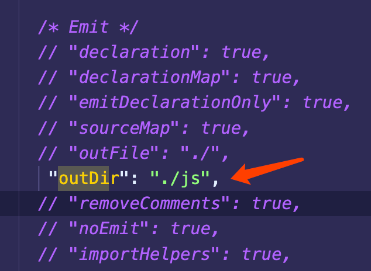
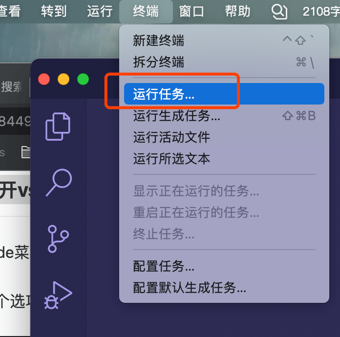
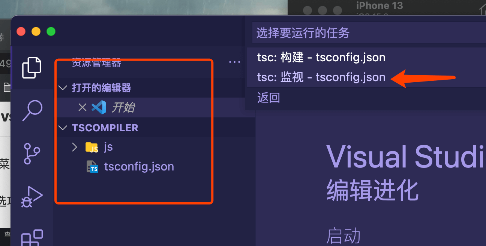
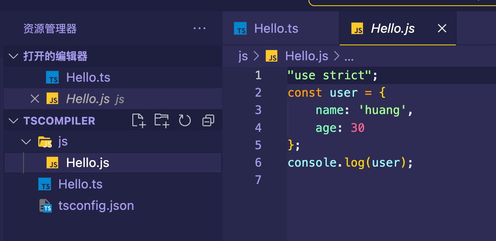

**①生产tsconfig.json 文件**

新建目标文件夹`TSCompiler`，iTerm进入目标文件夹，输入命令:

```shell
tsc --init
```

**②修改tsconfig.json文件**

首先在目标文件夹中新建一个文件夹(js)，存放vscode编译出来的文件；其次，在 tsconfig.json 文件中找到 “outDir”，并且修改其值为刚刚新建的文件夹路径:

```json
"outDir": "./js",
```



**③打开vscode终端运行typescript任务**

使用vscode打开目标文件夹，并找到`终端`，点击`运行任务`。在出现的搜索框中输入`typescript`，此时会出现两个选项，第二个选项是我们所需要监视：





点击`tsc: 监视 - tsconfig.json`。此时，会弹出一个终端，监视该文件夹中所有的ts文件是否被修改保存或新建，如果有，则编译出对应的js文件；否则一直监视着。

**④测试**

新建一个`Hello.ts`文件，编写以下代码:

```ts
type User = {
    name: string;
    age: number;
}
const user: User = {
    name: 'huang',
    age: 30
}
console.log(user);
```

此时vscode会自动在`js`文件夹中生成一个同名但是后缀为`js`的文件，选中生成的`js`文件，点击运行(右上角的三角形)即可在控制台看见输出结果了。

