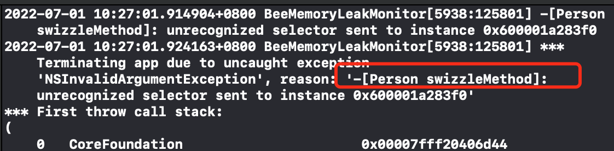

# Method Swizzle的细节

在我们利用runtime做方法的交换时，通常会先调用`class_addMethod`进行方法的添加，但是为什么要这样做呢？看下面的例子:

**基类**:

```objective-c
@interface Person : NSObject
- (void)originalMethod; // 原始方法
@end

@implementation Person
- (void)originalMethod {
    NSLog(@"--originalMethod--");
}
```

**子类:**

```objective-c
@interface Student : Person

@end
  
@implementation Student
// 子类没有重写父类的 *originalMethod* 方法
+ (void)load {
    
    static dispatch_once_t onceToken;
    dispatch_once(&onceToken, ^{
        SEL originalSelector = @selector(originalMethod);
        SEL swizzleSelector = @selector(swizzleMethod);
        // 交换时把父类的originalMethod给交换了，
        method_exchangeImplementations(class_getInstanceMethod(self, originalSelector), class_getInstanceMethod(self, swizzleSelector));
    });
}
- (void)swizzleMethod {
    [self swizzleMethod]; // 方法已经交换成了originalMethod方法，本类中没有只好去父类寻找IMP，但是父类中的originalMethod已经被交换成了swizzleMethod，导致调用不到
}
@end
```

调用时:

```objective-c
 Person *p = [[Person alloc] init];
 [p originalMethod]; // 调用的是子类的swizzleMethod方法
```

发生异常:



所以在方法进行交换之前，先要进行一些操作，保证方法的实现:

```objc
+ (void)load {
    
    static dispatch_once_t onceToken;
    dispatch_once(&onceToken, ^{
        SEL originalSelector = @selector(originalMethod);
        SEL swizzleSelector = @selector(swizzleMethod);
        
        Method originalMethod = class_getInstanceMethod(self, originalSelector);
        Method swizzleMethod = class_getInstanceMethod(self, swizzleSelector);
        
        // 如果当前类中实现了 originalSelector 则 class_addMethod方法的返回值为NO。即没有实现才会添加成功
        // 先添加，再替换。避免子类没有实现父类的方法，就直接进行交换。
        if (class_addMethod(self, originalSelector, method_getImplementation(swizzleMethod), method_getTypeEncoding(swizzleMethod))) {
            class_replaceMethod(self, swizzleSelector, method_getImplementation(originalMethod), method_getTypeEncoding(originalMethod));
        } else {
            method_exchangeImplementations(originalMethod, swizzleMethod);
        }
    });
}
- (void)swizzleMethod {
    [self swizzleMethod]; // 方法已经交换成了originalMethod方法，本类中没有只好去父类寻找IMP，但是父类中的originalMethod已经被交换成了swizzleMethod，导致调用不到
}
```


