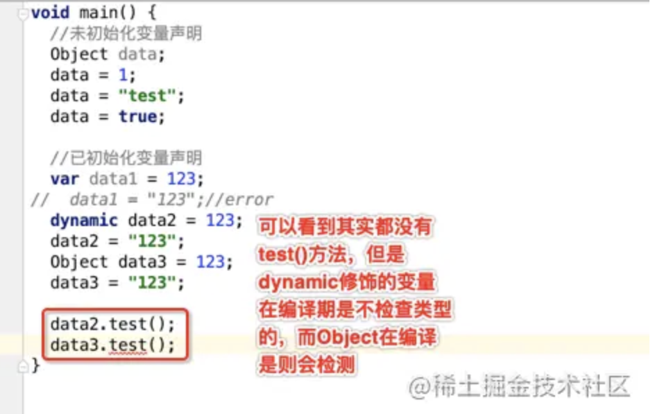

**Visual Code下Dart环境配置**

安装插件： Dart、Flutter、Code Runner

**变量与常量**

使用关键字`var`来定义变量(具备自动推到类型的能力)，也可以在定义时指定变量的类型

```dart
var str1 = "你好啊";
String str2 = "哈哈哈";
int num = 123;
print(str1);
print(str2);
print(num);
```

使用`const`、`final`关键字来定义常量

二者区别:

```dart
final time1 = new DateTime.now(); // 正确
const time2 = new DateTime.now(); // 报错
```

> 用`final`修饰的常量，必须在定义时将其初始化，其值在初始化后不可改变；
> `const`用来定义常量。
>
> 它们的区别在于，`const`比`final`更加严格。`final`只是要求常量在初始化后值不变，但通过`final`，我们无法在编译时（运行之前）知道这个变量的值(编译时无法确定)；而`const`所修饰的是编译时常量(编译时就能确定)，我们在编译时就已经知道了它的值，显然，它的值也是不可改变的。

to do : 王红元笔记

**字符串拼接**

```dart
var str1 = "Hello";
String str2 = "Dart";

print("$str1,$str2"); // 使用美元符号取值  print("姓名: ${this.name}");
print(str1 + str2);
```

**数据类型**

> int, double, bool(true or false), => 都是Class类型，对象类型，不再是基本数据类型

```dart
var list = ["张三", 20, true]; // List存储Object类型
print(list[0]);
var list2 = <String>["1", "3"]; // 指定数据类型
list2.add("4");
// 创建静态List
var list3 = List.filled(2, "1");
print(list3);
```

**Map**

```dart
var person = {
"name": "黄先生",
"age": 30,
"work": ["程序员","送外卖"]
};
print(person["name"]);

var p = new Map();
p["name"] = "黄先生";

// is 关键字的作用
if (p is Map) {
  print("is 关键字的作用");
}
```

**函数的定义及可选参数**

函数的定义: 

```dart
返回类型 方法名称(参数1,参数2...) { // 最好加上参数的类型进行约束
  方法体
  return 返回值
}
```

函数的可选参数和具名参数

```dart
// 1. 可选参数放在具名参数的后面
// 2.使用"[]"wrapper 可选参数
返回类型 方法名称(参数类型 参数1,参数类型 参数2,[参数类型 可选参数1,...]) { 
  方法体
  return 返回值
}

返回类型 方法名称(参数类型 参数1,参数类型 参数2,{参数类型 可选参数1,...}) { 
  方法体
  return 返回值
}

/*******Example*********/
void main(List<String> args) {
   print(sum(20, 30, "黄先生"));
   print(sum1(20, 40, name: "黄先生")); // 必须填写名称
}

String sum(int a, int b, [String? name, int age = 30]) {
  // 可选参数可能为null
  if (name != null) {
    return "$a + $b" + name;
  }
  return "name是null";
}

// name 就是具名可选参数 
String sum1(int a, int b, {String? name, int age = 30}) {
  // 可选参数可能为null
  if (name != null) {
    return "$a + $b" + name;
  }
  return "name是null";
}
```

**箭头函数**

```dart
List list = [1, 2, 3, 5];
list.forEach((element) {
print(element);
});
// 改写成箭头函数
list.forEach((value) => print(value));

var newList = list.map((e) => e > 3 ? e * 2 : e);
print(newList.toList());
```

箭头函数: 

  1.只能写一行代码

  2.如果只有一行代码可以省略"{}" 

  3.如果有返回值，不要显示的写"return"

**闭包Closure**

```dart
fn() {
    var a = 123;
    return (){
      a ++;
      print(a);
    };
  }
// a不会被立即释放
var b = fn();
b();
```

**类**

```dart
// 默认构造函数
// 命名构造函数
class Person {
  String? name;
  int? age;
  // 默认构造函数
  // Person() {}

  Person(String name, int age) {
    this.name = name;
    this.age = age;
  }

  // 命名构造函数
  Person.now(String name, int age) {
    this.name = name;
    this.age = age;
  }
}

void main(List<String> args) {

  Person p = Person.now("黄先生", 30);
  print(p.name);
  print(p.age);
}
```

**级联语法**

```dart
p.name = "张三";
p.age = 32;
p.printInfo();

// 使用级联语法
p..name = "王五"
..age = 33
..printInfo();
```

**类的构造函数**

类的构造函数不能继承

```dart
class Person {
  String? name;
  int? age;

  Person(this.name, this.age);
}

class Student extends Person {
  // 传入的参数传递给父类
  Student(String name, int age): super(name, age);
  
}

void main(List<String> args) {

  Person p = Person("黄先生", 30);
  print(p.name);
}

// 拓展子类自己的构造函数
class Student extends Person {

  String? sex;
  // 传入的参数传递给父类
  Student(String name, int age, String sex): super(name, age) {
    this.sex = sex;
  }
}
```

```dart
class Person {
  String? name;
  int? age;

  Person(this.name, this.age);
  Person.now(this.name, this.age);
}

class Student extends Person {

  String? sex;
  // 传入的参数传递给父类的命名构造函数
  Student(String name, int age, String? sex): super.now(name, age) {
    this.sex = sex;
  }
  
}

void main(List<String> args) {

  Person p = Person("黄先生", 30);
  print(p.name);
}
```

**抽象类、接口**

如果一个类使用了关键字`abstract`修饰并且只是定义了一些抽象方法，这个类可以看做接口

如果一个类使用了关键字`abstract`修饰并且只是定义了一些抽象方法和方法的实现，这个类就是抽象类。

```dart
abstract class A {
  printInfo();
}

abstract class B {
  String? name;
  printInfo();
  printUserInfo() {}
}
```

**泛型**

```dart
// 泛型方法
T getData<T>(T value) {
  return value;
}
// 泛型类
class Person<T> {
  T? name;
  Person(this.name);
}
// 泛型接口
abstract class Cache<T> {
  getByKey(String key);
  void setByKey(String key, T value);
}

class FileCache<T>implements Cache<T> {
  @override
  getByKey(String key) {
    return null;
  }

  @override
  void setByKey(String key, T value) {
     print("具体的实现");
  }
}


void main(List<String> args) {

   Person person = Person<String>("哈哈");
   print(person.name);
   Person person1 = Person<int>(30);
   print(person1.name);

}
```

```dart
class Person {

  String? name; // 可为空
  int age;
  Person({this.name, required this.age}); // name可以不传，但是age是必传的
}
```

**Var、Object和dynamic类型的区别**

- *Var*: 如果没有初始值，可以变成任何类型

```dart
var a;
a = "abc";
a = 123;
a = true;
a = ["123"]
```

 如果有初始值，那么其类型会被锁定

```dart
var a = "as"
a = 123; // 报错
```

- Object: 动态任意类型， <font color=#F00>编译阶段</font>检查类型

  ```dart
  Object a = "asa"
  a = 123;
  a = [222];
  ```

- dynamic: 动态任意类型， <font color=#F00>编译阶段不</font>检查类型

  ```dart
  dynamic a = "asa";
  a = 123;
  a = [222];
  ```

- 总结: 1.`var`初始化确定类型后不可更改类型，`Object`和`dynamic`可以更改类型;2.`Object`编译阶段检查类型，而`dynamic`编译阶段不检查类型。

  


**抽象类**

`Dart` 抽象类可以只声明方法，也可以有具体的方法实现，但是不能直接用抽象类来创建实例，只能被继承使用或者充当接口。

定义一个抽象类 `Animal`

```dart
abstract class Animal {
  // 仅声明eat方法
  void eat();

  // 声明方法，且有具体实现
  void sleep() {
    print("睡觉");
  }
}
```

继承使用

```dart
class Cat extends Animal {
  @override
  void eat() {
    print("喵喵吃");
    sleep();
  }

  // 可以不实现 sleep 方法
}
```

充当接口

```dart
class Cat implements Animal {
  void eat() {
    print("吃");
  }

  // 必须实现 sleep 方法
  void sleep() {
    print('睡');
  }
}
```

实例化

```dart
final animal = Animal();
// 抽象类实例化会报错
// Error: The class 'Test' is abstract and can't be instantiated.
```

- 抽象类不能实例化。
- 继承: 子类比较实现抽象方法，子类可以不重写抽象类中已实现的方法。
- 接口: 必须实现抽象类中声明的所有方法
