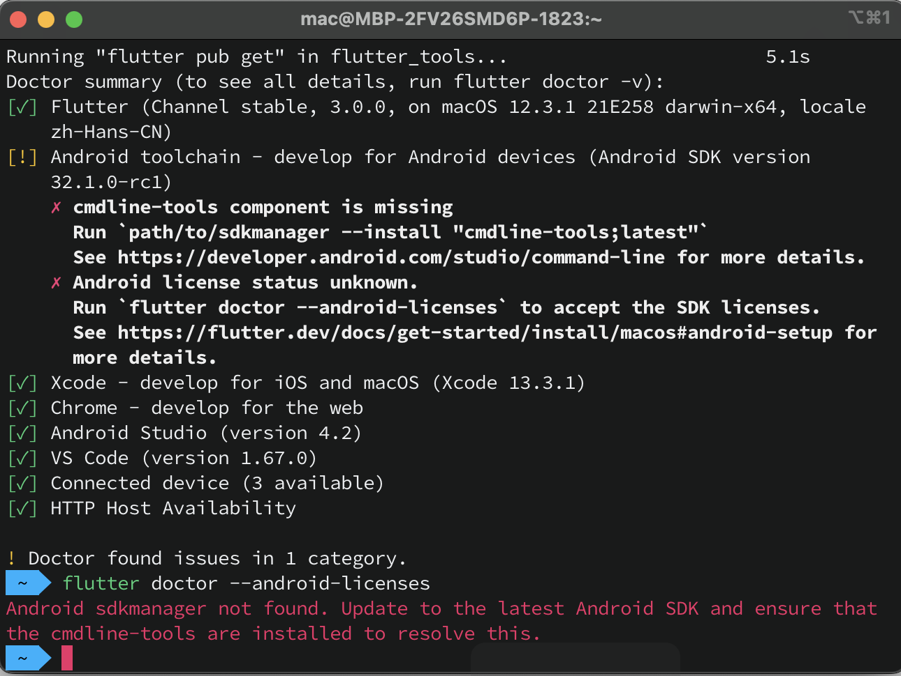
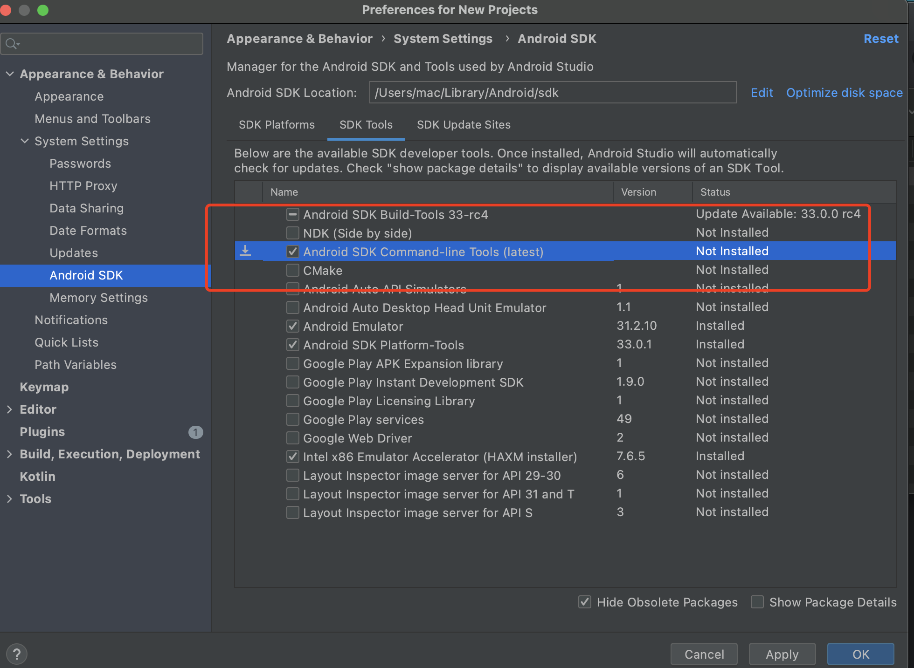
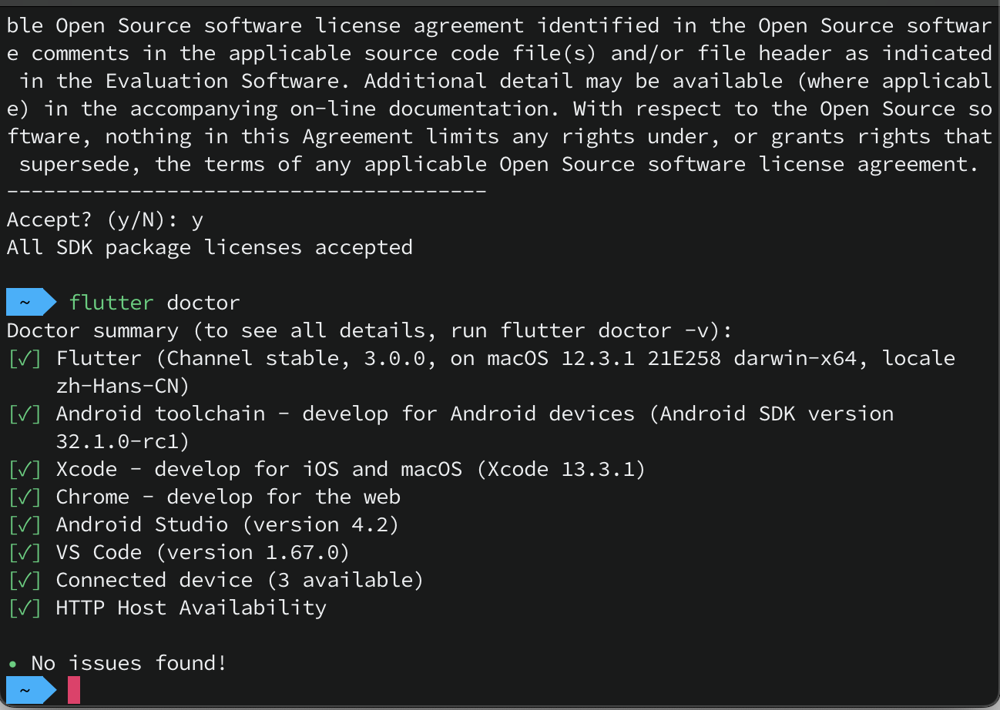

#### Flutter环境搭建

- 下载Flutter SDK ，并解压到安装目录(我的是: /usr/local/development)

- 配置Flutter环境变量，使用vim打开*.bash_profile*文件

  ```shell
  vim ~/.bash_profile
  
  # flutter SDK路径
  export PATH=/usr/local/development/flutter/bin:$PATH
  # 国内源
  export PUB_HOSTED_URL=https://pub.flutter-io.cn
  export FLUTTER_STORAGE_BASE_URL=https://storage.flutter-io.cn
  ```

- 运行*doctor*命令

  ```shell
  flutter doctor
  ```

  

需要配置Android Sdkmanager:



再次运行doctor命令



至此，flutter开发环境便配置好了。

从 macOS Catalina 版开始，您的 Mac 将使用 zsh 作为默认登录 Shell 和交互式 Shell。

所以有的时候还是会出现: zsh: command not found: flutter的情况。

```shell
vim ~/.zshrc 
```

讲bash_profile中配置的环境变量拷贝到zshrc中即可。

qaa