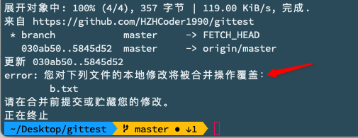
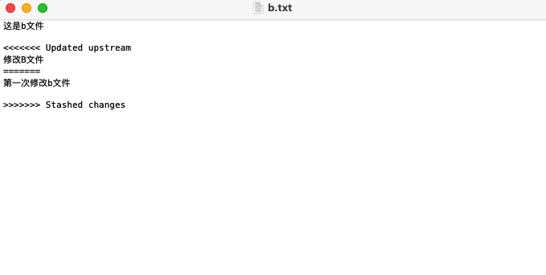
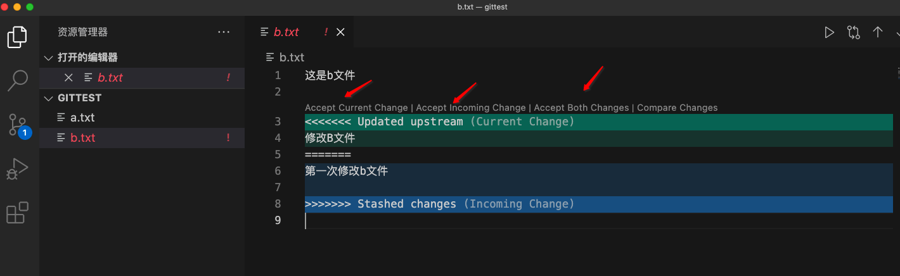

**Stash**

意为贮存的意思。

例子: 创建一个文件夹，包含2个文件(a.txt，b.txt) 提交到远程代码仓库。

B电脑从代码仓库拉下文件夹。

步骤一: A电脑修改a.txt和b.txt文件，提交时，只提交a.txt。

步骤二: B电脑拉下A提交的代码，并同时修改了a.txt和b.txt文件，提交到远程。

不步骤三: 此时在A电脑上拉取远程仓库的代码，会出现下列出错:



原因是b.txt文件有未提交的记录，如果从远程拉取到b.txt文件会覆盖本地未提交的记录。

为了解决这个问题，此时*stash*就排上用场了。

在A电脑上执行命令: 

```shell
git stash
```

把b.txt未提交的内容贮存起来。(此时b.txt中的内容会回到上个提交之前)

然后在执行拉取命令就没问题了:

```shell
git pull origin master
```

此时如果我们想取出b.txt贮存区里面的内容，则会报冲突的:

```shell
git stash pop
```



我们使用Visual Code 打开文件夹，修复冲突:



修复冲突再提交即可。


**Clone仓库时切分支**

```shell
git clone -b 分支名 仓库地址
```

如果直接使用 git 命令，默认分支是master

```shell
git clone 仓库地址
```

**Merge时发生冲突**

当从分支A Merge 到分支B时，如果出现冲突。解决办法:

1.本地先切换到分支A，2.在pull 一下分支B的代码到本地 3. 解决冲突后再push 到A即可。

待研究: https://blog.csdn.net/hd243608836/article/details/107183834

**撤回本地Commit**

```ruby
# 写完代码后，我们一般这样
git add . //添加所有文件
git commit -m "本功能全部完成"

# 执行完commit后，想撤回commit，怎么办？
# 可以像下面这样
git reset --soft HEAD^
# 这样就成功的撤销了你的commit，注意，仅仅是撤回commit操作，您写的代码仍然保留，既 git status 工作区仍然是clean的!!

# HEAD^的意思是上一个版本，也可以写成HEAD~1
# 如果你进行了2次commit，想都撤回，可以使用HEAD~2
```

几个参数的含义

`--mixed` :不删除工作空间改动代码，撤销`commit`，并且撤销`git add . `操作。这个为默认参数,`git reset --mixed HEAD^ `和 `git reset HEAD^ `效果是一样的。如果执行`git status`，<font color=#F00 size=4>会显示出未提交的信息!!!</font>

`--soft`: 不删除工作空间改动代码，撤销`commit`，不撤销`git add . `。

`--hard`: 删除工作空间改动代码，撤销`commit`，撤销`git add . `。注意完成这个操作后，就恢复到了上一次的commit状态。如果执行`git status`，<font color=#409FFF size=4>会显示 nothing to commit, working tree clean，不会显示出未提交的信息!!!</font>

*注意*: 如果只是`commit`注释写错了，只是想改一下注释，只需要执行下面命令即可

```ruby
git commit --amend
# 查看提交历史
git log
```

**Vim**

vim按住o(字母)即可进入下一行并且是编辑模式

**补充**

如果有两台电脑，都往同一条分支上提交代码。电脑A首先推送了代码到远程服务器，电脑B紧接着也马上提交代码到远程服务器，就会出现:

> 提示：更新被拒绝，因为远程仓库包含您本地尚不存在的提交。这通常是因为另外
> 提示：一个仓库已向该引用进行了推送。再次推送前，您可能需要先整合远程变更
> 提示：（如 'git pull ...'）。
> 提示：详见 'git push --help' 中的 'Note about fast-forwards' 小节。

此时的解决办法是:

 ①回退电脑B本地的commit信息

```shell
git reset --soft HEAD^
```

②暂存电脑B中修改的代码

```shell
git stash
```

③拉取远程服务器的代码到本地

```shell
git pull
```

④电脑B取出暂存的代码

```shell
git stash pop
```

⑤查看本地git状态，如果都在git管理中，直接推送到远程服务器即可；如果没有执行commit命令后再推送即可。

