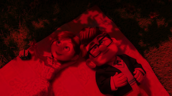
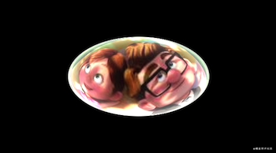

# GPUImage滤镜实现分析

[toc]

### 基础

在开始解析GPUImage的滤镜之前，先来回顾一下图形学基础知识。

#### 灰度图、全彩图


#### 色彩空间的概念

#### 可能会用到的数学知识


### 摘要

[滤镜名称](https://blog.csdn.net/Dullyoung/article/details/106094881)

本系列文章主要学习GPUImage滤镜的算法，并加以实践。网上有很多介绍GPUImage的文章，这里就不再赘述。GPUImage内置有100多种滤镜，按功能可划分为:**颜色调整(Color adjustments)**、**图像处理(Image processing)**、**混合模式(Blending modes)**和**视觉效果(Visual effects)**等。如果大家对着色器编程感兴趣，推荐大家去[ShaderToy](https://www.shadertoy.com/)和[IQ的博客](https://www.iquilezles.org/)学习。废话不多说，我们开始吧~。

 ### ShaderToy简单介绍

因为本次实践是在ShaderToy上进行的，所以这里简单演示一下如何在ShaderToy上编写shader:

- 打开[ShaderToy](https://www.shadertoy.com/)，会在右上角看到`浏览`、`新建`、`登录`三个按钮。通过点击上述按钮就能查看当前网站上的shader、新建一个页面用于编辑Shader和登录注册了。如果没有登录，编写的shader是不会被保存的。

- 点击`新建`按钮，进入编辑页面:

   

   

   页面左边是渲染窗口，右边是编辑shader区域。在编辑完shader后点击图中的`Compiled`按钮即能在左边窗口中看到渲染的结果。点击`S`下拉菜单按钮还可以修改文字的大小。在`Compiled`下方有4个黑色的窗口，通过这些窗口可以添加图片、音频、视频等资源。推荐安装谷歌浏览器的插件:[Shadertoy Custom Texures](https://chrome.google.com/webstore/detail/shadertoy-custom-texures/jgeibpcndpjboeebilehgbpkopkgkjda?hl=zh-CN)，能很方便的添加资源到页面中。下面介绍一下编辑区域:

  ```glsl
  // 入口函数
  void mainImage(out vec4 fragColor, in vec2 fragCoord )
  {
      // 获取坐标
      vec2 uv = fragCoord/iResolution.xy;
      // 定义颜色
      vec3 col = vec3(1.,uv.x,uv.y);
      // 显示到屏幕上 
      fragColor = vec4(col,1.0);
  }
  ```

 - 内置变量介绍

   >`fragCoord`:二维变量，表示渲染区域的宽高;
   >
   >`iResolution`:二维常量，也表示渲染区域的宽高；
   >
   >`texture(通道(iChannel0、iChannel1...)，纹理坐标)`函数:读取通道中的纹理，类似GLSL中的`sample2D`函数；
   >
   >`iTime`:定时器；
   >
   >`fragColor`:显示到屏幕上

 更多关于ShaderToy详细的介绍，大家自行谷歌即可。

### 滤镜的分析与实现

#### 颜色调整滤镜

##### GPUImageBrightnessFilter

调节图像的亮度，公式如下:
$$
y = x + 255 * b
$$

其中$x$为调节前的像素值，$y$为调节后的像素值，$$b$$为调节参数；即分别在R、G、B三通道上加上调节参数(归一化后的值)即可。
```glsl
vec3 col = texture(iChannel0,uv).rgb;
float brightness = 0.5;
col += vec3(brightness);
fragColor = vec4(col, 1.);
```

**brightness**等于**0.0、0.5、0.7** 时效果如下:


##### GPUImageExposureFilter

调节图像的曝光度。根据维基百科给出的定义:

> 曝光值是一个以2为底的[对数](https://zh.wikipedia.org/wiki/对数)刻度系统。曝光值(EV)满足公式:
> $$
> EV = log_{2}\frac{N^2}{t}
> $$
>
> $$
> 2^{EV} = \frac{N^2}{t}
> $$
>
> 其中N是光圈(f值)；t是曝光时间(快门)，单位秒。

因为我们关心的是曝光值大小与图像的关系，所以只看$2^{EV}$即可。这里GPUImage的作者认为图像的呈现效果是与$2^{EV}$大小成线性关系的。

```glsl
// 曝光值设置成1.0
const float exposure = 1.;
vec2 uv = fragCoord/iResolution.xy;
vec4 col = texture(iChannel0,uv);
// 调整图像的RGB
col.rgb = col.rgb * pow(2.,exposure);
fragColor = vec4(col.rgb,1.0);
```
**exposure**等于**0.0、1.0、1.5** 时效果如下:


##### GPUImageContrastFilter(对比度滤镜)

 调节图像的对比度。对比度，简单来讲就是反应了一张图像的亮区域和暗区域的层次感。更详细的内容请访问[对比度](https://zh.wikipedia.org/zh/%E5%B0%8D%E6%AF%94%E5%BA%A6)。对比度的算法公式如下:

 $ 
      y = [x - 127.5 * (1 - b)] * k + 127.5 * (1 + b);
 $

其中$x$为调节前的像素值，$y$为调节后的像素值;$b$的取值范围$[-1,1]$,用于调节亮度;$k$用于调整对比度。特别地:$当b=0时， y = (x - 127.5) * k + 127.5$,此时只调节对比度；当$k=1时， y = x + 255 * b$,此时只调节亮度。

```glsl
vec3 col = texture(iChannel0,uv).rgb;
float contrast = 0.2;
col = (col.rgb - vec3(.5)) * contrast + vec3(.5);
fragColor = vec4(col, 1.);
```

**contrast**等于**1.0、2.0、3.0** 时效果如下:


##### GPUImageSaturationFilter(暂时)

##### GPUImageGammaFilter(gamma校正滤镜)

可以通过参数*gamma*对图像进行校正(<font color=#F00 size=2>范围 0.0 ~ 3.0,默认值1.0</font>)。
$$
f(I) = I^γ
$$

```glsl
// gamma值设置为2.2
const float gamma = 2.2;
vec2 uv = fragCoord/iResolution.xy;
vec4 col = texture(iChannel0,uv);
// 对分别对R、G、B进行gamma校正
fragColor = vec4(pow(col.rgb,vec3(gamma)),col.a);
```


##### GPUImageLevelsFilter

##### GPUImageColorMatrixFilter

##### GPUImageAverageColor(平均色滤镜)

平均色滤镜，其核心算法就是获取当前位置的`上左、上右、下左、下右`位置的像素之和，对其求平均后赋给当前位置。

```glsl
// 纹理坐标
vec2 uv = fragCoord/iResolution.xy;

// 水平方向上的偏移量
float ESP_W = 1./iResolution.x;
// 垂直方向上的偏移量
float ESP_H = 1./iResolution.y;

// 读取不同位置的像素
// 上左
vec4 tl = texture(iChannel0,uv + vec2(-ESP_W,-ESP_H));
// 上右
vec4 tr = texture(iChannel0,uv + vec2(ESP_W,-ESP_H));
// 下左
vec4 bl = texture(iChannel0,uv + vec2(-ESP_W,ESP_H));
// 下右
vec4 br = texture(iChannel0,uv + vec2(ESP_W,ESP_H));
// 求其平均值
vec4 col = .25 * (tl + tr + bl + br);
// 输出到屏幕
fragColor = col;
```


相比于原图，经过平均色滤镜处理后的图片变得模糊了。

##### GPUImageColorInvertFilter(反色滤镜)

 反色滤镜，获取当前像素的相反值。

```glsl
vec4 col = texture(iChannel0,uv);
// rgb取反值
fragColor = vec4(1.-col.rgb,col.a);
```


##### GPUImageOpacityFilter(不透明度滤镜)

不透明度滤镜。参数opacity代表不透明度的程度，opacity=1图像完全不透明，显示原图；opacity=0图像完全透明，显示背景。

```glsl
vec3 col = texture(iChannel0,uv).rgb;
float opacity= 0.2;
// 这里为了简便，假设背景是白色的
col = mix(col,vec3(1.),opacity);
fragColor = vec4(col,1.0);

// GPUImage做法
// gl_FragColor = vec4(textureColor.rgb, textureColor.a * opacity);
```


`mix函数`: $mix(x,y,a) = (1.0 - a) * x + y * a $

##### GPUImageRGBFilter(调整RGB占比滤镜)

可以分别调整图像的R、G、B通道的占比滤镜。实现很简单，这里不再过多赘述。

```glsl
vec3 col = texture(iChannel0,uv).rgb;
float redAdjustment = .8;
float greenAdjustment = .1;
float blueAdjustment = .1;
// 调整R、G、B占比
col.r *= redAdjustment;
col.g *= greenAdjustment;
col.b *= blueAdjustment;
fragColor = vec4(col, 1.);
```




##### RGB和HSV色彩空间的转换

在讲下面的内容之前，有必要去了解一下常见的色彩空间。常见的颜色空间除了RGB外，还有HSV(HSB)、YUV等，下面简单介绍一下HSV颜色空间。


 `色相(Hue)`：表示色彩，用一个0°~360°的圆形来表示不同的色彩，如上图所示。其中0°表示红色，60°表示黄色，120°表示绿色，180°表示青色，240°表示蓝色，300°表示深红色。

`饱和度(Saturation)`：表示色彩的纯度或颜色接近光谱色的的程度。饱和度的取值越大，纯度越高，接近光谱色的程度也就越高，图像越鲜艳；反之，图像纯度越低，图像也就越接近灰度图。

`明度(Value)`：也叫亮度(Brightness)，表示色彩的明亮程度，明度越高，色彩越亮；反之，色彩越暗。

HSV的颜色空间模型是一个六棱锥，如下图所示:


 `H参数`表示色彩信息，即所处的光谱颜色的位置，该参数用一个角度量来表示，红、绿、蓝分别相隔120°，互补色相差180°；`S参数`为一个比值，它表示所选颜色的纯度和该颜色最大的纯度之间的比率，当S=0时，只有灰度; `V参数`表示色彩的明亮程度。

 如果想改变图片的饱和度，该怎么用Shader实现呢？我们知道，Shader中的色彩空间为RGB，如果想改变图片的饱和度，需要先把色彩空间从RGB转换为HSV，修改了饱和度后，再把色彩空间从HSV转回RGB，交给Shader去渲染。

**RGB转HSV公式**
$$
max = max(r,g,b) \\
        min = min(r,g,b)  \\
        h= \begin{cases}
         0, &如果 \ max = min \\
        60 * {g - b\over {max - min} } + 0, &如果\ max=r,且\ g\ge b \\
        60 * {g - b\over {max - min} } + 360, &如果\ max=r,且\ g\lt b \\
         60 * {b - r\over {max - min} } + 120, &如果\ max=g \\
        60 * {r - g\over {max - min} } + 240, &如果\ max=b  
        \end{cases}  \\
        s = \begin{cases}
        0, &如果\ max = 0\\
       {max - min}\over max, &其他
       \end{cases}  \\
       v = max
$$
注意:r、g、b均为归一化后的值，范围为 ` 0~1 `之间。

**HSV转RGB公式**
$$
 h_1 = \lfloor {h\over60} \rfloor  \\
       f = {h \over 60} - h_1 \\
       p = v *(1 - s) \\
       q = v * (1 - f *s) \\
       t = v * (1 - (1- f) * s) \\\\
       (r,g,b) = 
      \begin{cases}
      (v,t,p) &如果\ h_1 = 0 \\
      (q,v,p) &如果\ h_1 = 1 \\
      (p,v,t) &如果\ h_1 = 2 \\
      (p,q,v) &如果\ h_1 = 3 \\
      (t,p,v) &如果\ h_1 = 4 \\
      (v,p,q) &如果\ h_1 = 5 \\
      \end{cases}
$$
注意：上面公式中$\lfloor {h\over60} \rfloor $ 含义是`向下取整`，而不是取绝对值!

```glsl
vec3 rgb2hsv(vec3 rgb) {
  float r = rgb[0],g = rgb[1],b = rgb[2];
  float h = 0.0,s = 0.0,v = 0.0;
  float minValue = min(min(r, g),b);
  float maxValue = max(max(r, g),b);
  v = maxValue;
  float delta = maxValue - minValue;
  if (maxValue != 0.0){
    s = delta / maxValue;
  }else {
    return vec3(h, s, v);
  }
  if (r == maxValue){
    h = (g - b) / delta;
  }else if (g == maxValue) {
    h = 2.0 + (b - r) / delta;
  }else {
    h = 4.0 + (r - g) / delta;
  }
  h = h * 60.0;
  if (h < 0.0){
    h += 360.0;
  }
  return vec3(h, s, v);
}
```

```glsl
vec3 hsv2rgb(vec3 hsvColor) {
  float h = hsvColor[0],s = hsvColor[1], v = hsvColor[2];
  if (h >= 360.0) h = 0.0;
  vec3 rgb = vec3(0.0);
  if(s<=0.0) {
    rgb = vec3(v);
  }else {
    float hi = floor(h/60.0);
    float f = (h/60.0)-hi;
    float p = v*(1.0-s);
    float q = v*(1.0-s*f);
    float t = v*(1.0-s*(1.0-f));
    if(hi<=0.0) {
      rgb = vec3(v,t,p);
    } else if(hi<=1.0) {
      rgb = vec3(q,v,p);
    } else if(hi<=2.0) {
      rgb = vec3(p,v,t);
    } else if(hi<=3.0) {
      rgb = vec3(p,q,v);
    } else if(hi<=4.0) {
      rgb = vec3(t,p,v);
    } else if(hi<=5.0) {
      rgb = vec3(v,p,q);
    }
  }
  return rgb;
}
```

```glsl
void main(){
    vec2 uv = fragCoord/iResolution.xy;
    vec3 rgbColor = texture(iChannel0,uv).rgb;
    vec3 hsvColor = rgb2hsv(rgbColor);
    float saturation = 1.5;
    // 调整的是Saturation
    hsvColor.y *= saturation; 
    // HSV转RGB
    rgbColor = hsv2rgb(hsvColor);
    fragColor = vec4(rgbColor,1.);
}
```

效果图:


RGB和HSV相互转换的公式还有很多，下面是我在网上找到的比较流行的方法:

```glsl
// RGB转HSV
vec3 rgb2hsv(vec3 c) {
  vec4 K = vec4(0.0, -1.0 / 3.0, 2.0 / 3.0, -1.0);
  vec4 p = mix(vec4(c.bg, K.wz), vec4(c.gb, K.xy), step(c.b, c.g));
  vec4 q = mix(vec4(p.xyw, c.r), vec4(c.r, p.yzx), step(p.x, c.r));
  float d = q.x - min(q.w, q.y);
  float e = 1.0e-10;
  return vec3(abs(q.z + (q.w - q.y) / (6.0 * d + e)), d / (q.x + e), q.x);
}
// HSV转RGB
vec3 hsv2rgb(vec3 c) {
  vec4 K = vec4(1.0, 2.0 / 3.0, 1.0 / 3.0, 3.0);
  vec3 p = abs(fract(c.xxx + K.xyz) * 6.0 - K.www);
  return c.z * mix(K.xxx, clamp(p - K.xxx, 0.0, 1.0), c.y);
}
//IQ大神的算法
// iq's smooth hsv to rgb
vec3 hsv2rgb(vec3 c)  {
  vec3 rgb = clamp( abs(mod(c.x*6.0+vec3(0.0,4.0,2.0),6.0)-3.0)-1.0, 0.0, 1.0 );
  rgb = rgb*rgb*(3.0-2.0*rgb);
  return c.z * mix( vec3(1.0), rgb, c.y);
}
```

##### GPUImageSaturationFilter(饱和度滤镜)

有了上面的理论基础之后，来看下GPUImage是如何实现图像饱和度的调整的。

```glsl
// 灰度值
const mediump vec3 luminanceWeighting = vec3(0.2125, 0.7154, 0.0721);
void main() {

  lowp vec4 textureColor = texture2D(inputImageTexture, textureCoordinate);
  // 根据公式计算同等亮度情况下饱和度最低的值 即Saturation=0 此时图像就为一张灰度图了
  lowp float luminance = dot(textureColor.rgb, luminanceWeighting);
  lowp vec3 greyScaleColor = vec3(luminance);
  // 在饱和度最低的图像和原图之间进行差值 saturation = 1.5
  gl_FragColor = vec4(mix(greyScaleColor, textureColor.rgb, saturation), textureColor.w); 
}
```

不得不说，这种做法确实精妙。


##### GPUImageGrayscaleFilter(灰度图滤镜)

 获取图片的灰度图方法有很多种，常见的有`平均值法`、`心理学法`、`去饱和法`、`分解法`、`单一通道法`。

- 平均值法

   $$ Gray = (Red + Green + Blue) / 3 $$

- 心理学法

   $$ Gray = (Red * 0.3 + Green * 0.59 + Blue * 0.11) $$

  类似的算法还有:

   $$ Gray = (Red * 0.2126 + Green * 0.7152 + Blue * 0.0722)$$ 或 $$Gray = (Red * 0.299 + Green * 0.587 + Blue * 0.114)$$

- 去饱和法

  $$Gray = (max(Red, Green, Blue) + min(Red, Green, Blue) ) / 2 $$

- 分解法

  $$ Gray = max(Red, Green, Blue)  或  Gray = min(Red, Green, Blue)$$

- 单一通道法

  $$Gray = Red $$ 或 $$ Gray = Green $$或 $$Gray = Blue$$

  参考来源:[图片灰度转换算法](https://github.com/aooy/blog/issues/4)

  GPUImage这里采用的是**心理学法**。

  ```glsl
  const vec3 W = vec3(0.2125, 0.7154, 0.0721);
  vec4 col = texture(iChannel0,uv);
  // to gray 
  float gray = dot(col.rgb,W);
  fragColor = vec4(vec3(gray),1.0);
  ```

  注解:`dot(col.rgb,W) = col.r * W.x + col.g * W.y + col.b * W.z`

  

  

##### GPUImageFalseColorFilter(替换色彩滤镜)

   将原来图片的色彩替换为指定的色彩。

  ```glsl
const vec3 W = vec3(0.2125, 0.7154, 0.0721);

vec4 col = texture(iChannel0,uv);
// 将原来的图像转为灰度图
float gray = dot(col.rgb,W);
vec3 firstCol = vec3(0.,0.,.5);
vec3 secondCol = vec3(1.,0.,0.);
// 混合两种颜色到灰度图中
col.rgb = mix(firstCol,secondCol,gray);
fragColor = vec4(col.rgb,1.0);
  ```


##### GPUImageSepiaFilter(深褐色滤镜)

颜色转换公式如下:
$$
Red = 0.393 * Red + 0.769 * Green + 0.189 * Blue;\\
       Green = 0.349 * Red + 0.686 * Green + 0.168 * Blue;\\
       Blue = 0.272 * Red + 0.534 * Green + 0.131 * Blue;
$$

```glsl
vec2 uv = fragCoord/iResolution.xy;
vec4 col = texture(iChannel0,uv);

// common 
const mat3 RGBToSepiaMatrix = mat3(
  0.393,0.769,0.189,
  0.349,0.686,0.168,
  0.272,0.534,0.131
);
const float sepiaIntensity = 1.;
col.rgb = mix(col.rgb,col.rgb * RGBToSepiaMatrix,sepiaIntensity);
fragColor = vec4(col.rgb,1.0);
```


而`GPUImageSepiaFilter`采用的颜色转换矩阵是:

```glsl
// from GPUImage's GPUImageSepiaFilter
const mat3 RGBToSepiaMatrixOther = mat3(
  0.3588,0.7044,0.1368,
  0.2990,0.5870,0.1140,
  0.2392,0.4696,0.0912
);
```

 这个矩阵我在网上找了很久也没找到具体出处，不过使用该颜色转换矩阵后渲染出的图像褐色效果要比上图深。如果有谁知道具体出处麻烦告诉我一声！


##### GPUImageCGAColorspaceFilter(CGA滤镜)

CGA全称是:Color Graphics Adapter，彩色图形适配器(关于CGA的更多资料请访问[Color Graphics Adapter)](https://en.wikipedia.org/wiki/Color_Graphics_Adapter)。在320x200标准图形模式下，可以选择3种固定的调色板:

> 1.CGA 320×200 in 4 colors palette 0 (red, yellow, green, black background)
>
> 2.CGA 320×200 in 4 colors palette 1 (cyan, magenta, white, black background)
>
> 3.CGA 320×200 in 4 colors 3rd palette (tweaked), (cyan, red, white, black background)

`GPUImageCGAColorspaceFilter`使用的是第二种调色板。

```glsl
vec2 uv = fragCoord/iResolution.xy;
// 采样大小 
vec2 sampleDivisor = vec2(1./200.,1./320.);
// 获取采样后的坐标
vec2 samplePos = uv - mod(uv,sampleDivisor);
vec4 col = texture(iChannel0,samplePos);

// 4种颜色 
vec4 whiteCol = vec4(1.);
vec4 blackCol = vec4(0.,0.,0.,1.);
vec4 cyanCol = vec4(0.33,1.,1.,1.);
vec4 magentaCol = vec4(1.,0.33,1.,1.);

// 和当前位置的颜色进行比较 获取一个比较标准
float whiteDis = length(col-whiteCol);
float blackDis = length(col-blackCol);
float cyanDis = length(col-cyanCol);
float magentaDis = length(col-magentaCol);

// 获取和当前位置的颜色最接近的色彩
float finalDis = min(min(min(whiteDis,blackDis),cyanDis),magentaDis);
vec4 finalCol = vec4(0.);
if (finalDis == whiteDis){
  finalCol = whiteCol;    
}else if (finalDis == blackDis) {
  finalCol = blackCol;
}else if (finalDis == cyanDis) {
  finalCol = cyanCol;
}else{
  finalCol = magentaCol;
}
// 渲染到屏幕上
fragColor = finalCol;
```


第一、三种调色板渲染结果如下:


#### 高斯模糊

##### GPUImageGaussianBlurFilter(高斯模糊滤镜)

继承于`GPUImageTwoPassTextureSamplingFilter`，所以对图像进行了2次滤波处理(一次是在垂直方向上，另一次是在水平方向上)。

**标准高斯模糊算法**

[高斯模糊](https://en.wikipedia.org/wiki/Gaussian_blur)是一种将[正太分布](https://zh.wikipedia.org/wiki/%E6%AD%A3%E6%80%81%E5%88%86%E5%B8%83)应用于图像处理的方法(越靠近计算中心点，像素点的权重越大)，使图片产生"模糊"的效果。像素点的权重可以使用下面公式来获取:
$$
f(x) = \frac{1}{\sqrt{2π\partial^2}} \large e^{\frac{-x^2}{2\partial^2}}
$$
在获取到像素点的权重后，还要获取权重的[加权平均数](https://zh.wikipedia.org/wiki/%E5%8A%A0%E6%AC%8A%E5%B9%B3%E5%9D%87%E6%95%B8)(图像的亮度不变)。下图为模糊半径等于3时参与计算像素点的示意图:


```glsl
#define PI 3.1415926
float CalWeight(float x){
  float sigma = 2.;
  return (1./sqrt(2.*PI *pow(sigma,2.))) * exp(-pow(x,2.)/(2.*pow(sigma,2.)));
}
void mainImage( out vec4 fragColor, in vec2 fragCoord )
{
    vec2 uv = fragCoord/iResolution.xy;
    //float s = 1./iResolution.x;
    //float t = 1./iResolution.y;
    // 为了模糊效果更明显
    float s = 1./320.;
    float t = 1./211.;
    // 权重之和
    float totalWeights = 0.;
    // 计算权重
    float w0 = CalWeight(0.);
    float w1 = CalWeight(1.);
    float w2 = CalWeight(2.);
    float w3 = CalWeight(3.);
   // 正、负对称  获取所有权重值之和
    totalWeights = w0 + (2.*w1 + 2.*w2 + 2. * w3) * 2.;
    // 计算加权平均数
    float weight0 = w0/totalWeights;
    float weight1 = w1/totalWeights;
    float weight2 = w2/totalWeights;
    float weight3 = w3/totalWeights;
    // 像素坐标
    vec4 col = vec4(0.);
    col += texture(iChannel0,uv) * weight0;
    // 水平方向
    col += texture(iChannel0,uv - 1. * vec2(s,0.)) * weight0;
    col += texture(iChannel0,uv + 1. * vec2(s,0.)) * weight1;
    col += texture(iChannel0,uv - 2. * vec2(s,0.)) * weight2;
    col += texture(iChannel0,uv + 2. * vec2(s,0.)) * weight2;
    col += texture(iChannel0,uv - 3. * vec2(s,0.)) * weight3;
    col += texture(iChannel0,uv + 3. * vec2(s,0.)) * weight3;
    // 垂直方向 
    col += texture(iChannel0,uv - 1. * vec2(0.,t)) * weight1;
    col += texture(iChannel0,uv + 1. * vec2(0.,t)) * weight1;
    col += texture(iChannel0,uv - 2. * vec2(0.,t)) * weight2;
    col += texture(iChannel0,uv + 2. * vec2(0.,t)) * weight2;
    col += texture(iChannel0,uv - 3. * vec2(0.,t)) * weight3;
    col += texture(iChannel0,uv + 3. * vec2(0.,t)) * weight3;
    fragColor = col;
}
```


**优化高斯模糊(Optimized Guassian Algorithm)**

从上面`标准高斯模糊算法`可知，当模糊半径为$n$时，需要计算的像素点位置的数量为$(2n+1)$(只考虑单次滤波)。通过优化后可以把计算点个数缩小到$(\frac{n}{2} + n\%2 + 1)$ ，来看看GPUImage是怎么做的:

> 除开中心点像素的位置，把需要参与计算的位置分为两两一组，然后求取每组数据的加权平均数作为新的计算点，这样就可以把计算量减少到$(\frac{n}{2} + n\%2 + 1)$了。

这样说可能很难理解为什么这样做就能起到优化计算的作用，下面我们来慢慢分析。

顶点着色器中，以标准高斯模糊算法为例，假设模糊半径$n=2,sigma=2$，权重的加权平均数如下:
$$
f(-2) = 0.152469 \\
f(-1) = 0.221841 \\
f(0) = 0.251379\\
f(1) = 0.221841 \\
f(2) = 0.152469 \\
$$
将这些权重和对应偏移点的像素值相乘然后累加就能得到该点的高斯模糊像素值。仔细观察上面的式子：既然知道了相邻两个偏移点的权重和坐标值，自然就能求出这两个偏移点的平均偏移点的坐标值。以$f(1)和f(2)$为例


根据加权平均数的概念及计算公式，可求得$x$:
$$
x = \frac{1 * f(1) + 2 * f(2)}{f(1)+f(2)}
$$
GPUImage的作者是按照下面计算公式来`Reduce(减少)`计算次数的:

```objective-c
// 优化后的偏移次数  模糊半径限制最大为14
NSUInteger numberOfOptimizedOffsets = MIN(blurRadius / 2 + (blurRadius % 2), 7);
```


从上图可以看出，公式将两个点一一`组合`在一起了。所以，在计算偏移点坐标的时候就能减少计算次数。

在片元着色器中，因为在顶点着色器中已经算出了平均偏移点的位置，所以计算平均偏移点的像素的时候乘以的是两个点的`权重之和`:

```objective-c
GLfloat firstWeight = standardGaussianWeights[currentBlurCoordinateIndex * 2 + 1];
GLfloat secondWeight = standardGaussianWeights[currentBlurCoordinateIndex * 2 + 2];
// 权重之和
GLfloat optimizedWeight = firstWeight + secondWeight;
// 拼接的时候乘以的是权重之和
[shaderString appendFormat:@"sum += texture2D(inputImageTexture, blurCoordinates[%lu]) * %f;\n", (unsigned long)((currentBlurCoordinateIndex * 2) + 1), optimizedWeight];
[shaderString appendFormat:@"sum += texture2D(inputImageTexture, blurCoordinates[%lu]) * %f;\n", (unsigned long)((currentBlurCoordinateIndex * 2) + 2), optimizedWeight];
```

模糊半径$n=5$，如果按照标准高斯模糊算法偏移位置则需要计算$(2n+1) = $11次；而采用优化后的算法只需要$(\frac{n}{2} + n\%2 + 1) = 4$次。甚是秒!!!

##### GPUImageSingleComponentGaussianBlurFilter(黑白高斯模糊滤镜)

继承于`GPUImageGaussianBlurFilter`，shader的实现基本一致，只不过在片元着色器中获取的是单通道的像素值。

```glsl
 float sum = 0.0;
 sum += texture2D(inputImageTexture, blurCoordinates[0]).r;
```


##### GPUImageGaussianBlurPositionFilter(可指定模糊位置的滤镜)

同样继承于`GPUImageTwoPassTextureSamplingFilter`。在shader中指定了每个偏移位置像素的权重大小，实现比较简单，这里就不贴代码了。


##### GPUImageZoomBlurFilter(Zoom效果滤镜)

下图是在网上找到的Zoom效果图片:


从分析高斯模糊滤镜shader中我们知道，偏移量越大，图像就越模糊；反之图像越清晰(可以理解成图像像素是连续的，偏移量越大，像素差别越大，累加后成像越模糊)。所以`Zoom`效果实现思路是:偏移量从图像中心开始往四周逐渐变大(在图像中心为0)。

```glsl
vec2 uv = fragCoord/iResolution.xy;
// 偏移量如果是固定值 就全部模糊了
//float s = 1./320.;
//float t = 1./200.;
//vec2 sampleOffset = vec2(s,t);

vec2 sampleOffset = (vec2(.5) - uv) * 0.012;
vec4 col = vec4(0.);
// 乘以各自的权重
col += texture(iChannel0,uv) * 0.18;
col += texture(iChannel0,uv + sampleOffset) * 0.15;
col += texture(iChannel0,uv + 2. * sampleOffset) * 0.12;
col += texture(iChannel0,uv + 3. * sampleOffset) * 0.09;
col += texture(iChannel0,uv + 4. * sampleOffset) * 0.05;
col += texture(iChannel0,uv - sampleOffset) * 0.15;
col += texture(iChannel0,uv - 2. * sampleOffset) * 0.12;
col += texture(iChannel0,uv - 3. * sampleOffset) * 0.09;
col += texture(iChannel0,uv - 4. * sampleOffset) * 0.05;
fragColor = col;
```


#### 边缘检测

边缘检测原理

> 边缘是图像中像素灰度值`突变`的结果，也就是不连续的像素，对于这些像素突变的地方，它的微积分运算中，一阶导数表现为极值点，二阶导数表现为过零点。因此，我们可以用微分算子来计算图像的边缘像素点，而这些微分算子，通常可以通过小区域的模板卷积来近似计算，这种小区域模板就是边缘检测的模板算子，这种模板卷积计算边缘像素的方法叫做模板算子法。

常用的模板算子包括`Prewitt算子`、`Sobel算子`以及`Canney算子`等。


图中的点表示为$P_1 到 P_9$。对于上图中的像素点 $P_5{(i,j)}$，则$P_1可表示为P_{(i-1,j-1)}，P_2表示为P_{(i,j-1)},P_4表示为P_{(i-1,j)}...$ 依次类推(`GPUImageAverageColor`类似)。

```glsl
// 取r、g、b都一样 只要是单色图就行 
vec2 uv = fragCoord/iResolution.xy; 
float p1 = texture(iChannel0,uv + vec2(-1.,-1.)/iResolution.xy).b;
float p2 = texture(iChannel0,uv + vec2(0.,-1.)/iResolution.xy).b;
float p3 = texture(iChannel0,uv + vec2(1.,-1.)/iResolution.xy).b;

float p4 = texture(iChannel0,uv + vec2(-1.,0.)/iResolution.xy).b;
float p5 = texture(iChannel0,uv).b;
float p6 = texture(iChannel0,uv + vec2(1.,0.)/iResolution.xy).b;

float p7 = texture(iChannel0,uv + vec2(-1.,1.)/iResolution.xy).b;
float p8 = texture(iChannel0,uv + vec2(0.,1.)/iResolution.xy).b;
float p9 = texture(iChannel0,uv + vec2(1.,1.)/iResolution.xy).b;
```

##### GPUImagePrewittEdgeDetectionFilter(Prewitt边缘检测滤镜)

Prewitt算子又叫交叉微分算子，通过计算中心像素周围邻域的差分来定位边缘像素。它的水平和垂直方向模板如下:
$$
\left[
 \begin{matrix}
   -1 & -1 & -1 \\
   0 & 0 & 0 \\
   1 & 1 & 1
  \end{matrix}
  \right]\tag{水平方向}
$$

$$
\left[
 \begin{matrix}
   -1 & \ \ \ 0 &  \ \ \ 1 \\
   -1 &  \ \ \ 0 &  \ \ \ 1 \\
   -1 &  \ \ \ 0 &  \ \ \ 1
  \end{matrix}
  \right]\tag{垂直方向}
$$

对于上图中的像素点 $P_5{(i,j)}$，Prewitt算子在水平和垂直方向上的表示为:
$$
        D_x = P_{(i-1,j+1)} + P_{(i,j+1)} + P_{(i+1,j+1)} - P_{(i-1,j-1)} - P_{(i,j-1)} - P_{(i+1,j-1)} \\
       D_y = P_{(i + 1,j-1)} + P_{(i+1,j)} + P_{(i+1,j+1)} - P_{(i-1,j-1)} - P_{(i-1,j)} - P_{(i-1,j+1)} \\
   
        D_{(i,j)} = \sqrt{D_x^2 + D_y^2}
$$
$D_{(i,j)} $ 即为点$P_5$的梯度，表示图像在点${(i,j)}$处的最大变化率，亦是该点的边缘像素值。

```glsl
float h = -(p1 + p2 + p3) + p7 + p8 + p9;
float v = -(p7 + p4 + p1) + p9 + p6 + p3;

// edgeStrength = 1.0;边缘检测的强度 
float mag = length(vec2(h, v)) * edgeStrength;
fragColor = vec4(vec3(mag),1.);
```

效果如下:


##### GPUImageSobelEdgeDetectionFilter(Sobel边缘检测滤镜)

Sobel算子常用的是3 * 3大小的模板算子，它在`prewitt`算子的基础上，考虑了中心像素与周围像素距离的关系，周围邻域像素距离中心像素越近，影响越大，因此，权重越大。Sobel算子常用水平和垂直方向模板分别如下：
$$
\left[
 \begin{matrix}
   -1 & {-2} & -1 \\
   0 & 0 & 0 \\
   1 & 2 & 1
  \end{matrix}
  \right]\tag{水平方向}
$$

$$
\left[
 \begin{matrix}
   -1 & \ \ \ 0 & \ \ \ 1 \\
   -2 & \ \ \ 0 &  \ \ \ 2 \\
   -1 & \ \ \ 0 &  \ \ \ 1
  \end{matrix}
  \right]\tag{垂直方向}
$$

即:
$$
D_x = -P_{(i - 1,j-1)} - 2 * P_{(i,j - 1)} - P_{(i+1,j-1)} + P_{(i-1,j+1)} + 2*P_{(i,j + 1)} + P_{(i+1,j+1)}  \\
       D_y = P_{(i + 1,j-1)} + 2 * P_{(i+1,j)} + P_{(i+1,j+1)} - P_{(i-1,j-1)} - 2*P_{(i-1,j)} - P_{(i-1,j+1)} \\
       
       D_{(i,j)} = \sqrt{D_x^2 + D_y^2}
$$

```glsl
float h = -p1 - 2. * p2 - p3 + p7 + 2. * p8 + p9;
float v = p9 + p3 + 2. * p6 - 2. * p4 - p7 - p1;
// edgeStrength = 1.0;边缘检测的强度 
float mag = length(vec2(h,v)) * edgeStrength;
fragColor = vec4(vec3(mag),1.);
```


##### 彩色`Sobel`边缘检测

上面的两种边缘检测方法都是基于灰度图来进行的，我们也可以实现基于彩色图的边缘检测，两者原理都差不多。

```glsl
vec3 Gx = ((p6 * vec3(-2)) + (p4 * vec3(2)) + (p9 * vec3(-1)) + (p7 * vec3(1)) + (p3 * vec3(-1)) + (p1 * vec3(1))));
vec3 Gy = ((p9 * vec3(-1)) + (p8 * vec3(-2)) + (p7 * vec3(-1)) + (p8 * vec3(2)) + (p5 * vec3(1)) + (p1 * vec3(1))));
vec3 G = vec3(length(vec2(Gx.x,Gy.x)),length(vec2(Gx.y,Gy.y)),length(vec2(Gx.z,Gy.z)));
// 显示
fragColor = vec4(G, 1.);
```


##### GPUImageSketchFilter(素描滤镜)

素描滤镜。即`GPUImageSobelEdgeDetectionFilter`边缘检测滤镜像素值取反，以前显示白色的地方显示黑色，显示黑色的地方显示白色，看起来就像一张"素描"图像。

```glsl
// 取反
float mag = 1. - length(vec2(h,v)) * edgeStrength;
```


#### 形状滤镜

##### <font color=#F00>GPUImageSphereRefractionFilter(球形折射滤镜)</font>

经过该滤镜处理过的图像呈现出"球形"的状态；也可以理解成把图像纹理渲染到了"球体"上。 下面来看看这个滤镜是如何实现的。

- 获取环形区域

  ```glsl
   #define PI 3.14159265359
   // 旋转矩阵
   mat2 rotate2d(float angle) {
      return mat2(cos(angle),-sin(angle),sin(angle),cos(angle));
   }
  
  void mainImage( out vec4 fragColor, in vec2 fragCoord )
  {
    // 获取纹理坐标
    vec2 uv = fragCoord/iResolution.xy;
    // 获取纹理坐标到坐标系中心点的距离(可以理解成把纹理坐标系的0点从左下角移动到了屏幕的中心)
    float d = length(uv - .5);
    // 消除抗锯齿
    float r = smoothstep(.25,.24,d);
    // 纹理坐标旋转180°
    uv *= rotate2d(PI);
    // 渲染到屏幕上
    fragColor = texture(iChannel0,uv) * r;
  }
  ```

  

​      这里我使用了`smoothstep`这个内置函数来消除环形区域的抗锯齿。GPUImage的作者使用的是`step`函数来进行环形区域的裁剪，可以看到裁剪出来的图像出现了明显的抗锯齿。

- 更改法向量的方向

  图像的法向量的方向和视线相交平面处于垂直状态。当我们去观察一张图像时，由于法向量始终垂直于图像所在平面，所以所有的法向量方向都一样，图像看起来就没有层次感。要让图像看起来具有立体感，就要更改图像的法向量的方向。GPUImage的做法是:求出纹理坐标到屏幕中心点的距离，然后根据距离的不同，设置的法向量的方向就不同。GPUImage的作者使用了二次函数来达到上述目的($$radius=0.25$$)。
  
  ```glsl
  // 放大4倍
  d = d / 0.25; 
  float depth = .25 * sqrt(1. - d * d);
  fragColor = vec4(vec3(depth),1.) * r;
  ```
  
  $$
  y = 0.25 * \sqrt{1 - x^2}
  $$


<div align = middle></div>

​       可以看到$x$在0.0到0.5的范围内几乎成直线变化，在0.5到1.0的范围内呈现曲线变化(变化率增大)。 

<div align = middle></div>

​              

- 折射

   为什么要使用`折射`呢？因为观察向量的方向在进入物体表面后有轻微弯曲，这样可以让图像看起来更加具有立体感。

  下图中`look_at`为观察点,`I`为入射向量，`N`为法向量,`R`为折射向量。有了上面求出的法向量再     根据GLSL内置函数 $refract(I, normal, ratio)$即可求出折射了。其中`I`为入射视线，`normal`为法向 量,`ratio`为折射率，不同材质的折射率不同，最常见的：水的折射指数为1.33，玻璃则为1.52、而空气的折射指数为1.00。

   <div align = middle></div>

   - 渲染结果

     ```glsl
     // 求取法向量。这里减去0.5的原因是 观察点放置在屏幕中心
     vec3 depthNormalize = normalize(vec3(uv - .5,depth));
     // 求取折射向量。观察点的坐标为屏幕中心 并从屏幕外向屏幕内看去  这里折射率设置的是0.66
     vec3 refracted = refract(vec3(0.,0.,-1.),depthNormalize,0.66);
     // 渲染到屏幕上。(refracted.xy + 1.01) * 0.5 调节显示的位置
     fragColor = texture(iChannel0,(refracted.xy + 1.01) * 0.5) * r;
     ```

     

​       可以看出，图像是颠倒的。

- 总结

   通过分析`GPUImageSphereRefractionFilter`滤镜shader的实现收获还是蛮多的。学习到了折射相关的知识和法向量、方向向量的区别。不过，个人认为`GPUImageSphereRefractionFilter`能进行抗锯齿的优化外，还能提供一个能设置图像方向的功能。下面是个人的做法:

  ```glsl
  // 坐标旋转180°
  refracted.xy *= rotate2d(PI);
  // 渲染到屏幕上
  fragColor = texture(iChannel0,(refracted.xy + 1.01) * 0.5) * r;
  ```

  

##### GPUImageGlassSphereFilter(玻璃球体滤镜)

   玻璃球体滤镜，其实就是在`GPUImageSphereRefractionFilter`的基础上添加了2个镜面光照效果。

```glsl
// 把图像颠倒
refractSaler.xy = -refractSaler.xy;
vec3 col = texture(iChannel0,(refractSaler.xy + 1.) * 0.5).rgb;

// 镜面光照1
float lightIntensity = 2.5 * (1. - pow(clamp(dot(ambientLight_pos,normalDepth),0.,1.),.25));
col += lightIntensity;
// 镜面光照2
lightIntensity = pow(clamp(dot(normalize(light_pos),normalDepth),0.,1.),15.);
col += lightIntensity * vec3(0.8,0.8,0.8);
// 渲染
fragColor = vec4(col,1.0) * r;
```

  先来看镜面光照1。光源位置为`ambientLight_pos = vec3(0,0,1)`，从屏幕中间内部射向观察点`(0,0,-1)`。所以，如果把`lightIntensity`更改为:

```glsl
 float lightIntensity = pow(clamp(dot(ambientLight_pos,normalDepth),0.,1.),.25);
```

 渲染出的图像:


  可以看出光照从图像中心向四周开始衰减。如果想衰减的方向刚好相反，使用`1.0`减去光照即可；2.5是镜面光照强度。

```glsl
float lightIntensity = 2.5 * (1. - pow(clamp(dot(ambientLight_pos,normalDepth),0.,1.),.25));
```



最后再加上镜面光源2让图像看起来更具有`玻璃`质感。

```glsl
lightIntensity = pow(clamp(dot(normalize(light_pos),normalDepth),0.,1.),15.);
//  vec3(0.8,0.8,0.8)光照的颜色  默认是白色的
col += lightIntensity * vec3(0.8,0.8,0.8);
```


参考链接:[LearnOpenGL CN - 基础光照](https://learnopengl-cn.github.io/02%20Lighting/02%20Basic%20Lighting/)


#### 马赛克滤镜

##### GPUImagePixellateFilter(普通马赛克滤镜)

普通的马赛克滤镜:


 滤镜分析:

 `mod`函数:
$$
mod(x,y) = x - y * floor(\frac xy)
$$
 假设采样的大小是`sampleFactor = 0.1`(只考虑水平方向上)，`mod(x,sampleFactor)`即为$y = x - 0.1 * floor(\frac x{0.1})$,生成的图像如下(10个采样周期 $SampleCycle = \frac {1.0}{sampleFactor}$)


从图像中可以看出`y`的增量和`x`的增量是相同的。所以
``` glsl
 // 马赛克的尺寸 
 vec2 sampleFactor = vec2(.05,.05);
 // 采样位置
 vec2 samplePos= uv - mod(uv,sampleFactor);
 fragColor = texture(iChannel0,samplePos);
```
`samplePos`在一个采样周期内是不变的，`samplePos`始终等于每一个采样周期开始时`uv`的值，即在每一个采样周期的范围内获取到的颜色值是一样的。

##### GPUImagePixellatePositionFilter(环形区域马赛克滤镜)

环形马赛克，可以指定半径大小。有了上面的分析，`GPUImagePixellatePositionFilter`的实现就很简单了:

``` glsl
// 获取和中心点的距离
float d = length(uv - .5);
// 环形半径为0.3
if (d < 0.3){  // 显示马赛克
  // 马赛克的尺寸 
  vec2 sampleFactor = vec2(.05,.05);
  // 采样位置
  vec2 samplePos= uv - mod(uv,sampleFactor);
  fragColor = texture(iChannel0,samplePos);
}else{
  // 显示原图像
  fragColor = texture(iChannel0,uv);
}
```


##### GPUImagePolarPixellateFilter(旋转马赛克滤镜)

极坐标马赛克滤镜，马赛克是在极坐标下生成的。上述两种马赛克的实现都是在`纹理`坐标下生成的，这次要在`极坐标`下来生成马赛克。


**纹理坐标** 转 **极坐标**

```glsl
// 坐标范围扩充为 [-1,1] 
vec2 uv = (2. * fragCoord - iResolution.xy)/iResolution.xy;
// 利用反正切函数获取角度 θ  范围 [-π,π]
float phi = atan(uv.y,uv.x);
// 获取半径 r
float r = length(uv);
// 获取x、y
uv.x = r * cos(phi);
uv.y = r * sin(phi);
```

在极坐标下可以绘制出很多漂亮的图形，如三叶草([教程](https://www.youtube.com/watch?v=-z8zLVFCJv4)):


所以，在极坐标的基础上添加绘制马赛克的步骤即完成了旋转马赛克滤镜。

```glsl
// [-1,1]
vec2 uv = (2. * fragCoord - iResolution.xy)/iResolution.xy;
float r = length(uv);
float phi = atan(uv.y,uv.x);

// 采样像素
float samplePixel = 0.05;
// 加0.03是防止 r = 0时 留出空白区域
r = r - mod(r,samplePixel) + 0.03;
phi = phi - mod(phi,samplePixel);

uv.x = r * cos(phi);
uv.y = r * sin(phi);
// (uv * 0.5 + 0.5):水平和垂直方向扩大2倍并向左下角移动0.5个屏幕长宽
fragColor = texture(iChannel0,uv * 0.5 + 0.5);
```


#### 图片处理

##### GPUImageGaussianBlurFilter

高斯滤波滤镜。


