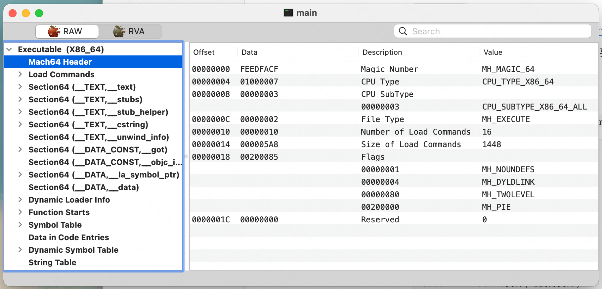
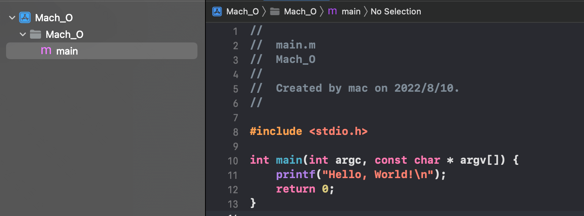
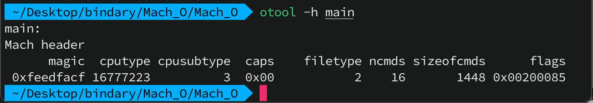
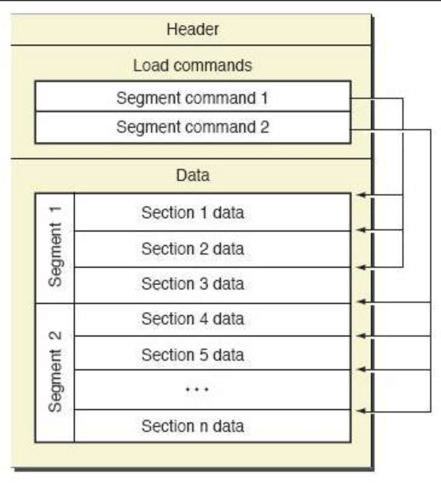
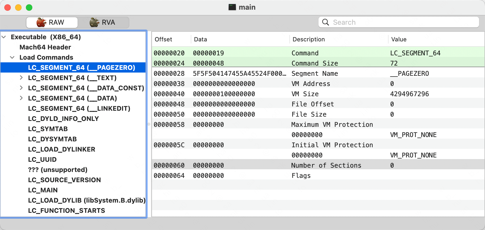
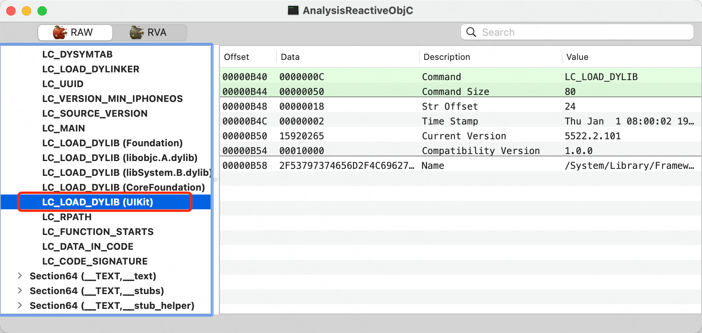
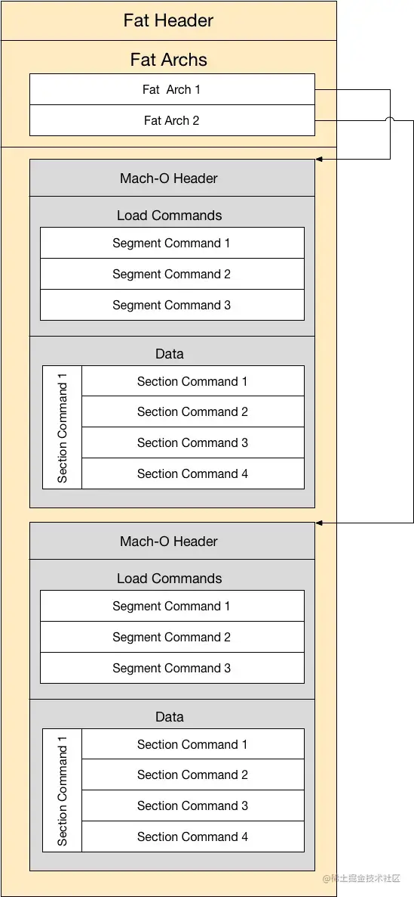

[Mach-O文件结构分析](https://juejin.cn/post/7045928743310721037)

**前言**: `Mach-O` 是 `iOS/macOS` 系统上应用程序的文件格式。

**分析`Mach-0`文件的工具**

- `MachOView`

  免费开源的 `Mach-O` 文件分析工具。[Github链接](https://github.com/gdbinit/MachOView)、[网盘链接]()

  注: 安装好`MachOView`后，打开软件后需要把可执行文件拖动到`MachOView`软件上才能查看`Mach-O`结构

  

- `otool`

  此为命令行的方式，具体参数可以使用 `man` 进行查看

  ```shell
  # command
  man otool
  
  # **** #
  -h Display the Mach header. 
  -l Display the load commands.
  ...
  
  # 查看 Header
  otool -h Mach-O文件(可执行文件)
  ```

  新建一个命令行工程

  

生成`Mach0-O`文件

```shell
clang -S fobjc-arc main.m  # 生成汇编文件(.s)
clang -fmodules -c main.s -o main.o # 汇编文件生成目标文件
clang main.o -o main  # 将目标文件转成可执行文件
```



也可以`Command+B`编译工程，然后在Xcode的`Products`文件夹中`Show in Finder`定位到编译生成的产物，再右键 => 显示包内容即可拿到生成的可执行文件。

**Mach-O结构**



如上图所示，`Mach-O` 文件由三部分组成

| 名称                      | 作用                                                         |
| ------------------------- | ------------------------------------------------------------ |
| Mach-O头部(`Header`)      | 保存了 `CPU` 架构、大小端序、文件类型、加载命令数量等一些基本信息 |
| 加载命令(`Load commands`) | 指定了文件的逻辑结构和文件在虚拟内存中的布局                 |
| 数据块(`Data`)            | `Load Commands` 中定义的 `Segment` 的原始数据                |

**Header**

> `Mach-o` 头部（`Header`）保存了 `CPU` 架构、大小端序、文件类型、加载命令数量等一些基本信息，用于校验 `Mach-O` 文件的合法性和确定文件的运行环境。

在 `Xcode` 中按快捷键 `⌘ + Shift + o` ，输入 `mach-o/loader.h`，即可找到头部的定义。`32` 位和 `64` 位架构的 `CPU` 分别使用 `mach_header` 与 `mach_header_64` 结构体来描述 `Mach-O` 头部，本文所述内容均以 `64` 位为主，定义如下：

```c
/*
 * The 32-bit mach header appears at the very beginning of the object file for
 * 32-bit architectures.
 */
struct mach_header {
	uint32_t	magic;		/* mach magic number identifier */
	cpu_type_t	cputype;	/* cpu specifier */
	cpu_subtype_t	cpusubtype;	/* machine specifier */
	uint32_t	filetype;	/* type of file */
	uint32_t	ncmds;		/* number of load commands */
	uint32_t	sizeofcmds;	/* the size of all the load commands */
	uint32_t	flags;		/* flags */
};

/* Constant for the magic field of the mach_header (32-bit architectures) */
#define	MH_MAGIC	0xfeedface	/* the mach magic number */
#define MH_CIGAM	0xcefaedfe	/* NXSwapInt(MH_MAGIC) */

/*
 * The 64-bit mach header appears at the very beginning of object files for
 * 64-bit architectures.
 */
struct mach_header_64 {
	uint32_t	magic;		/* mach magic number identifier */
	cpu_type_t	cputype;	/* cpu specifier */
	cpu_subtype_t	cpusubtype;	/* machine specifier */
	uint32_t	filetype;	/* type of file */
	uint32_t	ncmds;		/* number of load commands */
	uint32_t	sizeofcmds;	/* the size of all the load commands */
	uint32_t	flags;		/* flags */
	uint32_t	reserved;	/* reserved */
};

/* Constant for the magic field of the mach_header_64 (64-bit architectures) */
#define MH_MAGIC_64 0xfeedfacf /* the 64-bit mach magic number */
#define MH_CIGAM_64 0xcffaedfe /* NXSwapInt(MH_MAGIC_64) */
```

字段说明:

<font color=#F00>magic</font>: 魔数（特征字段），用于标识当前设备是大端序还是小端序。由于 `iOS` 是小端序，所以其被定义常量 `MH_MAGIC_64`，即固定取值为 `0xfeedfacf`;

<font color=#F00>cputype</font>: 标识 `CPU` 架构，类型为 `cpu_type_t`，其定义于 `mach/machine.h`;

<font color=#F00>cpusubtype</font>： 标具体的 `CPU` 架构，区分不同版本的处理器，类型为 `cpusubtype`，其定义于 `mach/machine.h`;

<font color=#F00>filetype</font>: `Mach-O` 文件类型（如：可执行文件、库文件等），可在 `mach-o/loader.h` 中找到具体定义和取值。常见的有 `MH_OBJECT`（中间目标文件）、`MH_EXECUTE`（可执行文件）、`MH_DYLIB`（动态链接库）、`MH_DYLINKER`（动态链接器）;

<font color=#F00>ncmds</font>: `Load Commands` 的数量;

<font color=#F00>sizeofcmds</font>: `Load Commands` 所占的总字节大小;

<font color=#F00>flags</font>: 一些标识信息，可在 `mach-o/loader.h` 中找到具体定义和取值。其中 `#define MH_PIE 0x200000` 值得注意，只会在文件类型为 `MH_EXECUTE` 时使用，表明开启 `ASLR`，用来增加程序安全性; 

<font color=#F00>reserved</font>: 系统保留字段。

注： `ASLR` ，全称 `Address Space Layout Randomization`，地址空间布局随机化。顾名思义，每次启动程序，加载的地址都会随机变化，需要对代码地址进行计算修正才可正常访问。


**Load commands**

> 加载命令（`Load Commands`）紧跟 `Header`之后，指定了文件的逻辑结构与文件在虚拟内存中的布局，明确地告诉加载器如何处理二进制数据。有些命令由内核处理，有些由动态链接器(`dyld`)处理。

`Load commands` 可以当作是多个 `command` 的集合，每一个 `command` 的类型 `cmd` 都是以 `LC_` 为前缀的常量，如 `LC_SEGMENT`。



在头文件 `mach-o/loader.h` 中可以查看每个 `command` 的定义，每个 `command` 都拥有自己的独立结构，但是其结构的前两个字段固定为 `cmd` 和 `cmdsize`

```c
struct load_command {
	uint32_t cmd;		// 当前Load command的类型，如 LC_SEGMENT
	uint32_t cmdsize;	// 当前Load command的大小， 保证其可被正确解析
};
```

```c
struct segment_command { /* for 32-bit architectures */
	uint32_t	cmd;		/* LC_SEGMENT */
	uint32_t	cmdsize;	/* includes sizeof section structs */
	...
};

struct segment_command_64 { /* for 64-bit architectures */
	uint32_t	cmd;		/* LC_SEGMENT_64 */
	uint32_t	cmdsize;	/* includes sizeof section_64 structs */
	...
};
...
```

根据不同的命令类型（`cmd`），内核会使用不同的函数进行解析。


下面对几个重要的命令类型进行详解。

**LC_SEGMENT**

`LC_SEGMENT` 和 `LC_SEGMENT_64` 为段加载命令，每个段都定义了一个虚拟内存区域，动态链接器负责把这个区域映射到进程地址空间。其结构定义如下所示：

```c
struct segment_command_64 { /* 64位架构 /
	uint32_t	cmd;		/* 当前command类型 */
	uint32_t	cmdsize;	/* 当前command的大小 */
	char		segname[16];	/* 段名称，占16个字节 */
	uint64_t	vmaddr;		/* 段的虚拟内存地址 */
	uint64_t	vmsize;		/* 段的虚拟内存大小 */
	uint64_t	fileoff;	/* 段在文件中的偏移量 */
	uint64_t	filesize;	/* 段在文件中的大小 */
	vm_prot_t	maxprot;	/* 段页面的最高内存保护级别 */
	vm_prot_t	initprot;	/* 段页面的初始内存保护级别 */
	uint32_t	nsects;		/* 段中包含节的数量，一个段可以包含0个或多个节 */
	uint32_t	flags;		/* 段的标志消息(SG_HIGHVM、SG_FVMLIB) */
};
```

<font color=#FF2727 size=4>系统从 `fileoff` 处加载大小为 `filesize` 的内容到虚拟内存 `vmaddr` 处，大小为 `vmsize`, 段页面的权限由 `initprot` 进行初始化，权限可被修改，但不可超过 `maxprot` 的值。</font>

上图中的四个段作用如下：

<font color=#409FFF>__PAGEZERO</font>: 静态链接器创建了 `__PAGEZERO` 作为可执行文件的第一个段，该段在虚拟内存中的位置和大小皆为 `0`，不能读写、不能执行，用来处理空指针。

<font color=#409FFF>__TEXT</font>: 包含了可执行的代码和其他一些只读数据。静态链接器设置该段的虚拟内存权限为可读、可执行，进程被允许执行这些代码，但不能修改。

<font color=#409FFF>__DATA</font>: 包含了将会被更改的数据。静态链接器设置该段的虚拟内存权限为可读写。

<font color=#409FFF>__LINKEDIT</font>:包含了动态链接库的原始数据，如符号、字符串和重定位表条目等。

`64` 位的节(`section`)结构定义：

```c
struct section_64 { /* 64位架构 */
	char		sectname[16];	/* 节的名称，占 16 个字节 */
	char		segname[16];	/* 节指到的段名称，占 16 个字节 */
	uint64_t	addr;		/* 节在内存中的起始位置 */
	uint64_t	size;		/* 节占用的内存大小 */
	uint32_t	offset;		/* 节的文件偏移地址 */
	uint32_t	align;		/* 节的字节对齐大小 */
	uint32_t	reloff;		/* 重定位入口的文件偏移 */
	uint32_t	nreloc;		/* 需要重定位的入口数量 */
	uint32_t	flags;		/* 节的类型和属性 */
	uint32_t	reserved1;	/* 系统保留字段 */
	uint32_t	reserved2;	/* 系统保留字段 */
	uint32_t	reserved3;	/* 系统保留字段 */
};
```

**LC_LOAD_DYLIB**

`LC_LOAD_DYLIB` 指向程序依赖库的加载信息，可以使用 `MachOView` 进行查看



`LC_LOAD_DYLIB` 的结构定义为 `dylib_command`

```c
struct dylib {
    union lc_str  name;			/* 依赖库的完整路径。动态链接器会使用此路径进行动态库加载 */
    uint32_t timestamp;			/* 依赖库构建时的时间戳 */
    uint32_t current_version;		/* 当前版本号 */
    uint32_t compatibility_version;	/* 兼容版本号 */
};

struct dylib_command {
	uint32_t	cmd;		/* LC_ID_DYLIB, LC_LOAD_{,WEAK_}DYLIB,
					   LC_REEXPORT_DYLIB */
	uint32_t	cmdsize;	/* cmd的大小，包含路径名字符串 */
	struct dylib	dylib;		/* the library identification */
};
```

`LC_LOAD_WEAK_DYLIB` 的结构也是 `dylib_command`，不同的是其声明的依赖库是可选的，即缺少声明的依赖库不会影响主程序的运行，而 `LC_LOAD_DYLIB` 声明的依赖库如果找不到，加载器会放弃并结束进程。

可以使用 `otool` 来查看有哪些依赖库

```shell
otool -arch x86_64 -L AnalysisReactiveObjC  # 如果是真机，x86_64 切换为 arm64即可

AnalysisReactiveObjC:
	/System/Library/Frameworks/Foundation.framework/Foundation (compatibility version 300.0.0, current version 1858.112.0)
	/usr/lib/libobjc.A.dylib (compatibility version 1.0.0, current version 228.0.0)
	/usr/lib/libSystem.B.dylib (compatibility version 1.0.0, current version 1311.100.3)
	/System/Library/Frameworks/CoreFoundation.framework/CoreFoundation (compatibility version 150.0.0, current version 1858.112.0)
	/System/Library/Frameworks/UIKit.framework/UIKit (compatibility version 1.0.0, current version 5522.2.101)
```

除了 `/System/Library/` 和 `/usr/lib` 这些系统路径外，还可能会遇到 `@rpath`、`@executable_path` 之类的路径

<font color=#F00>@executable_path</font>: 指可执行文件的目录

<font color=#F00>@rpath</font>: 由 `LC_RPATH` 加载指定，`iOS` 上通常为应用自身 `framework` 文件，默认为：`@executable_path/Framework`

这些路径可使用 `MacOS` 上提供的 `install_name_tool` 工具进行修改，注意：此操作对于未越狱平台注入动态库是必须掌握的！

```shell
# 修改依赖库路径(抄别人的例子，后续研究)
install_name_tool -change @rpath/Alamofire.framework/Alamofire @executable_path/Alamofire.framework/Alamofire LXFProtocolTool_Example
```

**通用二进制**

`Universal Binary`格式文件（通用二进制，也称胖二进制），实际上只是将不同架构的的 `Mach-O` 文件打包到一起，再在文件起始位置处加上 `fat_header` 结构来说明所支持的架构和偏移地址信息，其结构如下图所示：



头文件 `mach-o/fat.h` 中可查看通用二进制文件的定义：

```c
#define FAT_MAGIC    0xcafebabe
#define FAT_CIGAM    0xbebafeca /* NXSwapLong(FAT_MAGIC) */

struct fat_header {
    uint32_t magic;     /* 魔数（特征字段），其被定义常量 FAT_MAGIC，即固定取值为 0xcafebabe */
    uint32_t nfat_arch; /* 标识 Mach-O 文件包含的架构个数 */
};
```

`fat_header` 后紧跟 `fat_arch` 结构，有多少架构就会有多少 `fat_arch`，用于描述对应的 `Mach-O`文件的具体信息

```c
struct fat_arch {
    cpu_type_t  cputype; /* cpu specifier (int) */
    cpu_subtype_t    cpusubtype; /* machine specifier (int) */
    uint32_t    offset;  /* 指定对应架构相对于文件开头的偏移量 */
    uint32_t    size;    /* 指定对应架构数据的大小 */
    uint32_t    align;   /* 指定数据的内存对齐边界，取舍为 2 的 N 次方 */
};
```

`cputype` 和 `cpusubtype` 在前面已经提及过，这里就不赘述了

**参考资料**

- xnu源码

  [github](https://github.com/apple/darwin-xnu/)

  [苹果官方源码](https://opensource.apple.com/tarballs/xnu/)

- [《osx-abi-macho-file-format-reference》](https://github.com/aidansteele/osx-abi-macho-file-format-reference)