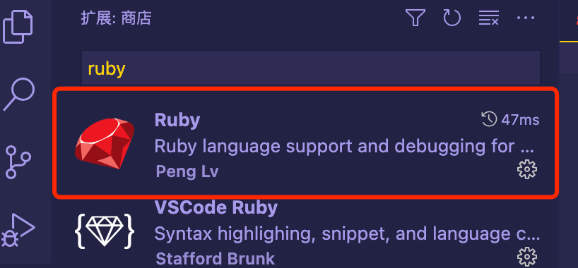

**①准备工作**

首先需要给Visual Code安装插件:



**②环境配置**

 ```ruby
  # 新建一个文件夹
  mkdir debugRuby
  cd debugRuby
  # 创建一个ruby文件
  touch main.rb
 ```

 编辑`main.rb`文件
  ```ruby
   str = "你好啊"
   puts str
  ```
  在debugRuby目录下创建`Gemfile`文件
  ``` ruby
  bundle init
  ```

编写`Gemfile`文件，指定调试工具
  ``` ruby
   source 'https://rubygems.org'
 
   gem 'ruby-debug-ide' # 调试工具
   gem 'debase', '0.2.5.beta2' # 调试工具
  ```

在debugRuby目录下再创建一个目录:`.vscode`(注意这是一个隐藏文件。最好使用终端命令创建)。在`.vscode`目录下创建一个名叫`launch.json`的配置文件，编写`launch.json`配置文件(用VSCode打开)
  ```ruby
   {
    "configurations": [
      {
        "name": "Deubg Ruby Program",
        "showDebuggerOutput": true,
        "type": "Ruby",
        "request": "launch",
        "useBundler": true,
        "cwd": "${workspaceRoot}", // cwd代表运行的目录，${workspaceRoot}指VSCode的工程目录
        "program": "${workspaceRoot}/main.rb", // 需要运行的代码
        "stopOnEntry": false
      }
    ]
   }
  ```

  终端进入debugRuby目录，执行安装命令
   ```ruby
   bundle install
   ```

如果没发生错误，就算安装调试命令成功了。
   #### 调试
  使用VSCode打开debugRuby目录，然后点击`运行` -> `调试`，就可以在终端看见运行结果了。
  
**断点调试**
  

#### 待续
  [Cocoapods源码调试](https://juejin.cn/post/7002215494459588615)