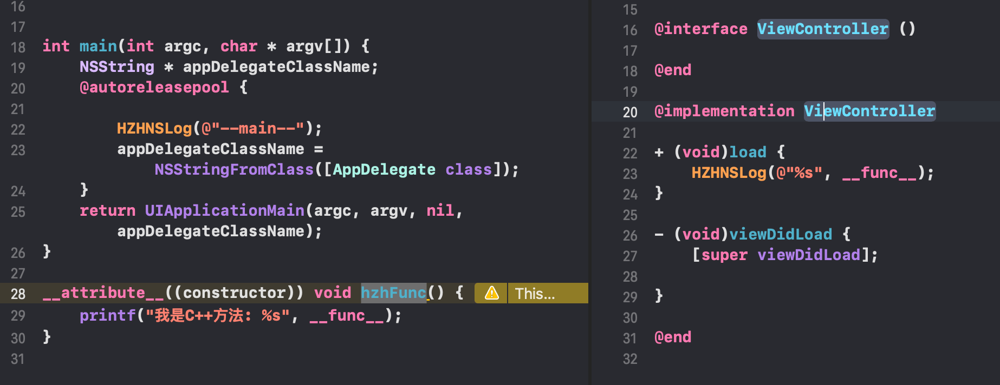

[dyld加载流程--应用程序的加载](https://juejin.cn/post/6936945078543843364)

[底层探索](https://www.yujiusheng.com/2021/07/08/iOS%E5%BA%95%E5%B1%82%E6%8E%A2%E7%B4%A2-dyld%E5%8A%A0%E8%BD%BD%E6%B5%81%E7%A8%8B/)

**前言**

看个🌰

创建一个`project`，在`ViewController`中重写了`load`方法，在`main.m`中加了一个`C++`方法，即`hzhFunc`，请问它们的打印先后顺序是什么？



```c
# 这样可以省略多余的日志信息
#ifdef DEBUG
#define HZHNSLog(format, ...) printf("%s\n", [[NSString stringWithFormat:format, ## __VA_ARGS__] UTF8String]);
#else
#define HZHNSLog(format, ...);
#endif
```


通过结果可以看出其顺序是 `load --> C++方法 --> main()`。为什么是这么一个顺序？按照常规的思维理解，`main`不是入口函数吗？为什么不是`main`最先执行？ 下面根据这个问题，我们来探索在走到`main`函数之前，到底还做了什么。

**① dyld简介**

`dyld`(`The dynamic link editor`)是`苹果的动态链接器`，负责程序的链接及加载工作，是苹果操作系统的重要组成部分，存在于`MacOS`系统的(`/usr/lib/dyld`)目录下。在应用被编译打包成可执行文件格式的`Mach-O`文件之后 ，交由`dyld`负责链接，加载程序。


App启动流程图如下


**② dyld_shared_cache**

由于不止一个程序需要使用`UIKit`系统动态库，所以不可能在每个程序加载时都去加载所有的系统动态库.为了优化程序启动速度和利用动态库缓存，苹果从`iOS3.1`之后，将所有系统库（私有与公有）编译成一个大的缓存文件，这就是`dyld_shared_cache`，该缓存文件存在iOS系统下的`/System/Library/Caches/com.apple.dyld/`目录下。

**③ dyld加载流程**

在前文的`dyldDemo`中,在`load方法`和`main方法`处加一个断点

[dyld源码地址](https://opensource.apple.com/tarballs/dyld/)

源码使用的是**852.2**版本

**④.1 _dyld_start**

小白


