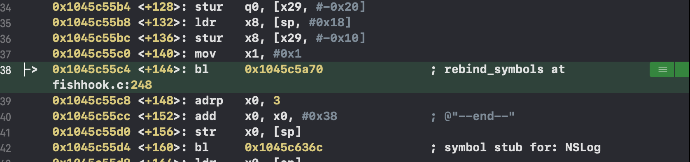
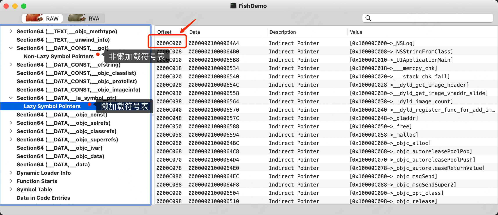
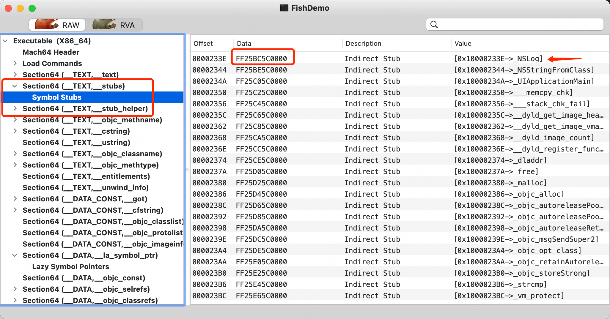
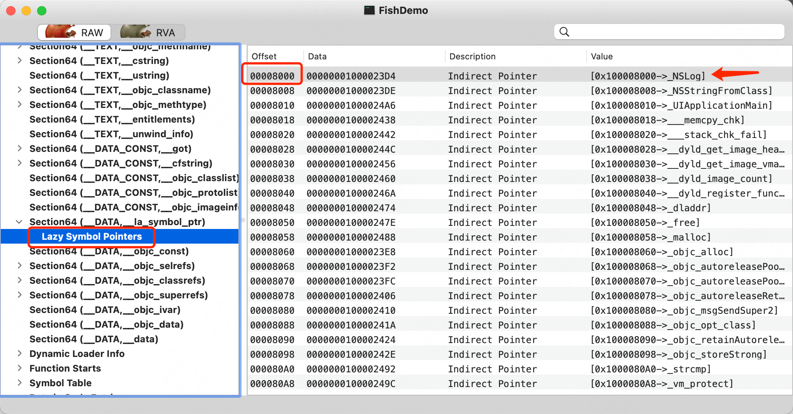

**前言**

fishhook是Facebook提供的一个动态修改链接mach-O文件的工具。利用MachO文件加载原理，通过修改懒加载和非懒加载两个表的指针达到C函数HOOK的目的。

在分析fishhook原理前，我们先来想两个问题：

① **Mach-O文件是被谁加载的？**

​     在程序启动的时候 Mach-O 文件(编译阶段生成的)会被 dyld(动态加载器)加载进内存。加载完 Mach-O 后，dyld接着会去加载 Mach-O 所依赖的动态库。

② **何为ASLR技术？**

​    地址空间布局随机化。它会让 Mach-O 文件加载的时候是随机地址。有了这个技术，Mach-O 文件每次加载进内存的时候地址都是不一样的。主要是为了防止逆向技术。Mach-O 文件里只有我们自己写的函数，<font color=#FF2727>动态库的函数是不在 Mach-O 文件里的。也就是说程序每次启动从 Mach-O 文件到动态库函数的偏移地址都是变化的</font>。<font color=#222222 size=4>那么问题来了，我们如何在Mach-O文件里找到动态库的函数地址呢？或者说Mach-O文件是如何链接外部函数的呢？</font>

程序的底层都是汇编，汇编代码都是写死的内存地址。我们该怎么找呢？而且系统的动态库在内存里面的地址是不固定的，每次启动程序的时候地址都是随机的。苹果为了能在 Mach-O 文件中访问外部函数，采用了一个叫做PIC(位置代码独立)的技术。当你的应用程序想要调用 Mach-O 文件外部的函数的时候，或者说如果 Mach-O 内部需要调用系统的库函数时，Mach-O 文件会：

> ① 先在 Mach-O 文件的 _DATA 段中建立一个指针（8字节的数据，放的全是0。
>
> ② dyld 会动态的进行绑定！将 Mach-O 中的 _DATA 段中的指针，指向外部函数。

<font color=#FF600>**我们经常说符号，其实 _DATA 段中建立的指针就是符号。fishhook的原理其实就是：将指向系统方法（外部函数）的符号重新进行绑定指向内部的函数(自己重新自定义的函数)。这样就把系统方法与自己定义的方法进行了交换。这也就是为什么C的内部函数修改不了，自定义的函数修改不了，只能修改 Mach-O 外部的函数**。</font>

以 NSLog 为例，看 fishhook 是如何通过修改懒加载和非懒加载两个表的指针达到C函数HOOK的目的(NSLog 是在懒加载表里)。NSLog隶属于Foundation.framework动态库。

>*对于非懒加载符号表，dyld会立刻马上去链接动态库*
>
>*对于懒加载符号表，dyld会在执行代码的时候去动态的链接动态库*(执行某句代码的时候才去链接动态库的意思？)

[fishhook地址](https://github.com/facebook/fishhook)

创建一个iOS项目: FishDemo，并拖入`fishhook.h`和`fishhook.c`文件。在`ViewController.m`文件中编写测试代码


```objective-c
- (void)viewDidLoad {
    [super viewDidLoad];
    
    // 这里必须要先加载一次NSLog，如果不写NSLog，符号表里面根本就不会出现NSLog函数的地址
    NSLog(@"--start--");

    // 定义rebinding结构体
    struct rebinding nslogBind;
    // 函数的名称
    nslogBind.name = "NSLog";
    // 新的函数地址
    nslogBind.replacement = myMethod;
    // 保存原始函数地址变量的指针
    nslogBind.replaced = (void *)&old_nslog;

    // 定义数组
    struct rebinding rebs[] = {nslogBind};
    /**
     参数1: 存放rebinding结构体的数组
     参数2: 数组的长度
     */
    rebind_symbols(rebs, 1);
  
    NSLog(@"--end--");
    NSLog(@"--end--");
}

// 函数指针，用来保存原始的函数地址
static void (*old_nslog)(NSString *format, ...);

// 新的NSLog
void myMethod(NSString *format, ...) {
    //再调用原来的
    old_nslog(@"hook上了！--");
}
```

打印结果:

```objective-c
--start--
hook上了！--
hook上了！--
```

可以看到，系统函数`NSLog()`被hook住了。

首先，系统的 NSLog 是在 `rebind_symbols(rebs, 1)` 方法里替换的，我们可以在这个方法上打个断点。我们可以先看一下，这个函数执行之前，NSLog 在懒加载符号表中的地址是多少，然后在执行之后，它有没有变成我们自己的符号表的地址。



那么问题来了，如何找到`NSLog`在懒加载符号表中的地址呢？

<font color=#F00>NSLog在懒加载符号表中的地址 = Mach-O文件的偏移地址 + NSLog懒加载符号表在Mach-O文件中的偏移地址</font>

<font color=#FF6000>① 符号表在Mach-O中的偏移地址</font>



<font color=#FF6000>② Mach-O文件的偏移地址(程序的地址)</font>

```shell
image list
```


查看符号表绑定的地址: 这个地址其实就是指向外部函数的指针的地址，也就是动态缓存区里面 NSLog函数的真实地址。


下面来看下在使用fishhook绑定符号前后NSLog的变化


<font color=#F00 size=4>第一次调用NSLog后</font>


获取到NSLog在懒加载符号表中的地址后，并使用反汇编得到函数


<font color=#F00 size=4>第二次调用NSLog后(hook之后)</font>


从图中可以看到，虽然NSLog在懒加载符号表中的地址不变，但是其存储的值(函数地址)被修改了: `0x01867e7938` => `0x0102d0160c`。


先用Any iOS Device(arm 64)进行编译，然后使用真机运行。获取到Mach-O文件即可看见Lazy Symbol Pointers符号表了。

**ASLR例子**

第一次启动


第二次启动


印证了上文所说的：<font color=#F00 size=4>Mach-O 文件每次加载进内存的时候地址都是不一样的</font> dyld加载Mach-O文件时地址不是固定的。


**Mach-O补充**

- Rebase

  <font color=#F00>**stubs桩**</font>

   stub 意为桩位代码占位，本质上是一小段会直接跳入 lazybinding 的表对应项指针指向的地址的代码。而 stubs_helper 是辅助函数，上述提到的 lazybinding 的表中对应项的指针在没有找到真正的符号地址的时候，都指向这里。

  还是以上面的Demo为例，在NSLog出戳一个断点

  

  运行程序，进入反汇编模式(选Xcode菜单`Debug->Workflow->Always Show Disassembly`)(运行前，先把上次生成的Mach-O文件清除一下，Product -> Show Build Folder in Finder，删除对应的缓存文件即可)

  

  

  查看`0x100d0d33e`位置所保存的值

  

  使用MachOView工具验证一下

  

   在TEXT区域(代码区), 可以看到编译器为动态库的符号设置了对应的stub, 每个stub占用6个字节(仅指x86_64模式下编译出来的), 存放的是一条汇编指令jmpq。

  继续输入命令`si`单步进入`callq`里面

  

  其中`jmpq *5cbc(%rip)`, 就是stub存放的数据 `FF25`(jmpq 指针)`BC5C`(大端写法，需要转为小端)。执行这条指令之后，rip(指令寄存器)的值是(偏移6个字节)`233E+6=2344, 0x2344+0x5cbc = 0x8000`。整条指令的意思就是跳转到`0x8000`这个地址存放的值上(这个概念和指针一样, 0x8000这个地址存放的是一个内存地址), 结合MachOView和调试的汇编代码, 可以看到**首次调用_NSlog这个函数, 会跳转到0x23D4这个地址上**

  

  使用Hopper Disassembler验证一下

  

  可以看到调用**NSLog**时是调用了 imp__stubs_NSLog指令

  右键行数即可跳转到指令定义处

  

  

  继续往下进到**_NSLog_ptr**里面

  

  和上面使用**ni**命令调试的结果是相同的。

  

  可以看到落入了 __stub_helper 中。用 Hopper 查看对应地址可以看到__stub_helper 中的指令都指向了 stub_helper 的头部，进而走向 dyld_stub_binder。

  

  进而看到 dyld_stub_binder 位于非 lazy 绑定符号指针表中

  

  

- Rebase

  这里真实的内存虚拟地址不是0x23D4, 仅为了调试方便, xcode调试模式运行的程序, 进程起始地址固定在0x100000000, 也就是0+4GB(其中4GB是__PAGEZERO陷阱区__)。<font color=#F00 size=4>一般情况下, 由于空间随机化的存在, 在dyld加载可执行文件到内存之后, 会对所有指向进程内的符号地址进行调整, 比如0x23D4这个地址, 调整为进程头部随机化后的地址xxxx+0x23D4, 可以看出来, 因为符号_NSLog的地址需要进程被加载后才能确定， 所以被放到__DATA区, 方便修改， 修改的过程称为rebase。</font>

- Binding(请看下面总结)

**③ 总结**

<font color=#409FFF size=4>首先可执行文件在调用 NSLog 等外部符号时，指令并没有与 NSLog 的实现地址进行绑定，而是利用 stub 放了桩指令，桩指令指向 la_symbol_ptr 表中；而 la_symbol_ptr 表中的指针在未绑定符号地址时，都指向 stub_helper，而 __stub_helper 作为辅助函数都指向nl_symbol_ptr 中的 dyld_stub_binder(可以理解为在编译阶段NSLog的实现地址是指向stub_helper中的)</font>

如在编译时，地址**0x0000000100002490**就是一个虚拟地址，不是NSLog函数的实现地址


<font color=#409FFF size=4>当程序执行时在第一次调用时走到 dyld_stub_binder，然后进行一个真正的符号 binding，并将 la_symbol_ptr 表中对应的符号从指向 stub_helper 修改为绑定真实调用地址，从而就实现了 lazy binding，后续调用时就会经由 stub、la_symbol_ptr 并拿到地址，不需要再走到 dyld_stub_binder中 了。</font> <font color=#F00>怎么验证不再走dyld_stub_binder??</font>

当程序运行时，通过命令`image list`获取到可执行文件的ASLR地址，然后查看偏移地址所对应的值


可以看到，NSLog函数的调用地址已经被替换成了真实地址了。

**fishhook 也正是利用了这个原理，调整 la_symbol_ptr 表中的指针走向，从而实现 C 函数的 hook。**

**参考资料**

[《iOS逆向工程-fishhook原理》](https://www.jianshu.com/p/4d86de908721)

[冬瓜](https://www.desgard.com/iOS-Source-Probe/C/mach-o/Mach-O%20%E6%96%87%E4%BB%B6%E6%A0%BC%E5%BC%8F%E6%8E%A2%E7%B4%A2.html)


https://zhuanlan.zhihu.com/p/368343903


https://github.com/Desgard/iOS-Source-Probe/blob/master/C/fishhook/%E5%B7%A7%E7%94%A8%E7%AC%A6%E5%8F%B7%E8%A1%A8%20-%20%E6%8E%A2%E6%B1%82%20fishhook%20%E5%8E%9F%E7%90%86%EF%BC%88%E4%B8%80%EF%BC%89.md