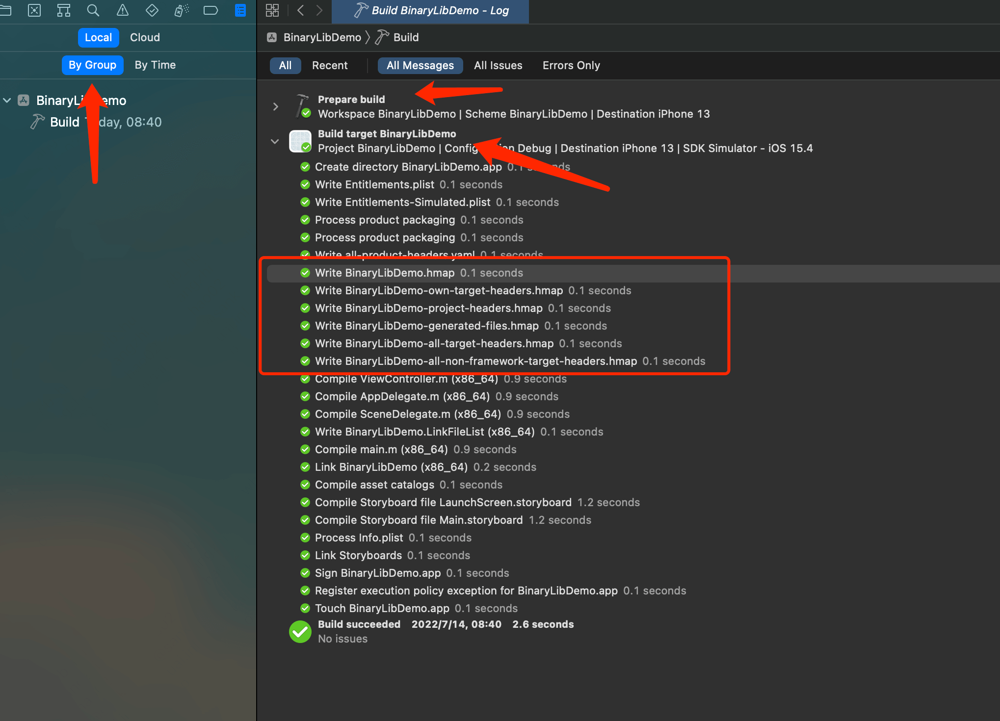
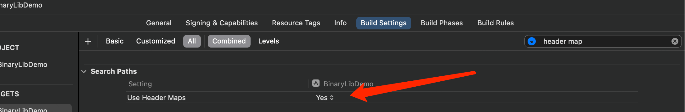

**工程的编译 **

当我们在build工程时，一般会经历一下2个步骤：`Prepare build` 和` Build target`

其中在`Build target`阶段，可以看到其中有0.6s的时间用于`Write xx.hmap`。试想，如果我们可以提前准备好这些`xx.hmap`是不是就可以节省0.6s的时间？假如项目中有100个pod文件(每个pod文件都会有相关的`xx.hmap`文件)，就可以节省大约6s!。

**hmap**

即headerMap,头文件映射。Xcode默认是开启了Header Maps的(即编译时默认生成)。

()

