**前言**

我们平时编写的iOS程序的入口函数都是`main.m`文件里面的`main`函数，但是这就是`App`的生命起点了吗？玩过逆向的`iOSer`都知道可以往`+load`方法注入代码来进行安全攻防，而`+load`方法先于`main`函数执行，那么`main`函数之前都发生了哪些有趣的事呢？

**知识储备**

我们常用的库文件格式有`.a、.dylib、.framework、.xcframework`

 `.a`:静态库

 `.dylib`:传统上说的动态库

`.framework`: 既有静态库，又有动态库

`.xcframework`: 是苹果`2018年推出`来的，可以将`不同架构`的`库整合到一起`。好处就是`模拟器，真机可以通用`，上架AppStore，`不需要将xcframework中的真机架构分离`，`.framework还需要用脚本分离` 。我们这里主要介绍`.a`和`.framework`格式的`静态库` 。

<font color=#F00>库(Library)说白了就是一段编译好的二进制代码，加上头文件就可以供别人使用</font>。

**库的好处**

1.某些`代码`需要`给别人使用`，但是我们`不希望`别人`看到源码`，就`需要以库`的形式`进行封装`，只`暴露出头文件。

2.对于某些`不会进行大的改动的代码`，我们想`减少编译的时间`，就可以把它`打包成库`，因为`库是已经编译好的二进制`了，使用的时候`只需要Link一下`，`不会浪费编译时间`。`link`又分为`静态`和`动态`两种方式。

静态库即静态链接库，可以简单的看成`一组目标文件的集合`。即`很多目标文件`经过`压缩打包`后形成的文件。`Windows下的 .lib`，`Linux 和 Mac 下的 .a`，`Mac独有的.framework`。缺点是浪费内存和磁盘空间，模块更新困难(编译时会拷贝到目标程序中，因为是目标文件，目标程序由目标文件构成)。

`动态库`在`编译时`并`不会`被`拷⻉到目标程序`中，目标程序中只会`存储指向动态库的引用`。等到`程序运行时`，`动态库`才会被`真正加载进来`。格式有：`.framework、.dylib、.tdb`。缺点是会导致一些性能丢失(但是可以优化，比如延迟绑定技术(Lazy Binding))。

**静态库的制作**

- 无资源文件

  以从github上下载的`AFNetworking`源码为例

  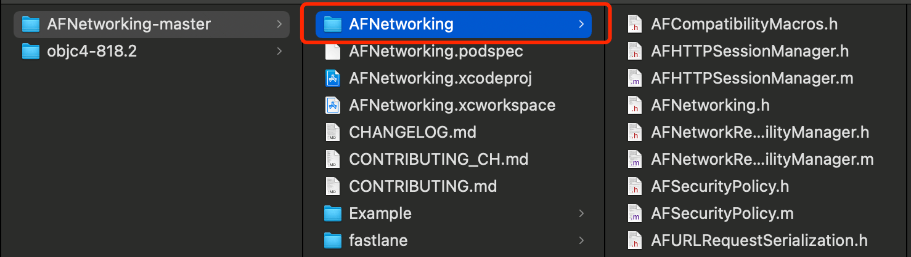

  新建一个静态库工程

  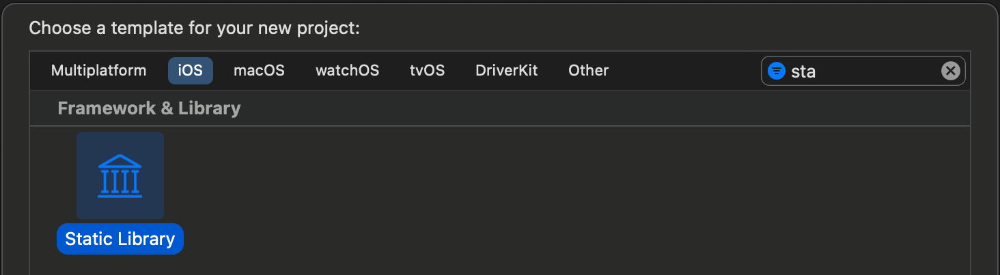

  删除生成的文件，并拖入`AFNetworking`文件夹

  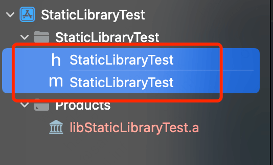

  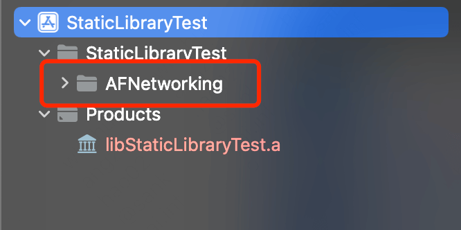

  配置静态库对外暴露的头文件(最好把.h文件全部暴露出去)

  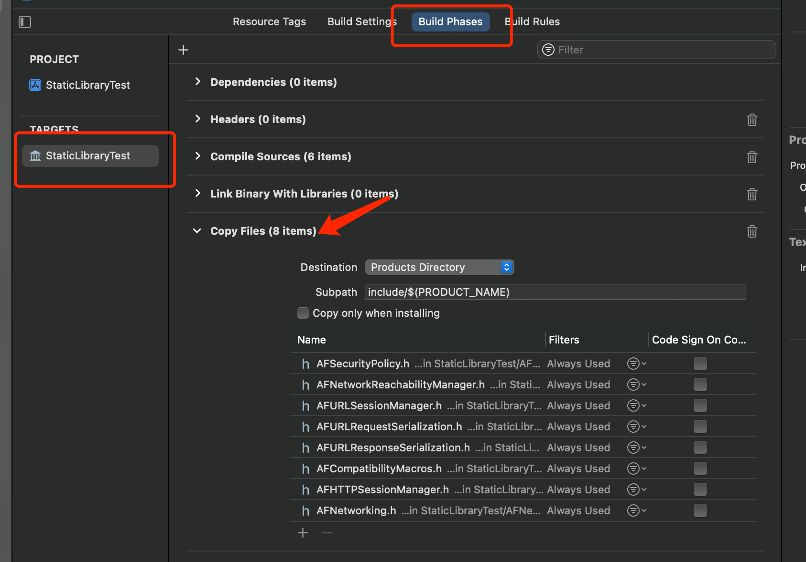

  设置架构，需要把Debug和Release两种模式都是设置为NO。否则只有真机可以使用编译出来的静态库

  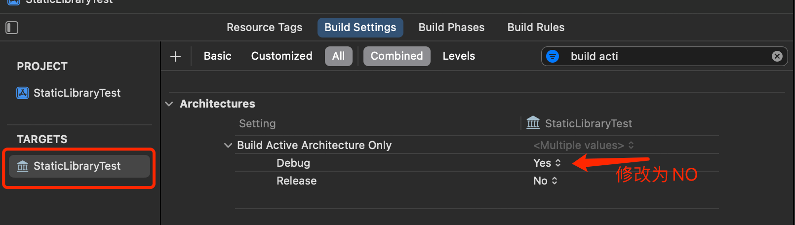

  编译模拟器包和真机包

  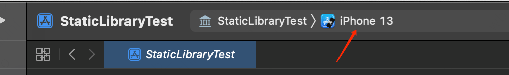

  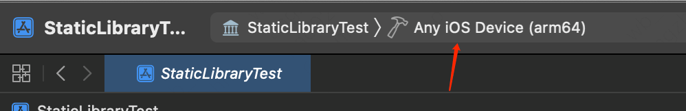

  编译成功后，可以看到静态库由红色变为正常了

  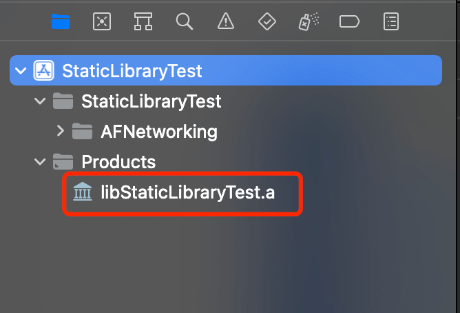

  鼠标点击生成的`libStaticLibraryTest.a`文件，并`Show in Finder`，找到生成的静态库文件

  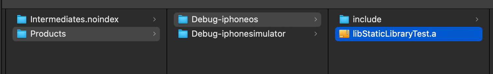

  合并生成的架构(此处比较简略，网上很多资料)

  查看静态库架构

  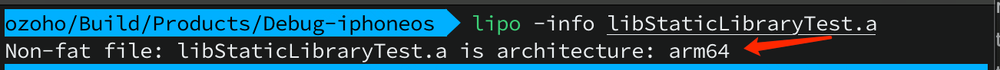

  把头文件和`.a`放在统一文件夹，即可使用

  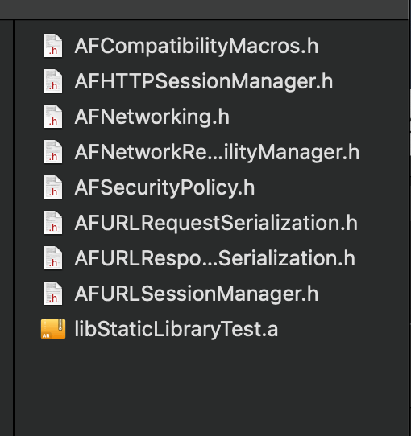

  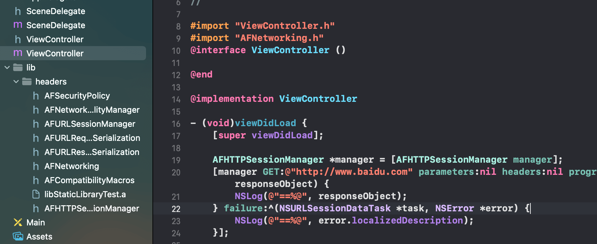

- <font color=#F00>todo : 有资源文件打包生成静态库</font>

**静态库的验证**

验证`.a`文件是`.o`文件的合集，使用`ar`命令

```shell
ar -t libAFNetworking.a
```

如果出现下列结果:

```shell
ar: libAFNetworking.a is a fat file (use libtool(1) or lipo(1) and ar(1) on it)
ar: libAFNetworking.a: Inappropriate file type or format
```

说明这个`.a`文件包含多种架构。

```shell
otool -Vf libAFNetworking.a # 查看静态库文件的架构
```

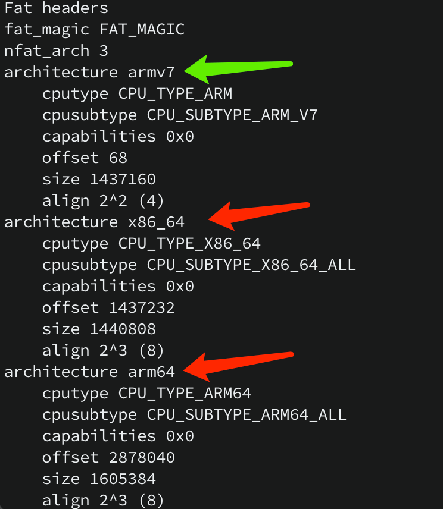

此时使用指令分离出所需的架构的静态库：

```shell
lipo libAFNetworking.a -thin armv7 -o lib_armv7.a
```

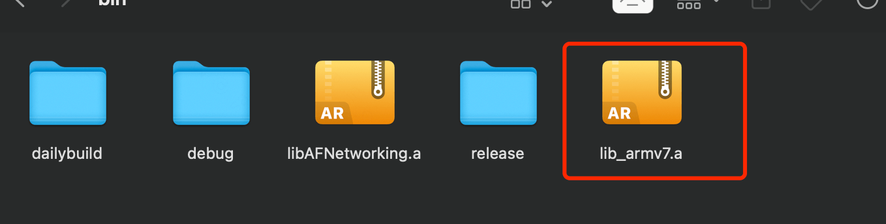

对只有`armv7`架构的`lib_armv7.a`静态库使用查看命令:

```shell
ar -t lib_armv7.a
```

生成结果如下

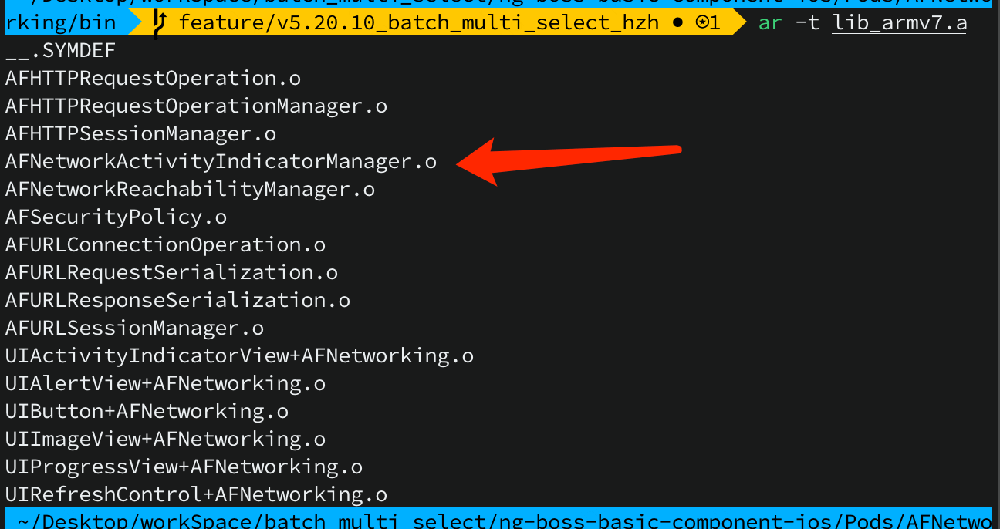

可以看到`lib_armv7.a`是`.o`文件的合集。

**动态库的制作**

[参考文章](https://www.jianshu.com/p/1c7bcf5ddb99)


