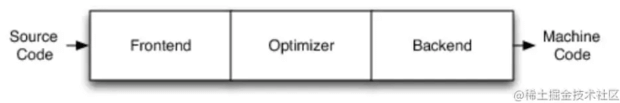

# LLVM编译流程

本文主要理解LLVM的编译流程。

##### 理解什么是编译器

**① Python案例**
使用Mac终端执行一段Python代码:

```python
python helloDemo.py
```

即可执行一段Python脚本。

**② C案例**

```c
// vim helloDemo.c
#include <stdio.h>
int main() {
   printf("hello\n");
   return 0;
}
```

使用`Clang`进行编译: `clang helloDemo.c`，生成`a.out`文件。


`file a.out`查看文件,发现`.out`文件是：`64位`的`Mach-O`可执行文件，当前`clang`出来的是`x86_64`架构，mac电脑可读. 所以可以`./a.out`直接执行：


第一个案例Python为`解释性语言`: 生成的是数据，不是0、1组合，机器也能直接识别。
第二个案例中的C为`编译性语言`: 不能直接执行，需要编译器将其转换成机器识别语言。编译后输出的是指令（0、1组合），cpu可直接执行指令。
**编译器的作用，就是将高级语言转化为机器能够识别的语言(可执行文件)**。

**LLVM概述**
LLVM是架构编译器（compiler）的框架系统，以C++编写而成，用于优化以任意程序语言编写的程序的编译时间（compile-time）、链接时间(link-time)、运行时间（run-time）以及空闲时间（idle-time），对开发者保持开放，并兼任已有脚本。LLVM计划启动于2000年,最初由美国UIUC大学的Chris Lattner博士主持开展。2006年Chris Lattner加盟Apple Inc.并致力于LLVM在Apple开发体系中的应用.Apple也是LLVM计划的主要资助者。目前LLVM已经被苹果iOS开发工具、Xilinx Vivado、Facebook、Google等各大公司采用.

**传统编译器的设计**
源码 `Source Code` + 前端 `Frontend`+ 优化器 `Optimizer` + 后端`Backend`（代码生成器 `CodeGenerator`）+ 机器码 `Machine Code`，如下图所示:



`编译器前端(Frontend)`：编译器前端的任务是解析源代码（编译阶段），它会进行 词法分析、语法分析、语义分析、检查源代码是否存在错误，然后构建抽象语法树（Abstract Syntax Tree AST）。LLVM的前端还会生成中间代码（intermediate representation，简称IR），可以理解为LLVM是编译器 + 优化器， 接收的是IR中间代码，输出的还是IR，给后端，经过后端翻译成目标指令集
`优化器(Optimizer)`：优化器负责进行各种优化，改善代码的运行时间，例如消除冗余计算等
`后端(Backend)/(代码生成器 Code Generator)`：将代码映射到目标指令集，生成机器代语言，并且进行机器代码相关的代码优化。

**iOS的编译器架构**
`Objective C/C/C++`使用的编译器前端是Clang，Swift是swift，后端都是LLVM.


**LLVM的设计**
当编译器决定支持多种源语言或多种硬件架构时,`LLVM`最重要的地方就来了.其他的编译器如`GCC`,它方法非常成功,但由于它是作为整体应用程序设计的,因此它们的用途受到了很大的限制.
`LLVM`设计的最重要方面是，`使用通用的代码表示形式（IR）`，它是用来在编译器中表示代码的形式，所以`LLVM`可以为任何编程语言独立编写前端，并且可以为任意硬件架构独立编写后端，如下所示:


通俗的一句话理解就是：`LLVM`的设计是`前后端分离`的，无论前端还是后端发生变化，都不会影响另一个。

**Clang简介**
`Clang`是`LLVM`项目中的一个子项目，它是基于`LLVM`架构图的`轻量级编译器`，诞生之初是为了替代`GCC`，提供更快的编译速度，它是负责`C、C++、OC语言的编译器`，属于整个LLVM架构中的 `编译器前端`，对于开发者来说，研究Clang可以给我们带来很多好处。

**LLVM编译流程**

新建一个`Mac OS`的命令行程序:

```c
#import <stdio.h>
#define AGE 30

int main(int argc, const char * argv[]) {
    @autoreleasepool {
        int a = 10;
        int b = 20;
        printf("%d\n", a + b + AGE);
    }
    return 0;
}
```

**① 打印源码的编译阶段**

`cd`到`main.m`所在的文件夹，使用`clang -ccc-print-phases main.m`命令查看`main.m`的编译步骤：


`编译流程`分为以下7步:

`0: input, "main.m", objective-c：`
输入文件：找到源文件

`1: preprocessor, {0}, objective-c-cpp-output：`
预处理：宏的展开，头文件的导入

`2: compiler, {1}, ir：`
编译：词法、语法、语义分析，最终生成IR

`3: backend, {2}, assembler ()：`
汇编： LLVM通过一个个的Pass去优化，每个Pass做一些事，最后生成汇编代码

`4: assembler, {3}, object：`
目标文件

`5: linker, {4}, image：`
链接： 链接需要的动态库和静态库，生成可执行文件

`6: bind-arch, "x86_64", {5}, image：`
架构可执行文件：通过不同架构，生成对应的可执行文件

**optimizer优化并没有作为一个独立阶段，在编译阶段内部完成的**。

**② 预处理阶段**
这个阶段主要是处理包括`宏的替换`，`头文件的导入`，可以执行如下命令，执行完毕可以看到头文件的导入和宏的替换
在相同路径执行命令: `clang -E main.m >> main2.m`，打开`main2.m`文件找到相应的代码:

```c
extern int __vsnprintf_chk (char * restrict, size_t, int, size_t,
       const char * restrict, va_list);
# 400 "/Applications/Xcode.app/Contents/Developer/Platforms/MacOSX.platform/Developer/SDKs/MacOSX.sdk/usr/include/stdio.h" 2 3 4
# 9 "main.m" 2

int main(int argc, const char * argv[]) {
    @autoreleasepool {

        int a = 10;
        int b = 20;
        printf("%d\n", a + b + 30);
    }
    return 0;
}
```

我们发现测试代码中的`宏AGE`，在`预编译阶段`完成了`替换`，变成了`30`

修改测试代码，给`int类型`取个别名`CJ_INT_64`，再次`预编译处理`：

```c
#import <stdio.h>
#define AGE 30

typedef int CJ_INT_64;
int main(int argc, const char * argv[]) {
    @autoreleasepool {
       
        CJ_INT_64 a = 10;
        CJ_INT_64 b = 20;
        printf("%d\n", a + b + AGE);
    }
    return 0;
}
```

发现`typedef`不会被替换

```c
extern int __vsnprintf_chk (char * restrict, size_t, int, size_t,
       const char * restrict, va_list);
# 400 "/Applications/Xcode.app/Contents/Developer/Platforms/MacOSX.platform/Developer/SDKs/MacOSX.sdk/usr/include/stdio.h" 2 3 4
# 9 "main.m" 2

typedef int CJ_INT_64;

int main(int argc, const char * argv[]) {
    @autoreleasepool {

        CJ_INT_64 a = 10;
        CJ_INT_64 b = 20;
        printf("%d\n", a + b + 30);
    }
    return 0;
}
```

**小结**:

- `typedef`在给数据类型取别名时，在预处理阶段`不会被替换掉`
- `define`则在预处理阶段`会被替换`，所以经常被用来进行代码混淆，目的是为了app安全，实现逻辑是：将app中核心类、核心方法等`用系统相似的名称进行取别名`，然后在预处理阶段就被替换了，来达到代码混淆的目的

**③ 编译阶段**

编译阶段主要是进行词法、语法、语义等的分析和检查，然后生成`中间代码IR`

**③.1 词法分析**

预处理完成后就会进行`词法分析`，这里会把代码切成一个个`Token`，比如大小括号、等于号还有字符串等,而且还标注了`位置`是`第几行`的第几个字符开始的(同编译原理词法分析阶段).

可以通过`clang -fmodules -fsyntax-only -Xclang -dump-token
s main.m`命令查看


**③.2 语法分析**

词法分析完成后就是`语法分析`，它的任务是`验证语法是否正确`，在词法分析的基础上将单词序列组合成各类此法短语，如程序、语句、表达式 等等，然后将所有节点组成抽象`语法树`（Abstract Syntax Tree, AST），`语法分析程序`判断`源程序`在`结构上`是否正确.

可以通过`clang -fmodules -fsyntax-only -Xclang -ast-dump main.m`命令查看语法分析的结果:


其中，主要说明几个关键字的含义

> - -FunctionDecl 函数
> - -ParmVarDecl 参数
> - -CallExpr 调用一个函数
> - -BinaryOperator 运算符

**③.3 生成中间代码IR**

完成以上步骤后，就开始生成中间代码`IR`了，`代码生成器`（Code Generation）会将`语法树自顶向下`遍历逐步翻译成`LLVM IR`.

便于理解，我们简化代码：

```c
#import <stdio.h>
int test(int a, int b) {
    return  a + b + 3;
}

int main(int argc, const char * argv[]) {
  
    int a = test(1, 2);
    printf("%d\n", a);
    return 0;
}
```

我们通过`clang -S -fobjc-arc -emit-llvm main.m`命令可以生成`.ll`文本文件(当前目录下)，使用VS查看`IR`代码(`OC`代码在这一步会进行`runtime`桥接、`property`合成、`ARC`处理等)。

**IR基本语法**

> - `@` 全局标识
> - `%` 局部标识
> - `alloca` 开辟空间
> - `align` 内存对齐
> - `i32` 32bit，4个字节
> - `store` 写入内存
> - `load` 读取数据
> - `call` 调用函数
> - `ret` 返回

下面是生成的中间代码`.ll`文件


当然，`IR`文件在`OC`中是可以进行优化的，一般Xcode中设置是在`target - Build Setting - Optimization Level`（优化器等级）中设置.(`Debug`模式默认`None` `[O0]无优化`，`Release`模式默认`Fastest`,`Smallest [Os]最快最小`)


`LLVM`的优化级别分别是`-O0 -O1 -O2 -O3 -Os`(第一个是大写`英文字母O`)，下面是带优化的生成中间代码IR的命令

```shell
clang -Os -S -fobjc-arc -emit-llvm main.m -o main.ll
```

这是优化后的`test`函数的中间代码


`xcode7`以后开启`bitcode`，苹果会做进一步优化，生成`.bc`的中间代码，我们通过优化后的`IR`代码生成`.bc`代码.

```shell
clang -emit-llvm -c main.ll -o main.bc
```

**④ 生成汇编代码**

LLVM在后端主要是会通过一个个的Pass去优化，每个Pass做一些事情，最终生成汇编代码

- 完成`中间代码`的生成后，可以将代码转变为`汇编代码`了。此刻我们有`4种`不同程度的代码（`源代码`->`无优化IR代码`->`Os优化IR代码` -> `bitcode优化代码`）

  

- 分别对4种程度的代码输出汇编文件：

  ```shell
  clang -S -fobjc-arc main.m -o main.s
  clang -S -fobjc-arc main.ll -o mainll.s
  clang -S -fobjc-arc main.bc -o mainbc.s
  clang -S -fobjc-arc mainNP.ll -o mainNP.s
  ```

  然后查看生成的汇编文件的代码量，可以看到: 在生成汇编代码时，只有选择了`优化等级`，才能`减少汇编代码量`。

  生成汇编代码也可以进行优化---即在`生成中间代码`的前后，`都可以`进行`优化`：

  ① 将`main.m`直接选择`Os`级别优化生成`.s`汇编文件--`clang -Os -S -fobjc-arc main.m -o mainOs.s`

  ② 将`main.m`生成无优化的`mainO0.ll`，再`mainO0.ll`选择`Os`级别优化生成`.s`汇编文件 -- `clang -S -fobjc-arc -emit-llvm main.m -o mainO0.ll`,`clang -Os -S -fobjc-arc mainO0.ll -o mainO0Os.s`

  ③ 将`main.m`选择`Os`级别优化生成`mainOs.ll`，再`mainOs.ll`选择无优化级别生成`.s`汇编文件 -- `clang -Os -S -fobjc-arc -emit-llvm main.m -o mainOs.ll`,`clang -S -fobjc-arc mainOs.ll -o mainOsO0.s`

  ④ 将`main.m`选择`Os`级别优化生成`mainOs.ll`，再`mainOs.ll`选择`Os`级别优化生成`.s`汇编文件 -- `clang -Os -S -fobjc-arc -emit-llvm main.m -o mainOs.ll`,`clang -Os -S -fobjc-arc mainOs.ll -o mainOsOs.s`

**⑤ 生成目标文件(机器码)**

目标文件的生成，是`汇编器`以`汇编代码作为插入`，将汇编代码转换为`机器代码`，最后输出目标文件（ `clang -fmodules -c main.s -o main.o`

```shell
clang -S -fobjc-arc -emit-llvm main.m -o main.ll # 转中间代码
clang -S -fobjc-arc main.ll -o main.s  # 中间代码转汇编
clang -fmodules -c main.s -o main.o # 汇编代码转机器码
```

此时我们`file`对比一下`main.s`汇编代码和`main.o`机器代码


可以通过`nm`命令，查看下`main.o`中的符号  `xcrun nm -nm main.o`


>  `_printf`函数是一个是`undefined 、external` 的

> `undefined`表示在当前文件暂时找不到符号`_printf`

>  `external`表示这个`符号`是`外部可以访问的`

所以当前虽转换成了`机器代码`.但是只是`目标文件`，并`不能`直接`执行`，需要将<font color=#F00>所有资源链接起来</font>，才可以执行.

**⑥ 生成可执行文件(链接)**

链接主要是链接需要的`动态库`和`静态库`，生成可执行文件，其中

- 静态库会和可执行文件合并
- 动态库是独立的

连接器把编译生成的`.o`文件和 `.dyld` 、`.a`文件链接，生成一个`mach-o文件`,接着输入以下指令

```shell
clang main.o -o main # 将目标文件转成可执行文件
file main            # 查看文件
xcrun nm -nm main    # 查看main的符号
# ************* #
./main # 执行生成的mach-o文件
```

其中的`undefined`表示会在`运行时进行动态绑定`


对比`main.o`目标文件，此时生成的`main`文件：

- 从`object`文件变成了`executable`可执行文件
- 虽然都有`undefined`，但是可执行文件中指定了`该符号的来源库`.机器在`运行时`，会从相应的库中取读取该符号(`printf`)

**⑦ 绑定**

绑定主要是通过不同的架构，生成对应的`mach-o`格式可执行文件

至此，我们已完整分析了:从`源代码`到`可执行文件`的`整个流程`

