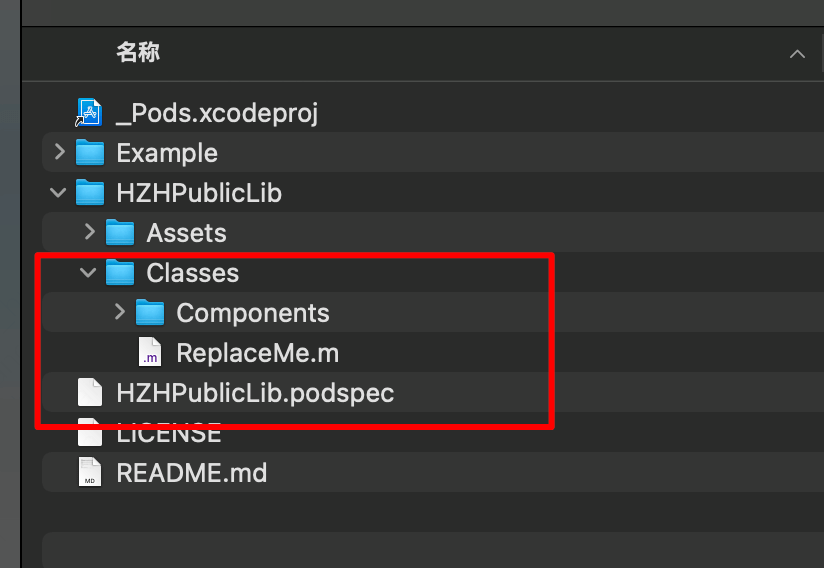
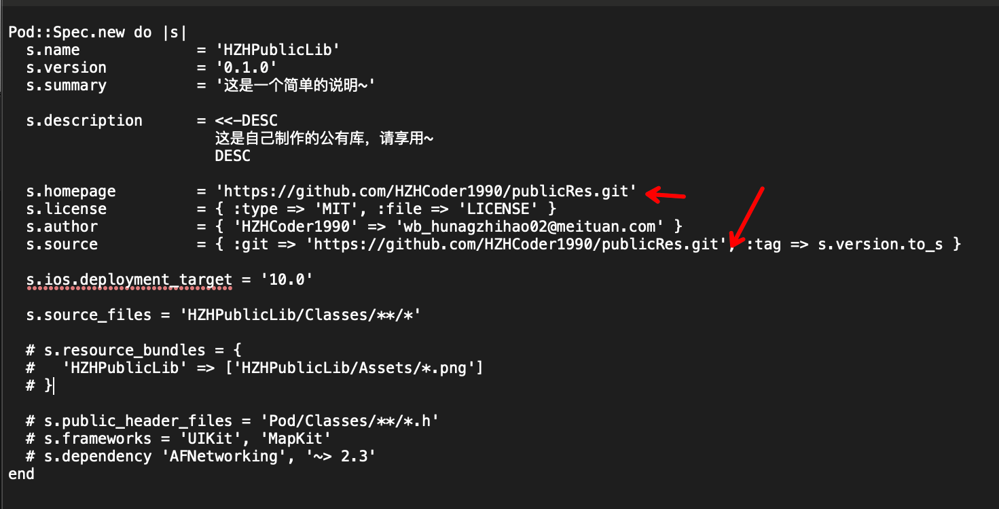
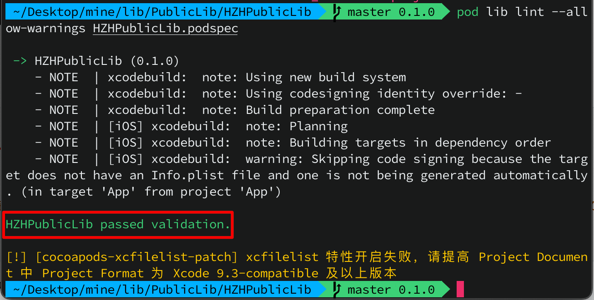
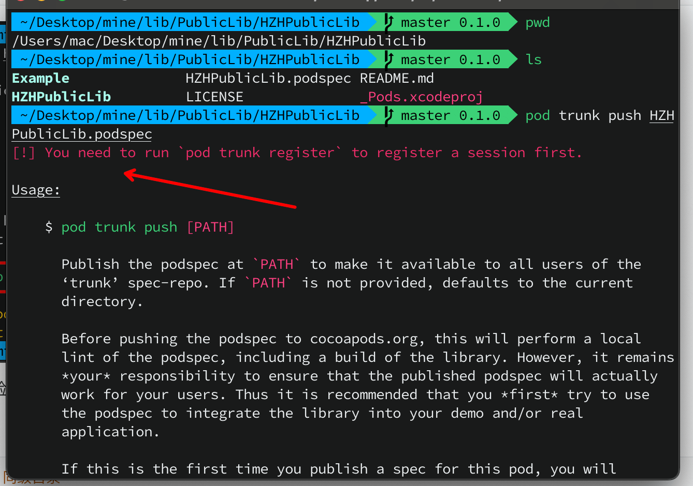
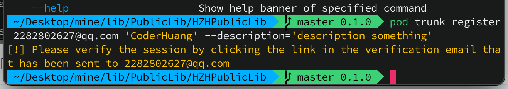
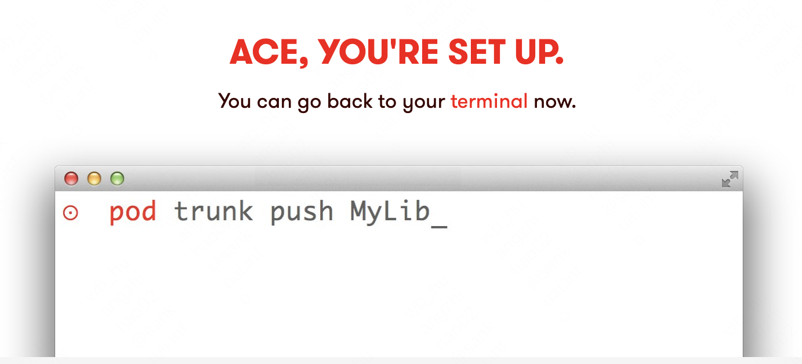
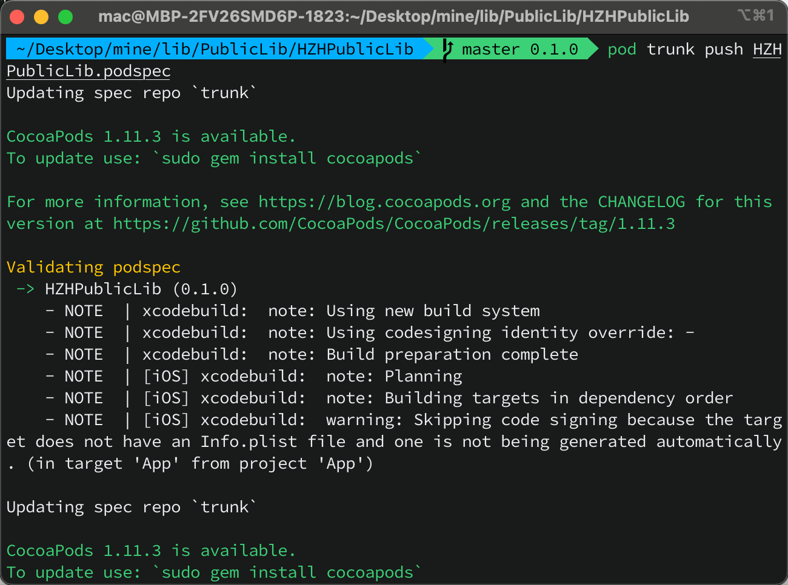
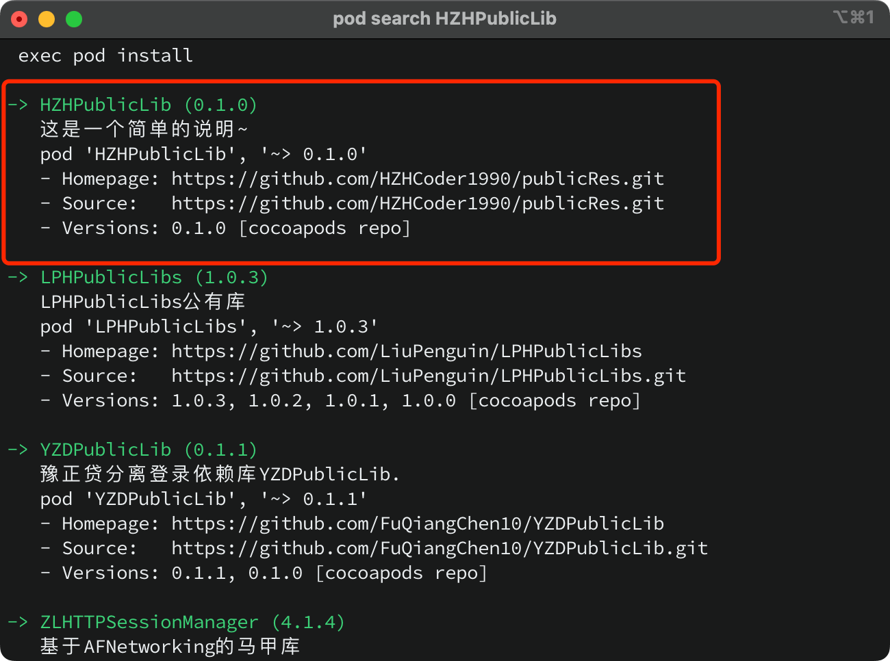

#### 制作一个pod公有库

**创建远程仓库**

- 在Github创建一个仓库`publicRes`，本地创建一个文件夹用于存放库的文件夹`PublicLib`。`cd`到`PublicLib`中，执行命令

  ```ruby
  pod lib create HZHPublicLib
  ```

  打开生成的`HZHPublicLib`文件夹，删除`Classes`下的`ReplaceMe.m`文件，并拖入写好的库文件`Components`

  

  

**修改podspec文件**



需要注意`s.homepage`和`s.source`要修改为仓库`publicRes`的地址。

**提交代码到远程仓库**

```ruby
cd HZHPublicLib
git remote add origin https://github.com/HZHCoder1990/publicRes.git
git add .
git commit -m"初始化库"
git push origin master # 如果在创建远程仓库时选择添加了忽略文件和Readme.md文件，需要解决冲突。所以最好自己在本地添加忽略文件等
git tag 0.1.0
git push origin 0.1.0
```

注意: 设置的tag必须和`podspec`文件中的`s.version`一致。

**lint检查podsepc**

```ruby
# 需要在和 HZHPublicLib.podspec 同级目录
pod lib lint --allow-warnings HZHPublicLib.podspec
```



出现`passed validation`证明通过验证了。

**推送podspec到pod库**

```ruby
# 需要在 HZHPublicLib.podspec 同级目录
pod trunk push HZHPublicLib.podspec
```

第一次推送会出现以下问题



需要去注册一个trunk。然后需要去邮箱验证

```ruby
I # pod trunk register 邮箱地址 用户名 描述文字
pod trunk register 2282802627@qq.com 'CoderHuang' --description='description something'
```



进入填写的邮箱，然后点击邮件的链接进行注册，当出现下图图片中的情形说明注册trunk成功了。



再次执行即可

```ruby
pod trunk push HZHPublicLib.podspec
```



此时使用`pod search HZHPublicLib`命令搜索不到刚发布的库时，需要更新一下`cocoapods`版本和`repo`(本地库)

```ruby
# 更新cocoapods版本
sudo gem install cocoapods
# 更新本地库
pod repo update

# 如果上诉操作都不能解决问题，需要删除搜索索引了
# 删除搜索索引
rm ~/Library/Caches/CocoaPods/search_index.json
# 成功后再执行搜索命令即可
pod search HZHPublicLib
```



此时修改`Example`中的`Podfile`文件中对库的引用

```ruby
source 'https://github.com/CocoaPods/Specs.git' # 源别忘记加
target 'HZHPublicLib_Example' do
  #pod 'HZHPublicLib', :path => '../'
  pod 'HZHPublicLib'
  target 'HZHPublicLib_Tests' do
    inherit! :search_paths

    pod 'FBSnapshotTestCase'
  end
end
```

**测试**

```objc
#import "HZHViewController.h"
#import <Component.h>

@interface HZHViewController ()

@end

@implementation HZHViewController

- (void)viewDidLoad{
    [super viewDidLoad];
    
    Component *cmp = [[Component alloc] init];
    [cmp justComponent];
    [cmp updateVersion];
    
}

@end
```

木有问题~~