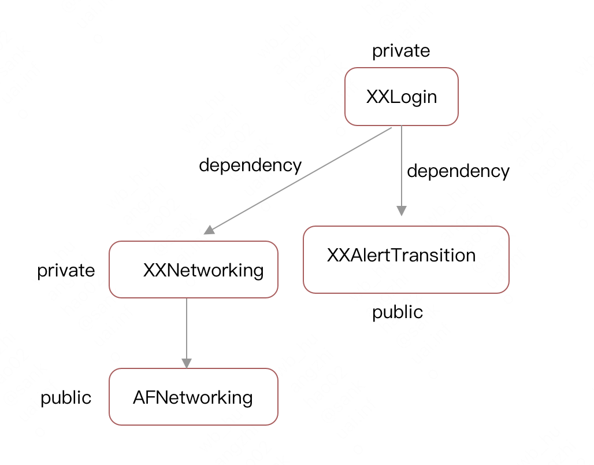
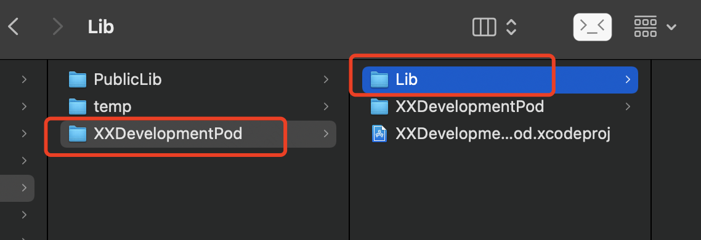
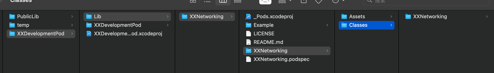
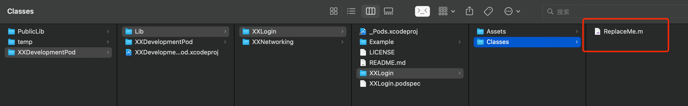
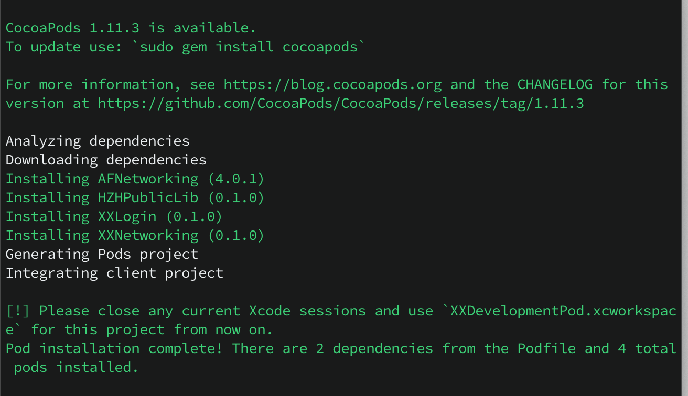
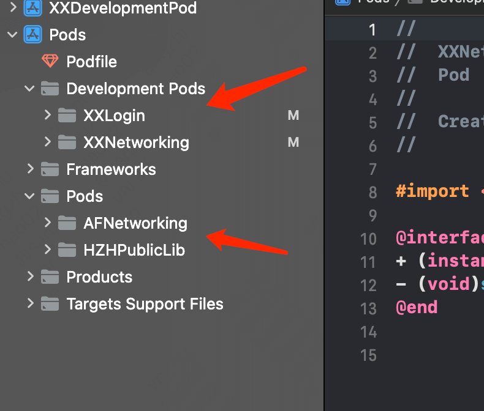

#### 制作本地库Development Pods

**前言**

制作一个有相互依赖关系的本地库。

**目标**



制作一个组件库1(`XXLogin`)，但是组件库1(`XXLogin`)依赖一个公开库2(`XXAlertTransition`)和一个本地库3(`XXNetworking`)，本地库3(`XXNetworking`)又依赖一个网络库4(`AFNetworking`)。

**新建工程**

创建一个名为`XXDevelopmentPod`的iOS项目，并创建一个`Lib`文件夹来管理所有的`development pod`。



**创建本地库XXNetworking**

因为`XXLogin`要依赖这个库，需要先把这个库制作好。

`cd`到`Lib`文件夹下执行`pod lib create XXNetworking`

```ruby
cd /Users/mac/Desktop/mine/lib/XXDevelopmentPod/Lib
pod lib create XXNetworking
```

删除`Classes`文件夹下的`ReplaceMe.m`文件，替换成自己写的库文件



*XXNetworking*只有简单的发送一个请求的方法

```objective-c
@interface XXNetworking : NSObject
+ (instancetype)sharedInstance;
- (void)sendRequest;
@end

#import "XXNetworking.h"
#import <AFNetworking.h>

@implementation XXNetworking
+ (instancetype)sharedInstance {
    static XXNetworking *_instance = nil;
    static dispatch_once_t onceToken;
    dispatch_once(&onceToken, ^{
        _instance = [[XXNetworking alloc] init];
    });
    return _instance;
}

- (void)sendRequest {
    
    AFHTTPSessionManager *manager = [AFHTTPSessionManager manager];
    manager.responseSerializer.acceptableContentTypes = [NSSet setWithObjects:@"application/json", @"text/json", @"text/javascript", @"text/html", nil];
    [manager GET:@"https://www.baidu.com/" parameters:nil headers:nil progress:nil success:^(NSURLSessionDataTask *task, id responseObject) {
        NSLog(@"success:%@", responseObject);
    } failure:^(NSURLSessionDataTask *task, NSError *error) {
        NSLog(@"error:%@", error.localizedDescription);
    }];
}
@end
```

导入的`AFNetworking`版本为:

```ruby
pod 'AFNetworking', '~>4.0.1'
```

修改`XXNetworking.podspec`

```ruby
Pod::Spec.new do |s|
  s.name             = 'XXNetworking'
  s.version          = '0.1.0'
  s.summary          = 'XXNetworking可以发送一个简单的GET请求.'


  s.description      = <<-DESC
                       XXNetworking是一个功能强大的网络请求库，快使用他吧
                       DESC

  s.homepage         = 'XXNetworking'
  s.license          = { :type => 'MIT', :file => 'LICENSE' }
  s.author           = { 'HZHCoder1990' => 'wb_hunagzhihao02@meituan.com' }
  s.source           = { :git => '', :tag => s.version.to_s }

  s.ios.deployment_target = '10.0'

  s.source_files = 'XXNetworking/Classes/**/*'
  s.dependency 'AFNetworking', '~> 4.0.1'
end
```

注意`XXNetworking.podspec`中的`s.homepage、s.source和s.dependency`。

**制作XXLogin本地库**

`cd`到`Lib`文件夹下执行`pod lib create XXLogin`

```ruby
cd /Users/mac/Desktop/mine/lib/XXDevelopmentPod/Lib
pod lib create XXLogin
```



`ReplaceMe.m`替换为`XXlogin`文件夹(包含XXLogin.h和XXLogin.m)

```objective-c
@interface XXLogin : NSObject
- (void)toLogin;
@end

@implementation XXLogin
- (void)toLogin {
    [[XXNetworking sharedInstance] sendRequest];
}
@end
```

修改`XXLogin.podspec`

```ruby
Pod::Spec.new do |s|
  s.name             = 'XXLogin'
  s.version          = '0.1.0'
  s.summary          = '这是一个登录模块的封装'


  s.description      = <<-DESC
                       登录相关的模块
                       DESC

  s.homepage         = 'XXLogin'
  s.license          = { :type => 'MIT', :file => 'LICENSE' }
  s.author           = { 'HZHCoder1990' => 'wb_hunagzhihao02@meituan.com' }
  s.source           = { :git => '', :tag => s.version.to_s }

  s.ios.deployment_target = '10.0'

  s.source_files = 'XXLogin/Classes/**/*'
  s.dependency 'XXNetworking'
  s.dependency 'HZHPublicLib' # 没有XXAlertTransition，用早前发布的HZHPublicLib替换
end
```

**使用**

`cd`到最开始创建的`XXDevelopmentPod`工程目录下，创建`Podfile`文件，

```ruby
platform :ios, '10.0'

target 'XXDevelopmentPod' do
  use_frameworks!

  pod 'XXNetworking', :path => 'Lib/XXNetworking'
  pod 'XXLogin', :path => 'Lib/XXLogin'

end
```

然后`pod install`。

```ruby
bundle exec pod install --repo-update  # Gem中指定了cocoapods的版本
```




**目录变化**



**参考链接**

[iOS制作本地库Development Pods](https://www.jianshu.com/p/5d59d36abb6e)