**切换Ruby源**

查看默认Ruby源

```ruby
gem sources

*** CURRENT SOURCES ***
https://gems.ruby-china.com/
```

如果VPN好使，可以不用把Ruby源切换到China。

**cocoapods模板工程**

通过`pod lib create` 命令，创建`pod库工程`

```ruby
pod lib create HZHComponent
```

会出现一些列的配置选项(根据实际情况操作即可)

```ruby
To get you started we need to ask a few questions, this should only take a minute.

If this is your first time we recommend running through with the guide:
 - https://guides.cocoapods.org/making/using-pod-lib-create.html
 ( hold cmd and click links to open in a browser. )

What platform do you want to use?? [ iOS / macOS ]
 > iOS

What language do you want to use?? [ Swift / ObjC ]
 > ObjC

Would you like to include a demo application with your library? [ Yes / No ]
 > Yes

Which testing frameworks will you use? [ Quick / None ]
 > None

Would you like to do view based testing? [ Yes / No ]
 > No

```

根据问答，输入相对应的选项，`强烈建议一定要包含一个demo应用`

**关联组件仓库地址**

在github上创建一个私有的代码仓库`HZHComponent`，并将本地代码和远程代码进行关联

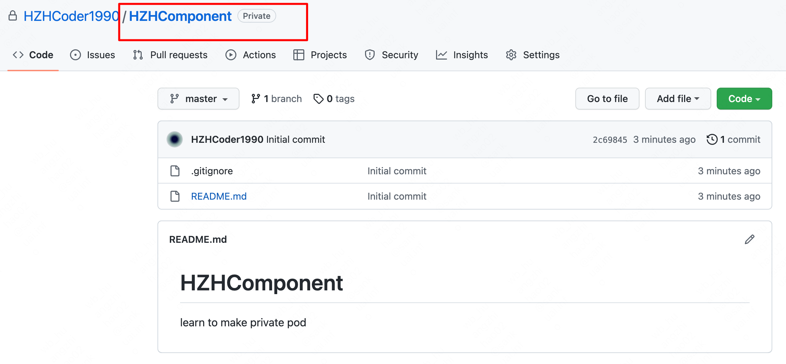

```ruby
cd HZHComponent # 进入目录
git remote add origin https://github.com/HZHCoder1990/HZHComponent.git # 关联远程仓库
git add .
git commit -m"初次提交"
git pull origin master --allow-unrelated-histories # 拉取远程代码到本地
# 注意此时可能会出现冲突，把冲突解决后再提交到远程 
# integrate: 融合 conflict: 冲突
git add .  
git commit -m"解决冲突"
git push origin master
git tag 0.1.0 # 打tag
git push origin 0.1.0  # tag推动到远程
```

值得一提的是，我们需要给项目工程 打`tag`，这样 `cocoapods` 就可以根据不同的版本，来获取相对应`tag`的代码。

**修改podspec**

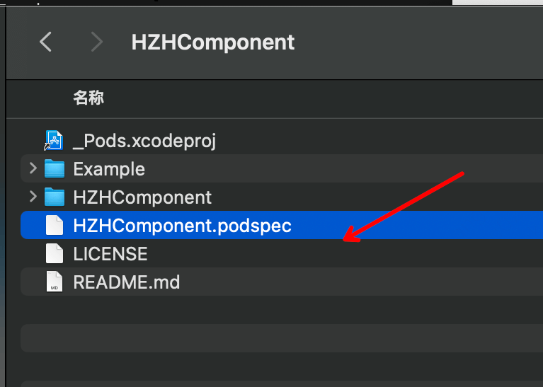

```ruby
Pod::Spec.new do |s|
  s.name             = 'HZHComponent'
  s.version          = '0.1.1'
  s.summary          = '私有库测试项目'
  s.description      = <<-DESC
                       黄智浩本人的测试工程
                       DESC

  s.homepage         = 'https://github.com/HZHCoder1990/HZHComponent'
  s.license          = { :type => 'MIT', :file => 'LICENSE' }
  s.author           = { 'HZHCoder1990' => 'wb_hunagzhihao02@meituan.com' }
  s.source           = { :git => 'https://github.com/HZHCoder1990/HZHComponent.git', :tag => s.version.to_s }

  s.ios.deployment_target = '10.0'

  s.source_files = 'HZHComponent/Classes/**/*'
  
  # s.resource_bundles = {
  #   'HZHComponent' => ['HZHComponent/Assets/*.png']  引用库内部的资源文件
  # }

  # 其他一些设置
  # s.public_header_files = 'Pod/Classes/**/*.h'   
  # s.frameworks = 'UIKit', 'MapKit'
  # s.dependency 'AFNetworking', '~> 2.3'
end
```

`s.version`: pod库的版本。

`s.homepage`: 作者的主页地址，该地址一定要保证能够正常访问，否则，无法校验通过。

`s.source`: `源代码`的存放的地址。

**添加业务代码**

在`HZHComponent`的`Classes`目录下，新建一个文件夹`componets`，并添加2个文件`Component.h`和`Component.m`用于测试

```objc
@interface Component : NSObject
- (void)justComponent;
@end

@implementation Component
- (void)justComponent {
    NSLog(@"你好啊，私有库");
}
@end
```

将代码提交到远程仓库，并设置新的`tag 0.1.1`。

**验证podspec**

本地测试没有问题后，我们需要使用`pob lib lint`验证`podspec`的合理性。

```ruby
pod lib lint --allow-warnings HZHComponent.podspec
```

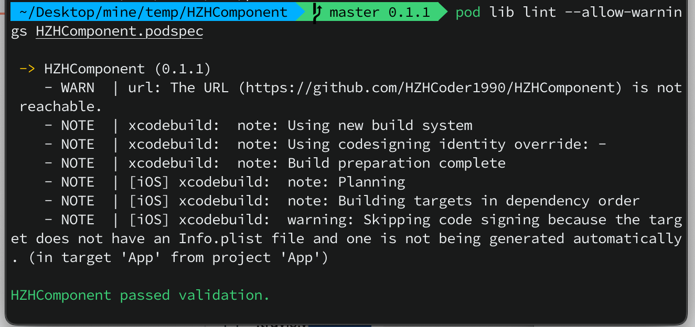

`podspec`文件校验通过之后，就意味本地私有库的制作已完成，下一步，我们要将本地的`podspec`推送至远程私有的`Spec`源地址。

#### 创建远程私有Spec源

**创建Spec索引仓库**

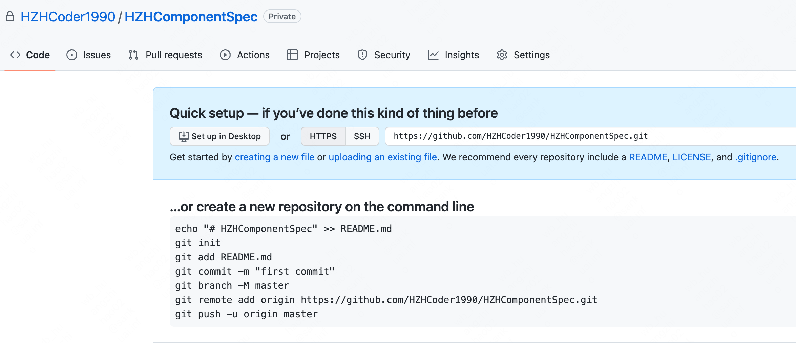

**创建本地私有索引并与git关联**

```ruby
pod repo add HZHSpecsPrivate https://github.com/HZHCoder1990/HZHComponentSpec.git
```

此时，在 `.cocoapods`目录下，会新增一个`HZHSpecsPrivate`的文件夹

此时在`/Users/mac/.cocoapods/repos`目录下就会新增一个`HZHSpecsPrivate`文件夹

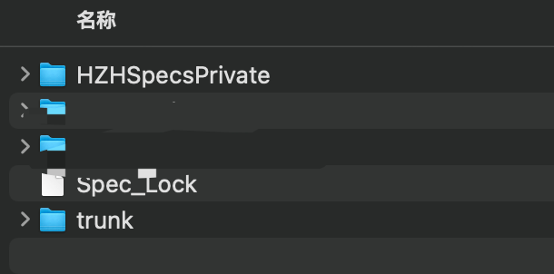

**发布和升级私有库**

创建好远程索引库后，我们需要将本地的podspec文件，推送至`远程索引库`中。

```ruby
pod repo push HZHSpecsPrivate *.podspec --allow-warnings
```

如果出现下列错误:

```ruby
[!] /usr/bin/git -C /Users/mac/.cocoapods/repos/HZHSpecsPrivate pull

Your configuration specifies to merge with the ref 'refs/heads/master'
from the remote, but no such ref was fetched.
```

是因为远程的spec仓库是空的，需要把远程`spec`仓库`clone`到本地，随便向里面提交一个文件再执行`pod repo push xxx`即可。

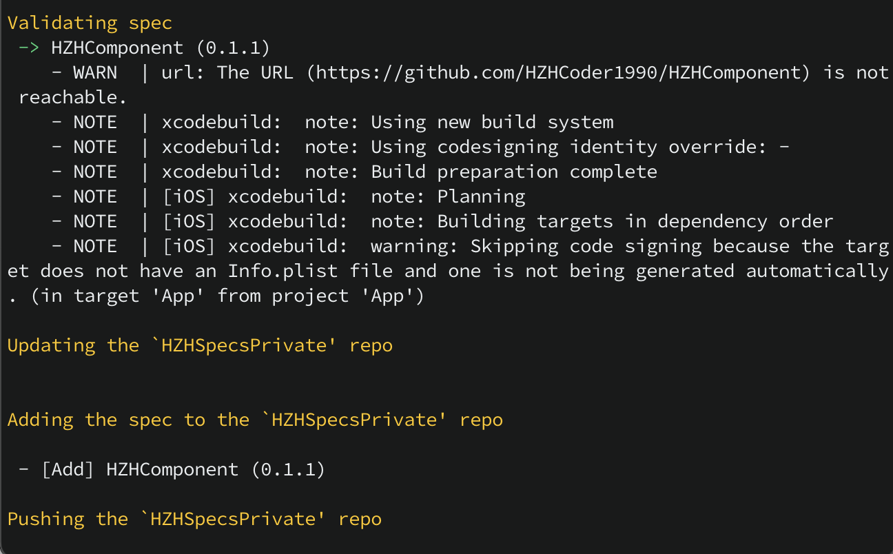

至此，我们成功的将本地私有库，推送到了远程私有库中。

可以使用`pod search HZHComponent`搜索一下

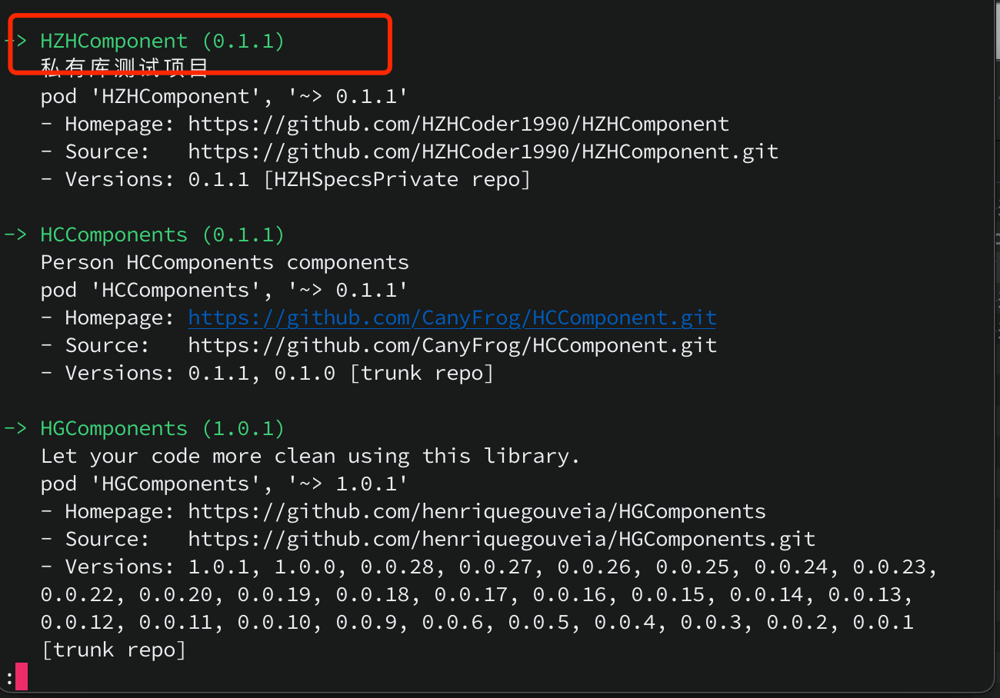

**使用**

修改Example中的`Podfile`文件

```ruby
source 'https://github.com/CocoaPods/Specs.git' # Cocoapods官方源
source 'https://github.com/HZHCoder1990/HZHComponentSpec.git' # 自己的私有库源

use_frameworks!

platform :ios, '10.0'

target 'HZHComponent_Example' do
  # 注释掉本地的引用
  # pod 'HZHComponent', :path => '../'
  pod 'HZHComponent'

  target 'HZHComponent_Tests' do
    inherit! :search_paths
    
  end
end
```

pod成功后，就可以看见`HZHComponent`已经拉到本地了。

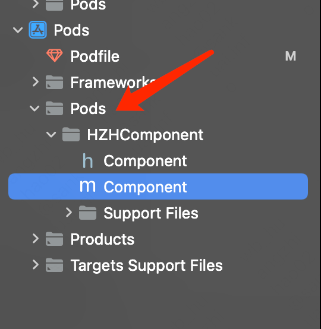

在Example中编译和运行都通过了。

**库的更新**

在`Component`文件中新增加一个方法

```objc
/// 更新版本
- (void)updateVersion;

- (void)updateVersion {
    NSLog(@"我是新增的方法");
}
```

修改`podspec`文件中的version为0.1.2

```ruby
s.version          = '0.1.2'
```

提交到代码仓库并设置新的tag

```ruby
# 提交代码....
git tag 0.1.2
git push origin 0.1.2
```

更新远程索引库

打开终端进入`HZHComponent.podspec`的父级目录

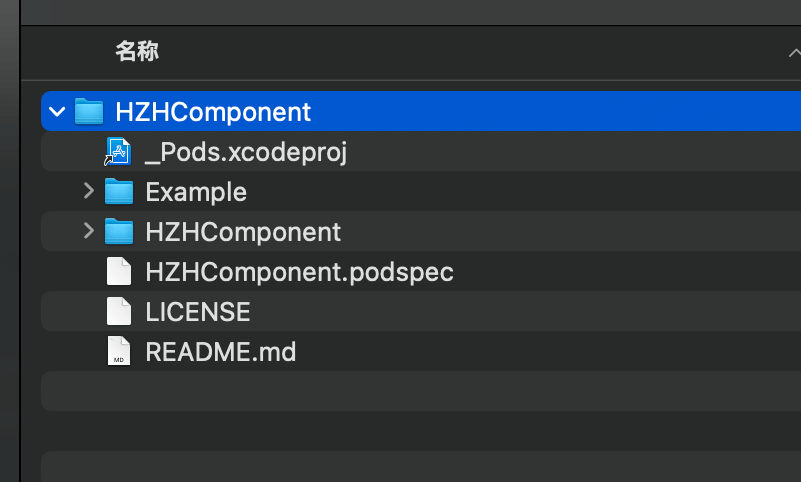

```ruby
# 进入HZHComponent.podspec的父级目录
cd HZHComponent
# 校验podspec
pod lib lint --allow-warnings HZHComponent.podspec 
# 推送到远程索引仓库
pod repo push HZHSpecsPrivate *.podspec --allow-warnings
```

在推送到远程索引仓库时可能会出现

```ruby
[!] The repo `HZHSpecsPrivate` at `../../../../.cocoapods/repos/HZHSpecsPrivate` is not clean
```

解决办法

```ruby
# 进入本地repo下的私有仓库
cd /Users/mac/.cocoapods/repos/HZHSpecsPrivate
# 删除 .DS_Store文件
git clean -f
# 然后再执行 [推送到远程索引仓库] 命令即可
```

此时在本地的索引仓库中可以看到刚才新增的版本号了

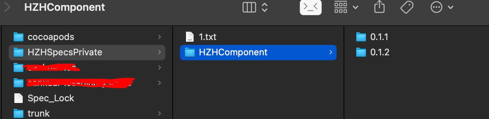

执行搜索命令

```ruby
pod search HZHComponent
```

能成功的搜索出刚才更新的版本

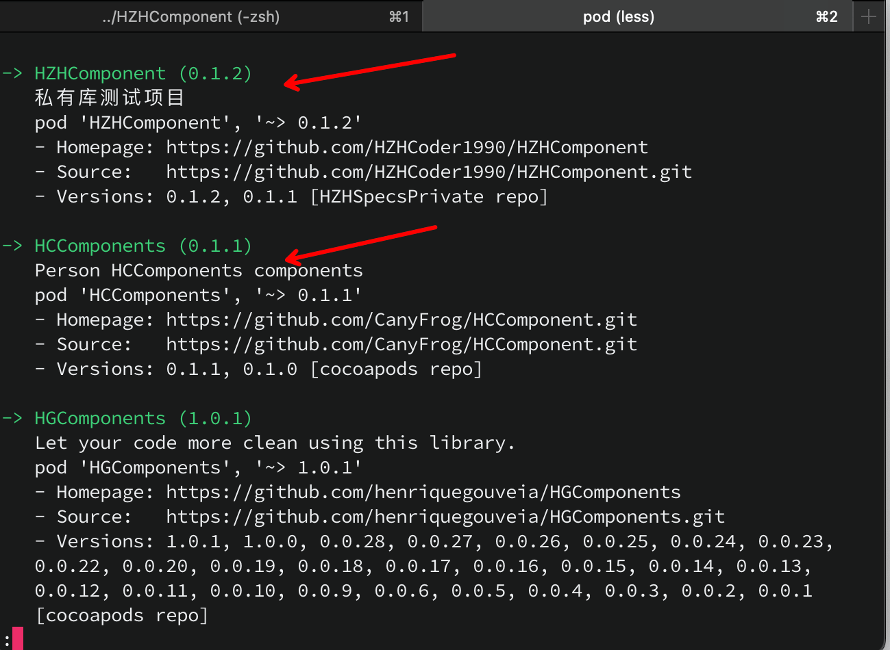

在`Example`的Podfile文件中锁定一下版本即可:

```ruby
pod 'HZHComponent', '~> 0.1.2'
```

