**本笔记概览**

> 1. 远程私有库的制作
> 2. 添加子模块
> 3. 添加资源文件

**准备工作**

创建两个远程私有仓库`HZHPrivateSpec`和`HZHPrivateLib`

> HZHPrivateSpec仓库用于存储spec
>
> HZHPrivateLib仓库用于存储项目工程文件

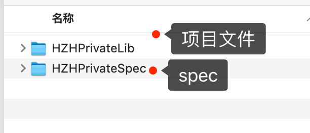

库比较简单，仅仅使用一个page展示一张网络图片


但库依赖`Masonry`和`SDWebImage`两个三方库。

**①创建远程仓库**

在github上创建一个私有仓库(<font color=#F00>特别提醒: 不要勾选添加README.md文件，否则会有冲突!!。图中是懒得换图了</font>)

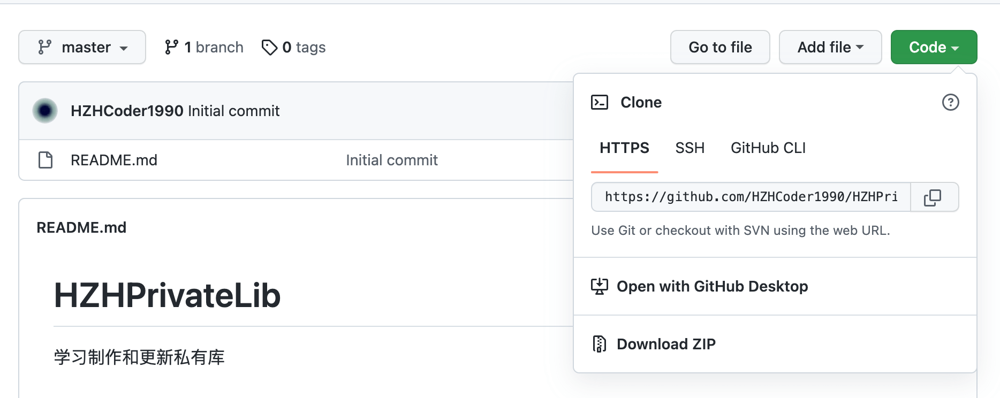

**②创建私有库的项目工程**

使用iTerm进入到`lib`文件夹(用于存放库和spec的文件夹)，创建工程

```ruby
pod lib create HZHPrivateLib
```

可能会遇到

> cannot load such file -- xcodeproj (LoadError)

此时执行安装xcodeproj命令即可

```shell
sudo gem install xcodeproj
```

按提示输入相应的内容

> What platform do you want to use?? [ iOS / macOS ]
>  > iOS
>
> What language do you want to use?? [ Swift / ObjC ]
>  > ObjC
>
> Would you like to include a demo application with your library? [ Yes / No ]
>  > Yes
>
> Which testing frameworks will you use? [ Specta / Kiwi / None ]
>  > None
>
> Would you like to do view based testing? [ Yes / No ]
>  > Yes
>
> What is your class prefix?
>  > HZH

完成后项目会自动打开

和远程git仓库关联并提交代码

```shell
git add .
git commit -m'初始化'
git remote add origin https://github.com/HZHCoder1990/HZHPrivateLib.git
git push -u origin master
```

然后进到HZHPrivateLib文件夹中找到Classes中的`ReplaceMe.m`文件删除，然后将需要的文件放到这里目录下，如图

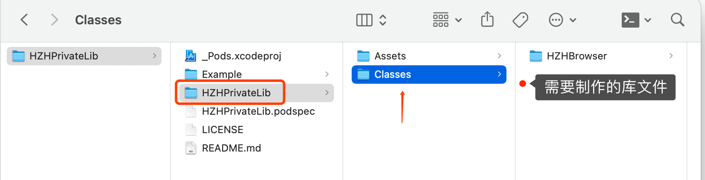

使用iTerm进入到Example文件夹下，执行`pod install` 更新`Example`项目中的`pod`

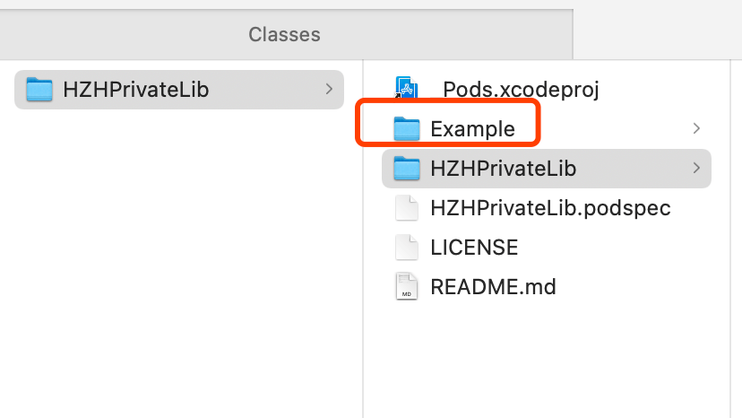

**④编写podspec文件**

使用Visual Code打开`HZHPrivateLib.podspec`文件，编写podspec文件

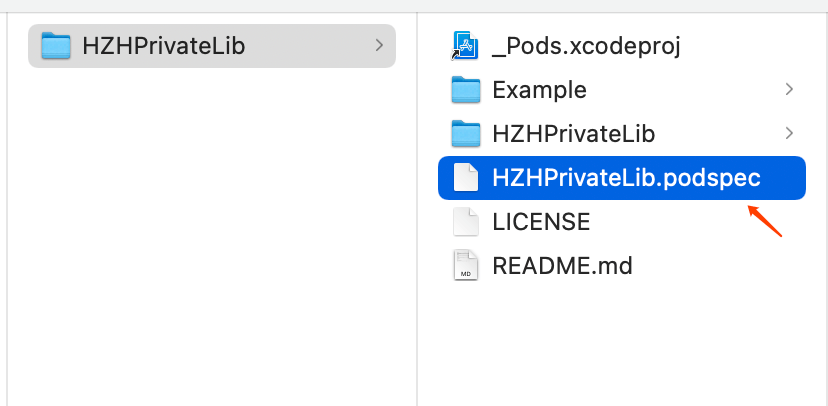

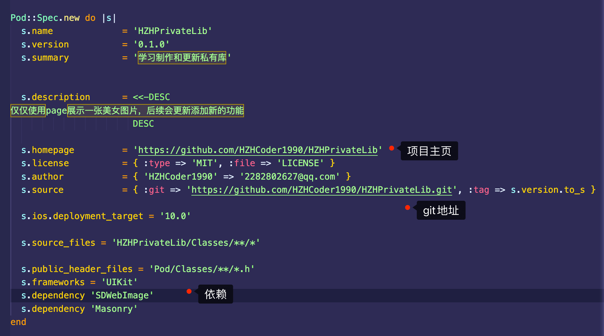

<font color=#F00 size=4>注意: HZHPrivateLib没有子模块，如果存在子模块，podspec文件的编写则不相同</font>

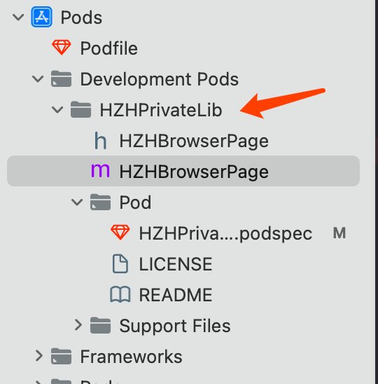

**⑤验证编写的podspec文件**

编写完毕后，需要对podspec文件进行本地校验。用iTerm进入`HZHPrivateLib`目录(podspec文件的父级目录)执行验证命令

```ruby
pod lib lint --allow-warnings 
# 下面的命令可以输出详细的日志信息
pod lib lint --verbose
# 如果上述两个命令都出现了错误，使用下面的命令(只依赖公开库，如果又依赖公开库，同时还依赖私有库这样也会出错，遇到了再更新笔记)
pod lib lint --verbose --use-libraries --allow-warnings 
```

> HZHPrivateLib passed validation. 即为通过了验证

**⑥将本地项目文件上传到远端私有库**

iTerm进入`HZHPrivateLib`项目文件夹(<font color=#F00>注意不是库文件夹，是包含Example和HZHPrivateLib库的文件夹</font>)，推送到远端后需要打tag

```shell
git add .
git commit -m"新增库文件"
git push origin master
# tag 值要和podspec中的version一致
git tag 0.1.0
# 推送tag到服务器上
git push --tags
```

**⑦校验spec**

执行下列命令(因为校验的还是podspec，所以还是和步骤⑤的目录一样)

```ruby
# 没有依赖公有库
pod spec lint
# 依赖了公有库
pod spec lint --verbose --use-libraries --allow-warnings
```

**⑧创建远程私有索引库(spec repo)**

进入文件夹`~/.cocoapods/repos`，可以查看本地`spec repo`(repo：意为回购协议)

```shell
cd ~/.cocoapods/repos
# 执行下面的命令可以打开当前路径的文件夹 (open 空格 .)
open .
```

此时需要在github上创建一个仓库用于存储索引库spec repo

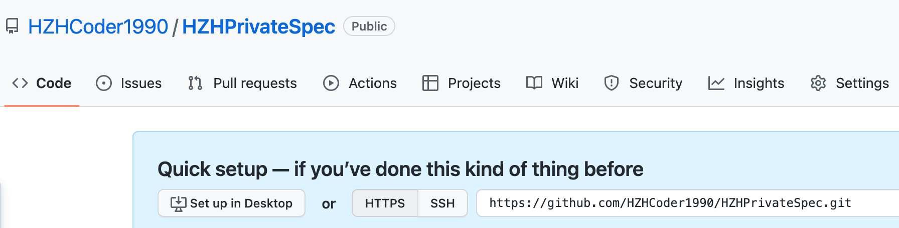

创建本地私有索引并与远端的git关联

```ruby
pod repo add HZHPrivateSpec https://github.com/HZHCoder1990/HZHPrivateSpec.git
```

此时在`~/.cocoapods/repos`目录下就会新增一个`HZHPrivateSpec`文件夹，不过此时是空的

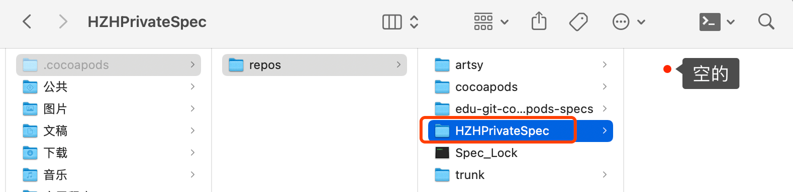

创建好远程索引库后，我们需要将本地的podspec文件，推送至`远程索引库`中。iTerm进入项目文件夹`HZHPrivateLib`中，执行下面的命令

```ruby
pod repo push HZHPrivateSpec HZHPrivateLib.podspec --use-libraries --allow-warnings
```

如果出现

> [!] Found multiple specifications for xxx

类型的错误，需要检查指定依赖的第三方 source的git地址。命令修改为

```ruby
pod repo push HZHPrivateSpec HZHPrivateLib.podspec --use-libraries --allow-warnings --sources='https://github.com/CocoaPods/Specs.git'
```

如果出现下列错误:

```ruby
[!] /usr/bin/git -C /Users/mac/.cocoapods/repos/HZHSpecsPrivate pull
Your configuration specifies to merge with the ref 'refs/heads/master'
from the remote, but no such ref was fetched.
```

是因为远程的spec仓库是空的，需要把远程`spec`仓库`clone`到本地，随便向里面提交一个文件再执行推送命令即可。

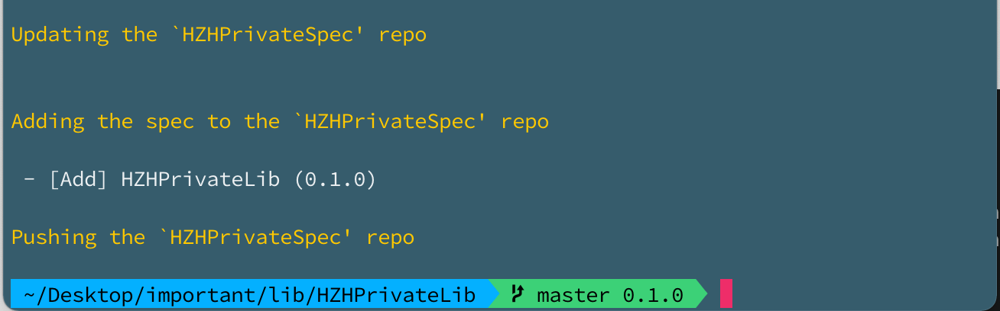

至此，我们成功的将本地私有库的spec，推送到了远程私有索引库中。

可以使用`pod search HZHPrivateLib`搜索一下，看是否能本地搜索到

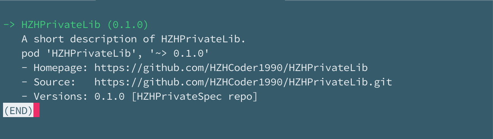

**⑧使用**

创建一个iOS工程来测试刚发布的`HZHPrivateLib`库，创建Podfile文件并修改

```ruby
# 添加两个索引源
source 'https://github.com/CocoaPods/Specs.git' # Cocoapods官方源
source 'https://github.com/HZHCoder1990/HZHPrivateSpec.git' # 自己的私有库的源

platform :ios, '10.0'

use_frameworks!
target 'TestProject' do
  pod 'HZHPrivateLib'
end
```

执行`pod install`后

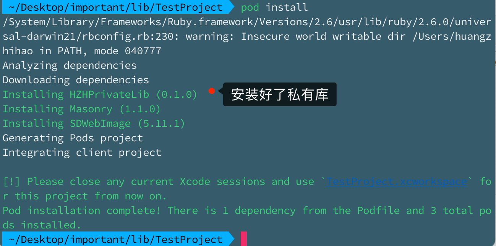

但是打开工程后出现报错

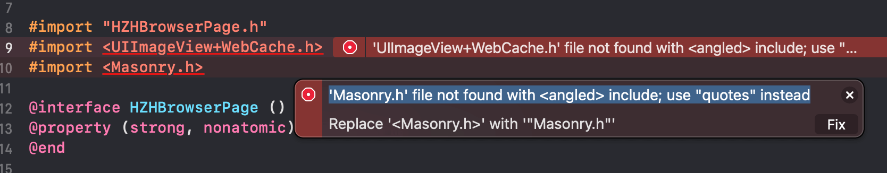

为了解决这个问题，需要更新库

**⑨库的更新**

修改库，把`Masonry`和`SDWebImage`头文件的导入方式修改如下：

```objc
#import <SDWebImage/UIImageView+WebCache.h>
#import <Masonry/Masonry.h>
```

修改项目的podspec文件

```ruby
s.version          = '0.1.1'
```

提交到远程仓库并打新tag

```ruby
# 推送等步骤
git tag 0.1.1
git push --tags
```

更新远程的podspec文件

```ruby
pod repo push HZHPrivateSpec HZHPrivateLib.podspec --use-libraries --allow-warnings --sources='https://github.com/CocoaPods/Specs.git'
```

>Updating the `HZHPrivateSpec' repo
>
>
>Adding the spec to the `HZHPrivateSpec' repo
>
> - [Update] HZHPrivateLib (0.1.1)  => 更新到 0.1.1了
>
>Pushing the `HZHPrivateSpec' repo

在`~/.cocoapods/repos`中可以看到本地的索引库

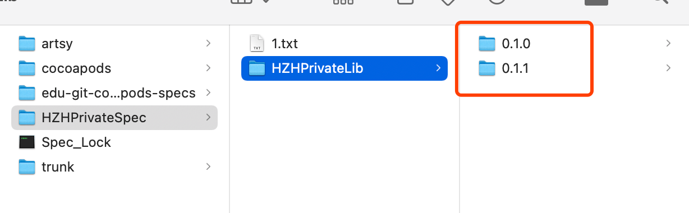

iTerm进入测试工程目录，删除`Podfile.lock`文件，并重新执行`pod install`安装命令

> Installing HZHPrivateLib 0.1.1 (was 0.1.0)

此时测试工程已安装库`HZHPrivateLib`版本为0.1.1了。

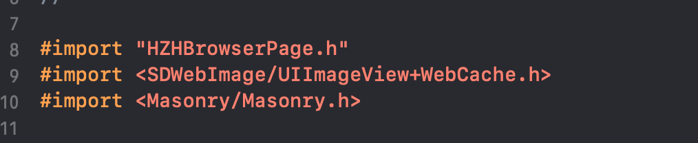

编译也没有报错了。

```objective-c
#import "ViewController.h"
#import <HZHBrowserPage.h>
@interface ViewController ()

@end

@implementation ViewController

- (void)viewDidLoad {
    [super viewDidLoad];
}

- (void)touchesBegan:(NSSet<UITouch *> *)touches withEvent:(UIEvent *)event {
    [self.navigationController pushViewController:[HZHBrowserPage new] animated:YES];
}
@end
```

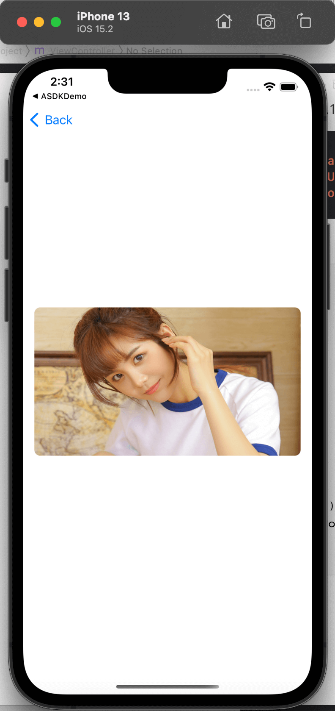

至此，制作远程私有库这第一阶段算是完成了。下面进入第二阶段: 私有库添加子模块

****

**①添加子模块**

在原有库的基础上进行调整

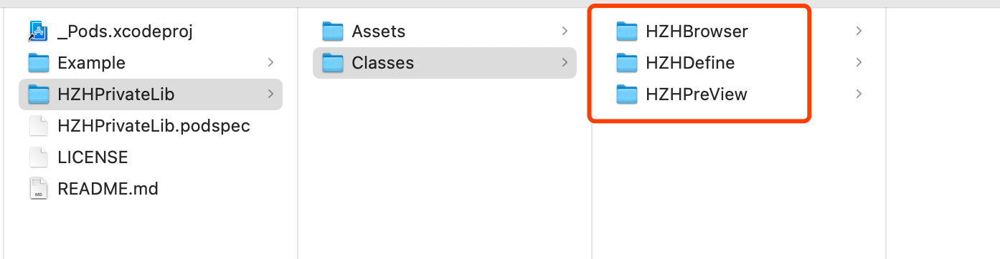

其中`HZHDefine`文件为定义的宏常量等，`HZHPreview`为新增的预览界面。

```objective-c
// HZHDefine
#ifndef HZHDefine_h
#define HZHDefine_h

#define IMAGE_HEIGHT 200
#define BG_COLOR  [UIColor whiteColor]

#endif /* HZHDefine_h */

// HZHPreviewPage
#import "HZHPreviewPage.h"
#import <ReactiveObjC.h>
#import <Masonry.h>
#import "HZHDefine.h"
#import "HZHBrowserPage.h"
@interface HZHPreviewPage ()

@end

@implementation HZHPreviewPage

- (void)viewDidLoad {
    [super viewDidLoad];
    self.view.backgroundColor = BG_COLOR;
    
    UIButton *entryButton = [UIButton buttonWithType:UIButtonTypeCustom];
    [entryButton setTitle:@"预览" forState:UIControlStateNormal];
    entryButton.backgroundColor = [UIColor lightGrayColor];
    entryButton.layer.cornerRadius = 20;
    entryButton.layer.masksToBounds = YES;
    [entryButton setTitleColor:[UIColor redColor] forState:UIControlStateNormal];
    [self.view addSubview:entryButton];
    
    [entryButton mas_makeConstraints:^(MASConstraintMaker *make) {
        make.center.equalTo(self.view);
        make.size.equalTo(@(CGSizeMake(60, 60)));
    }];
    
    [[entryButton rac_signalForControlEvents:UIControlEventTouchUpInside] subscribeNext:^( UIControl *x) {
        [self.navigationController pushViewController:[HZHBrowserPage new] animated:YES];
    }];
}
@end
  
// HZHBrowserPage
#import <SDWebImage/UIImageView+WebCache.h>
#import <Masonry/Masonry.h>
#import "HZHDefine.h"

@interface HZHBrowserPage ()
@property (strong, nonatomic) UIImageView *picture;
@end

@implementation HZHBrowserPage

- (void)viewDidLoad {
    [super viewDidLoad];
    
    self.view.backgroundColor = BG_COLOR;
    
    _picture = [[UIImageView alloc] init];
    _picture.backgroundColor = BG_COLOR;
    _picture.layer.cornerRadius = 8;
    _picture.layer.masksToBounds = YES;
    [self.view addSubview:_picture];
    
    [_picture mas_makeConstraints:^(MASConstraintMaker *make) {
        make.leading.equalTo(self.view).offset(15);
        make.centerY.equalTo(self.view);
        make.height.equalTo(@IMAGE_HEIGHT);
        make.trailing.equalTo(self.view).offset(-15);
    }];
    
    [_picture sd_setImageWithURL:[NSURL URLWithString:@"https://lmg.jj20.com/up/allimg/1111/0H11Q41927/1PH1141927-1-1200.jpg"]];
}

@end
```

逻辑关系为: 点击`HZHPreviewPage`中的"预览"按钮进入`HZHBrowserPage`页面。

iTerm进入Example文件夹，执行`pod install`命令后使用Xcode打开Example工程，注意看此时`Development Pods`的目录结构，和没有添加子模块时相比，`HZHBrowser.h/m`文件都有文件夹来标识了。

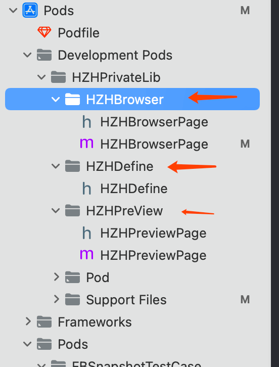

**②编写podspec文件**

重点来了，<font color=#F00>修改HZHPrivateLib库的podspec文件</font>

```shell
Pod::Spec.new do |s|
  s.name             = 'HZHPrivateLib'
  s.version          = '0.1.2'
  s.summary          = '学习制作和更新私有库'

  s.description      = <<-DESC
仅仅使用page展示一张美女图片，后续后更新添加新的功能
                       DESC

  s.homepage         = 'https://github.com/HZHCoder1990/HZHPrivateLib'
  s.license          = { :type => 'MIT', :file => 'LICENSE' }
  s.author           = { 'HZHCoder1990' => '2282802627@qq.com' }
  s.source           = { :git => 'https://github.com/HZHCoder1990/HZHPrivateLib.git', :tag => s.version.to_s }

  s.ios.deployment_target = '10.0'
  s.frameworks = 'UIKit'
  # 以上基础信息不会修改
  
  # 注释掉以前的 source_files和public_header_files
  #  s.source_files = 'HZHPrivateLib/Classes/**/*'
  #  s.public_header_files = 'Pod/Classes/**/*.h'
  #  s.dependency 'Masonry'
  #  s.dependency 'SDWebImage'

  # HZHBrowser模块依赖两个公开库: Masonry和SDWebImage，一个子模块: HZHDefine
  s.subspec 'HZHBrowser' do |sp|
    sp.source_files = 'HZHPrivateLib/Classes/HZHBrowser/*'
    sp.public_header_files = 'Pod/Classes/HZHBrowser/*.h'
    sp.dependency 'Masonry'
    sp.dependency 'SDWebImage'
    sp.dependency 'HZHPrivateLib/HZHDefine'
  end

  # HZHPreView模块依赖两个公开库: Masonry和ReactiveObjC，两个子模块: HZHDefine和HZHBrowser
  s.subspec 'HZHPreView' do |sp|
    sp.source_files = 'HZHPrivateLib/Classes/HZHPreView/*'
    sp.public_header_files = 'Pod/Classes/HZHPreView/*.h'
    sp.dependency 'Masonry'
    sp.dependency 'ReactiveObjC'
    sp.dependency 'HZHPrivateLib/HZHDefine'
    sp.dependency 'HZHPrivateLib/HZHBrowser'
  end

  # HZHDefine
  s.subspec 'HZHDefine' do |sp|
    sp.source_files = 'HZHPrivateLib/Classes/HZHDefine/*'
    sp.public_header_files = 'Pod/Classes/HZHDefine/*.h'
  end
end
```

iTerm进入对应目录后本地校验podspec文件

```ruby
pod lib lint --verbose --use-libraries --allow-warnings 
```

> HZHPrivateLib passed validation.

证明编写的podspec文件没有问题。

推送代码到远端仓库

```shell
git add . 
git commit -m "新增子模块"
git push origin master
git 
```

更新远程的podspec文件和本地索引库

```ruby
pod repo push HZHPrivateSpec HZHPrivateLib.podspec --use-libraries --allow-warnings --sources='https://github.com/CocoaPods/Specs.git'
```

> - [Update] HZHPrivateLib (0.1.2)

成功更新到了`0.1.2`版本

下面看下使用情况，还是首先删除测试工程中的`Podfile.lock`文件，然后执行安装命令`pod install`。打开工程，编译通过，运行工程没有报错。经测试功能一切正常。

**③总结**

> 1.编写库时，如果依赖第三方库，导入的头文件需要写全称，如: <font color=#F00><Masonry/Masonry.h></font>
>
> 2.编写podspec文件时，如果是依赖本地子模块，需要写库名，如: <font color=#F00>sp.dependency 'HZHPrivateLib/HZHBrowser'</font>
>
> 3.如果依赖的是公有静态库，podspec文件该怎么写？ <font color=#F00>Todo</font>

***

制作的私有库，需要依赖资源，此时又该怎么操作呢?

****

美团管家的组件`erp-boss-platform-ios`这个组件的podspec文件和工程目录需要copy过来记录一下