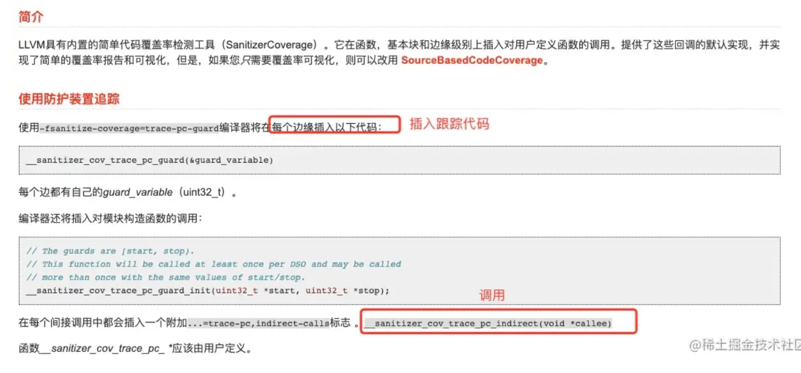
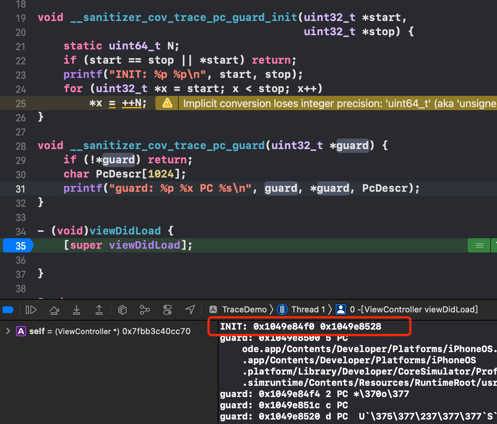
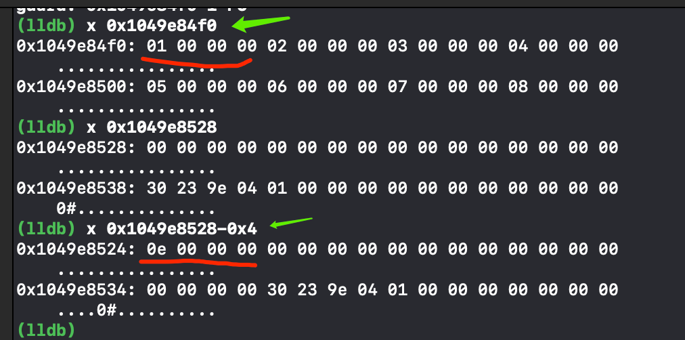
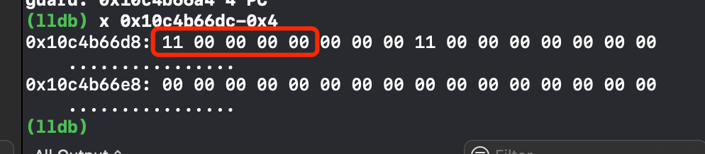
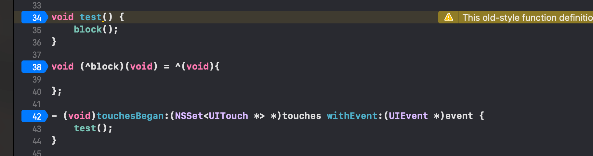
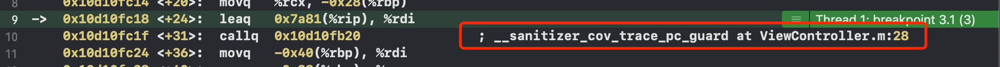
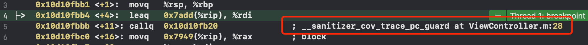
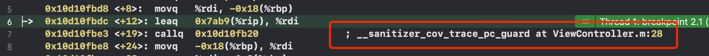
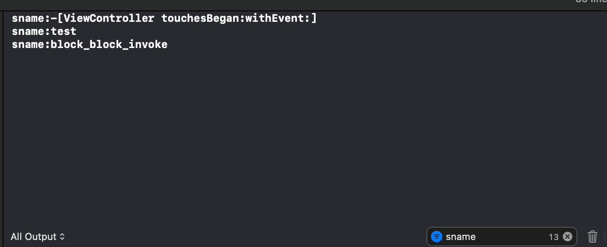

[原文](https://juejin.cn/post/6937261357339410462#heading-15)

**前面待补充**

**① 方法的排序顺序**

新建一个iOS项目，并在`ViewController`中按顺序添加以下几个方法

```objc
@implementation ViewController

void test1() {
    printf("test1");
}

void test2() {
    printf("test2");
}

- (void)viewDidLoad {
    [super viewDidLoad];
    
    test1();
}

+ (void)load {
    printf("load");
    test2();
}

@end
```

在 `Build Settings -> Write Link Map File` 设置为 `YES`


`CMD+B`编译`Demo`，然后在对应的路径下查找 `link map`文件 => 右键 `Show In Finder`打开包文件夹：


在包文件的上两层级，找到 `Intermediates.noindex`，(可以先用终端找到当前目录，然后返回上级目录，`pwd`拿到路径)，然后沿路径找到并打开`binary_reset-LinkMap-normal-x86_64.txt`文件(真机为arm64.txt)：


函数顺序（书写顺序），如下所示，可以发现`类中函数的加载顺序是从上到下的`，而`文件`的顺序是根据`Build Phases -> Compile Sources`中的顺序加载的


**总结** 从上面的`Page Fault`的次数以及加载顺序，可以发现其实**导致 Page Fault 次数过多的根本原因是启动时刻需要调用的方法，处于不同的Page导致的**.因此，我们的优化思路就是：**将所有启动时刻需要调用的方法，排列在一起，即放在一个页中，这样就从多个 Page Fault 变成了一个 Page Fault**. 这就是二进制重排的 **核心原理**，如下所示


> 注意：在iOS生产环境的app，在发生Page Fault进行重新加载时，iOS系统还会对其做一次签名验证，因此 iOS 生产环境的 Page Fault 比Debug环境下所产生的耗时更多

**② 二进制重排实践**

先理解几个名词

**②.1 Link Map**

`Link Map` 是iOS编译过程的中间产物，**记录了二进制文件的布局**，需要在Xcode的`Build Settings` 里开启`Write Link Map File`。`Link Map`主要包含三部分：

- `Object Files` 生成二进制用到的link单元的路径和文件编号
- `Sections` 记录Mach-O每个Segment/section的地址范围
- `Symbols` 按顺序记录每个符号的地址范围

**②.2 ld**

`ld`是Xcode使用的链接器，有一个参数`order_file`，我们可以通过在`Build Settings -> Order File`配置一个后缀为order的文件路径.在这个order文件中，将所需要的符号按照顺序写在里面，在项目编译时，会按照这个文件的顺序进行加载，以此来达到我们的优化。

所以**二进制重排的本质就是对启动加载的符号进行重新排列**。

上面Demo中函数加载顺序是: `test1 -> test2 -> viewDidLoad -> load`，通过`order`文件来修改函数的加载顺序: `load -> viewDidLoad -> test2 -> test1`。

在Demo同级目录创建一个`hzh.order`文件


在`hzh.order`文件中手动写入函数(还写了一个不存在的函数`hello`)


在`Build Settings`中搜索`order file`,加入`./hzh.order`


`Command + B`编译后，再次去查看`link map`文件：


- 发现`order`文件中`不存在的函数`(hello)，编译器会直接跳过
- 其他`函数符号`，完全按照我们`order`顺序排列
- `order`中没有的函数，按照默认顺序接在`order`函数后面

那么问题来了.靠手写一个个函数写进`order`文件中.代码写了那么多，还有些代码不是我写的，我怎么知道哪个函数先，哪个函数后呢？

**我们要做到的目标: 拿到`启动完成`后的`某个时刻`，`之前`的所有`被调用`的`函数`.劳烦你们`自己`排队进入我的`order`文件中(Clang插桩来实现)**

**③ Clang插桩**

要真正的实现二进制重排，我们需要拿到启动的所有方法、函数等符号，并保存其顺序，然后写入`order`文件，实现二进制重排。

在说**clang插桩**之前,我们来说说**什么是hook**?

`hook`是钩子:  获取原有`函数符号`的`内存地址`和`实现`，`勾住`它，做一些自己想做的事情。

很明显，我们此刻就是想hook住启动结束前的`所有函数`，附加一些代码，把`函数名`按顺序`存下来`，生成我们的`order`文件。

> Q: 有没有API，能让我hook一切我想hook的东西？swift、oc、c函数我都要hook? A: 有，clang插桩. 语法树都是它生成的，顺序它说了算.

`llvm`内置了一个简单的代码覆盖率检测（`SanitizerCoverage`）.它在函数级、基本块级和边缘级插入对用户定义函数的调用.我们这里的批量hook，就需要借助于`SanitizerCoverage`.

[clang自带代码覆盖工具官方文档](https://clang.llvm.org/docs/SanitizerCoverage.html)



新建一个`TraceDemo`项目，然后按照官方示例，尝试开发。

打开`TraceDemo`，在`Build Settings`中搜索`Other C`,在 `Other C Flags`里加入`-fsanitize-coverage=trace-pc-guard`配置，并在`ViewController.m`中添加以下代码:

```objc
#import "ViewController.h"
#include <stdint.h>
#include <stdio.h>
#include <sanitizer/coverage_interface.h>

@interface ViewController ()

@end

@implementation ViewController

void __sanitizer_cov_trace_pc_guard_init(uint32_t *start,
                                         uint32_t *stop) {
    static uint64_t N;
    if (start == stop || *start) return;
    printf("INIT: %p %p\n", start, stop);
    for (uint32_t *x = start; x < stop; x++)
        *x = ++N;
}

void __sanitizer_cov_trace_pc_guard(uint32_t *guard) {
    if (!*guard) return;
    char PcDescr[1024];
    printf("guard: %p %x PC %s\n", guard, *guard, PcDescr);
}

- (void)viewDidLoad {
    [super viewDidLoad];
    
}
@end
```

函数 **__sanitizer_cov_trace_pc_guard_init** 统计了方法的个数。

运行后可以看到





读取内存之后，我们可以看到一个类似计数器的东西。最后一个打印的是结束位置，按显示是4位4位的，所以向前移动4位，打印出来的应该就是最后一位。

解释两个参数:

- 参数1 `start` 是一个指针，指向无符号`int`类型，4个字节，相当于一个数组的起始位置，即符号的起始位置（是从高位往低位读）
- 参数2 `stop`，由于数据的地址是往下读的（即从高往低读，所以此时获取的地址并不是stop真正的地址，而是标记的最后的地址，读取stop时，由于stop占4个字节，`stop真实地址 = stop打印的地址-0x4`）
- `start`和`stop`表示当前文件的开始内存地址和结束内存地址。单位是int32，4字节
- 如果多加几个函数，会发现stop地址值也会相应的增加
- 此处是指从start到stop的前闭后开区间。[ , )，所以stop地址往前偏移4字节，才是最后一个函数符号的地址

根据小端模式，`0e 00 00 00`对应的是`00 00 00 0e`即14。

那么`stop`内存地址中存储的值表示什么？

再增加一个`touchesBegan`方法，一个`test()`函数，一个`block`代码块

```objective-c
#import "ViewController.h"
#include <stdint.h>
#include <stdio.h>
#include <sanitizer/coverage_interface.h>

@interface ViewController ()

@end

@implementation ViewController

void __sanitizer_cov_trace_pc_guard_init(uint32_t *start,
                                         uint32_t *stop) {
    static uint64_t N;
    if (start == stop || *start) return;
    printf("INIT: %p %p\n", start, stop);
    for (uint32_t *x = start; x < stop; x++)
        *x = ++N;
}

void __sanitizer_cov_trace_pc_guard(uint32_t *guard) {
    if (!*guard) return;
    char PcDescr[1024];
    printf("guard: %p %x PC %s\n", guard, *guard, PcDescr);
}

void test() {
    block();
}

void (^block)(void) = ^(void){
    
};

- (void)touchesBegan:(NSSet<UITouch *> *)touches withEvent:(UIEvent *)event {
    test();
}

- (void)viewDidLoad {
    [super viewDidLoad];
    
}

@end
```



根据小端模式，`11 00 00 00`对应的是`00 00 00 11`即17。到此时可以看到一共增加了3(block是匿名函数)，计数器统计了函数/方法/块的个数，这里添加了三个，索引增加了3。

**验证**

在`touchBegin`、`test()`、`block`都加入断点，并切换到汇编显示



`touchesBegan`时







可以看到，在每个函数被触发时，都调用了`__sanitizer_cov_trace_pc_guard`函数。

即:只要在`Other C Flags`处加入标记，开启了trace功能.`LLVM`会在每个函数边缘（开始位置），插入一行调用`__sanitizer_cov_trace_pc_guard`的代码.编译期就插入了.所以可以100%覆盖.(也就是说Clang插桩就是在汇编代码中插入了 `__sanitizer_cov_trace_pc_guard`函数的调用)。

`__sanitizer_cov_trace_pc_guard`方法:主要是捕获所有的启动时刻的符号，将所有符号入队。

拿到了全部的符号之后需要保存，但是不能用数组，因为有可能会有在子线程执行的，所以用数组会有线程问题 .这里我们使用原子队列：

```objc
#import "ViewController.h"
#include <stdint.h>
#include <stdio.h>
#include <sanitizer/coverage_interface.h>
#include <libkern/OSAtomic.h>
#include <dlfcn.h>

@interface ViewController ()
@end

@implementation ViewController

//定义原子队列: 特点 1.先进后出 2.线程安全 3.只能保存结构体
static OSQueueHead symbolList = OS_ATOMIC_QUEUE_INIT;
// 定义符号结构体链表
typedef struct {
    void *pc;
    void *next;
} SymbolNode;

void __sanitizer_cov_trace_pc_guard_init(uint32_t *start,
                                         uint32_t *stop) {
    static uint64_t N;
    if (start == stop || *start) return;
    printf("INIT: %p %p\n", start, stop);
    for (uint32_t *x = start; x < stop; x++)
        *x = ++N;
}

/*
 可以全面hook方法、函数、以及block调用，用于捕捉符号，是在多线程进行的，这个方法中只存储pc，以链表的形式
 - guard 是一个哨兵，告诉我们是第几个被调用的
 */
void __sanitizer_cov_trace_pc_guard(uint32_t *guard) {
    // if (!*guard) return;  // 将load方法过滤掉了，所以需要注释掉
    
    //获取PC
    /*
     - PC 当前函数返回上一个调用的地址
     - 0 当前这个函数地址，即当前函数的返回地址
     - 1 当前函数调用者的地址，即上一个函数的返回地址
     */
    void *PC = __builtin_return_address(0);
    
    //创建结构体!
    SymbolNode *node = malloc(sizeof(SymbolNode));
    *node = (SymbolNode){PC, NULL};
    
    //加入队列
    //符号的访问不是通过下标访问，是通过链表的next指针，所以需要借用offsetof（结构体类型，下一个的地址即next）
    OSAtomicEnqueue(&symbolList, node, offsetof(SymbolNode, next));
    
    // 使用dladdr方法可以获得一个函数所在模块，名称以及地址。
    Dl_info info; // 声明对象
    dladdr(PC, &info); // 读取PC地址，赋值给info
    
    printf("fnam:%s \n fbase:%p \n sname:%s \n saddr:%p \n",
           info.dli_fname,
           info.dli_fbase,
           info.dli_sname,
           info.dli_saddr);
}

void test() {
    block();
}

void (^block)(void) = ^(void){
    
};

- (void)touchesBegan:(NSSet<UITouch *> *)touches withEvent:(UIEvent *)event {
    test();
}

- (void)viewDidLoad {
    [super viewDidLoad];
    
}
@end
```

程序运行起来后，点击屏幕，就能看到符号名了



下面我们通过点击屏幕导出所需要的符号，需要注意的是**C函数和Swift方法前面需要加下划线**.(这一点可以在前面提到的**LinkMap**文件中确认)

```
```

