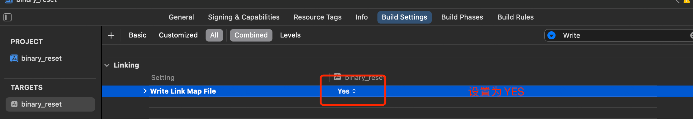
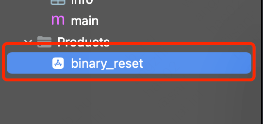
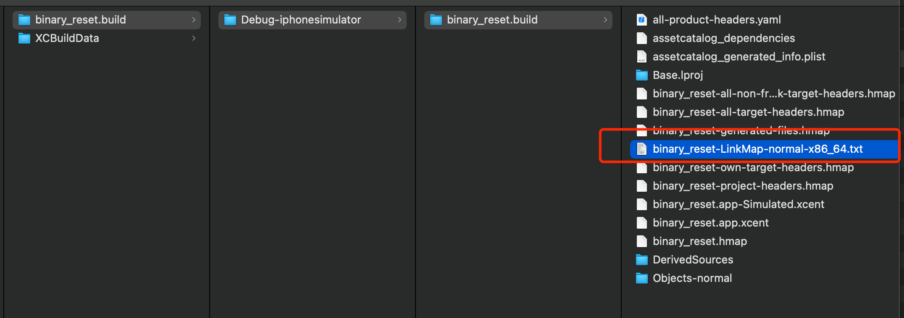
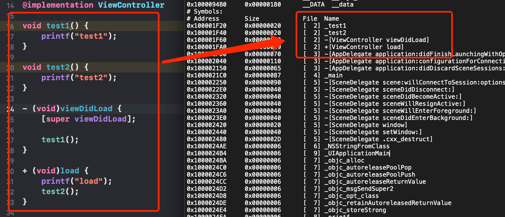
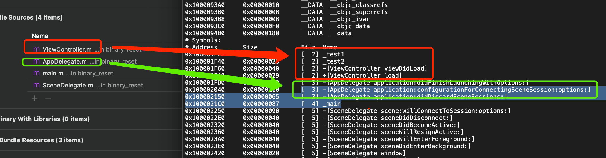
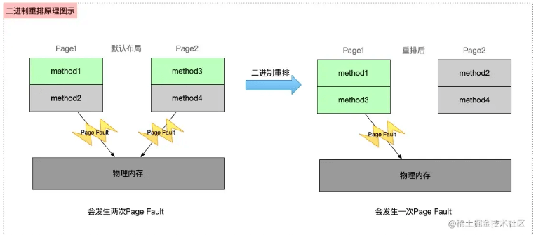
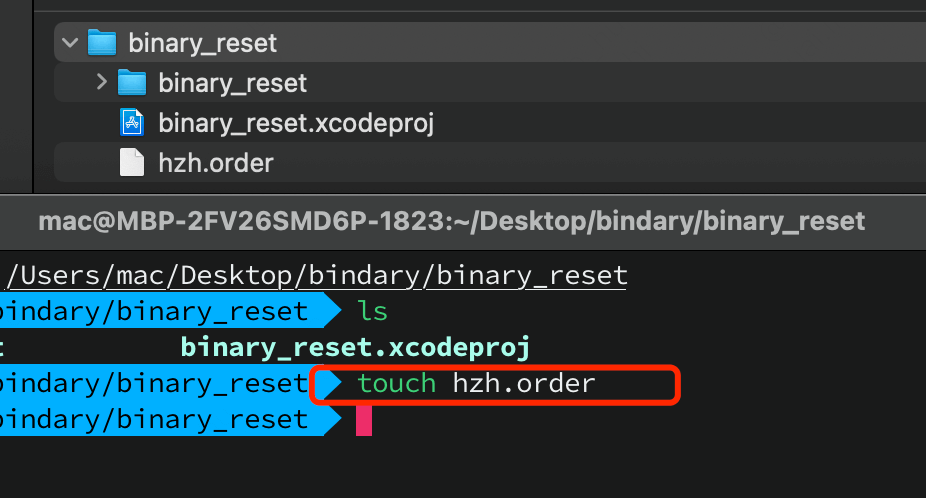
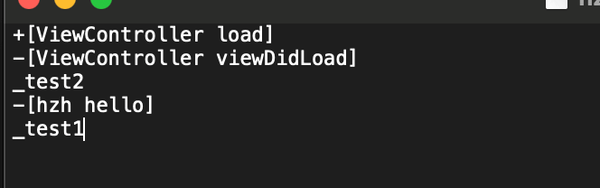
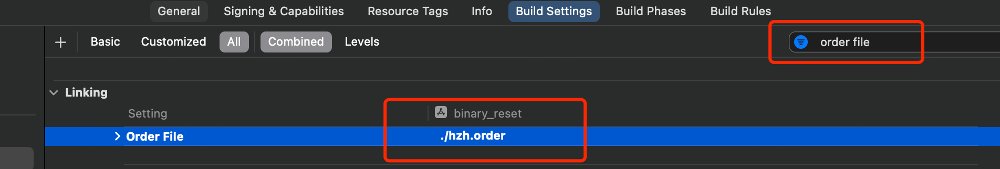
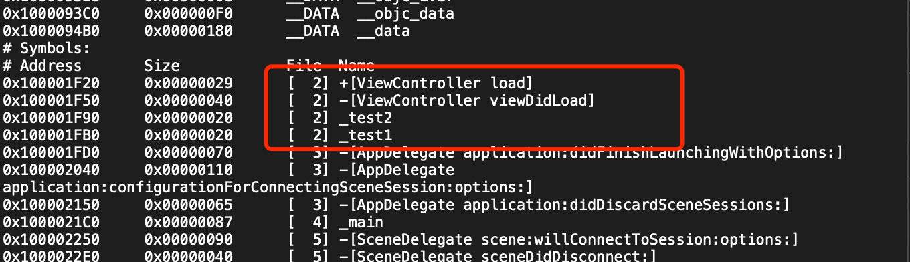

[原文](https://juejin.cn/post/6937261357339410462#heading-15)

**前面待补充**

**① 方法的排序顺序**

新建一个iOS项目，并在`ViewController`中按顺序添加以下几个方法

```objc
@implementation ViewController

void test1() {
    printf("test1");
}

void test2() {
    printf("test2");
}

- (void)viewDidLoad {
    [super viewDidLoad];
    
    test1();
}

+ (void)load {
    printf("load");
    test2();
}

@end
```

在 `Build Settings -> Write Link Map File` 设置为 `YES`



`CMD+B`编译`Demo`，然后在对应的路径下查找 `link map`文件 => 右键 `Show In Finder`打开包文件夹：



在包文件的上两层级，找到 `Intermediates.noindex`，(可以先用终端找到当前目录，然后返回上级目录，`pwd`拿到路径)，然后沿路径找到并打开`binary_reset-LinkMap-normal-x86_64.txt`文件(真机为arm64.txt)：



函数顺序（书写顺序），如下所示，可以发现`类中函数的加载顺序是从上到下的`，而`文件`的顺序是根据`Build Phases -> Compile Sources`中的顺序加载的





**总结** 从上面的`Page Fault`的次数以及加载顺序，可以发现其实**导致 Page Fault 次数过多的根本原因是启动时刻需要调用的方法，处于不同的Page导致的**.因此，我们的优化思路就是：**将所有启动时刻需要调用的方法，排列在一起，即放在一个页中，这样就从多个 Page Fault 变成了一个 Page Fault**. 这就是二进制重排的 **核心原理**，如下所示



> 注意：在iOS生产环境的app，在发生Page Fault进行重新加载时，iOS系统还会对其做一次签名验证，因此 iOS 生产环境的 Page Fault 比Debug环境下所产生的耗时更多

**② 二进制重排实践**

先理解几个名词

**②.1 Link Map**

`Link Map` 是iOS编译过程的中间产物，**记录了二进制文件的布局**，需要在Xcode的`Build Settings` 里开启`Write Link Map File`。`Link Map`主要包含三部分：

- `Object Files` 生成二进制用到的link单元的路径和文件编号
- `Sections` 记录Mach-O每个Segment/section的地址范围
- `Symbols` 按顺序记录每个符号的地址范围

**②.2 ld**

`ld`是Xcode使用的链接器，有一个参数`order_file`，我们可以通过在`Build Settings -> Order File`配置一个后缀为order的文件路径.在这个order文件中，将所需要的符号按照顺序写在里面，在项目编译时，会按照这个文件的顺序进行加载，以此来达到我们的优化。

所以**二进制重排的本质就是对启动加载的符号进行重新排列**。

上面Demo中函数加载顺序是: `test1 -> test2 -> viewDidLoad -> load`，通过`order`文件来修改函数的加载顺序: `load -> viewDidLoad -> test2 -> test1`。

在Demo同级目录创建一个`hzh.order`文件



在`hzh.order`文件中手动写入函数(还写了一个不存在的函数`hello`)



在`Build Settings`中搜索`order file`,加入`./hzh.order`



`Command + B`编译后，再次去查看`link map`文件：



- 发现`order`文件中`不存在的函数`(hello)，编译器会直接跳过
- 其他`函数符号`，完全按照我们`order`顺序排列
- `order`中没有的函数，按照默认顺序接在`order`函数后面

那么问题来了.靠手写一个个函数写进`order`文件中.代码写了那么多，还有些代码不是我写的，我怎么知道哪个函数先，哪个函数后呢？

**我们要做到的目标: 拿到`编译完成`后的`某个时刻`，`之前`的所有`被调用`的`函数`.劳烦你们`自己`排队进入我的`order`文件中(Clang插桩来实现)**