#### 多环境配置

Project：包含了项目所有的代码、资源文件、信息等。

Target： 指定代码和资源文件的具体构建方式

Scheme： 指定Target的环境配置

**Configurations**

添加新的模式:

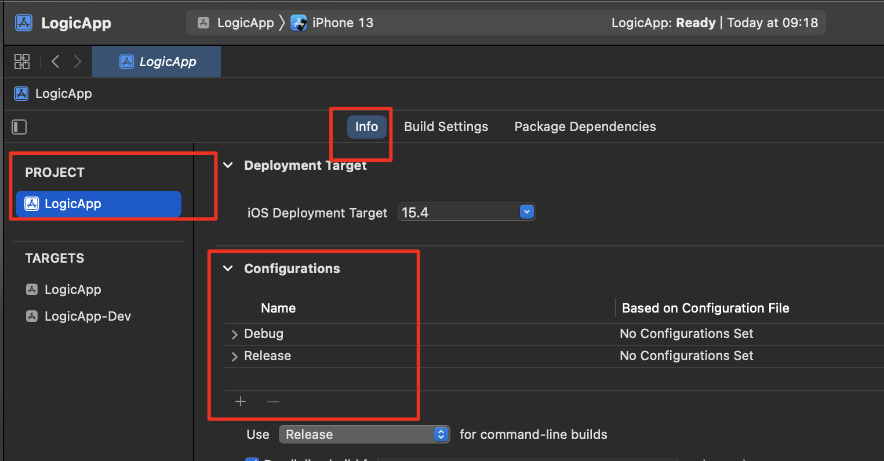

这样在 <font color=#F00>Product ----> Scheme  ---> Edit Scheme </font>中就新增加了一种模式了。

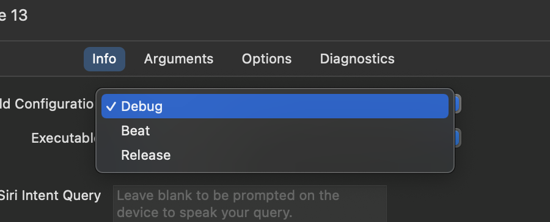

**New Scheme**

我们在Configurations下新增一个*beta*模式

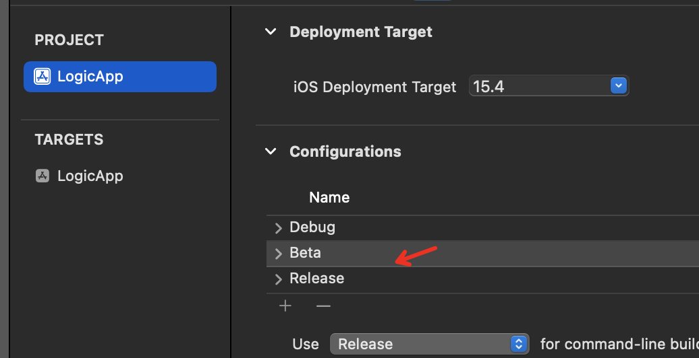

然后打开项目的 Edit Scheme，新增Scheme

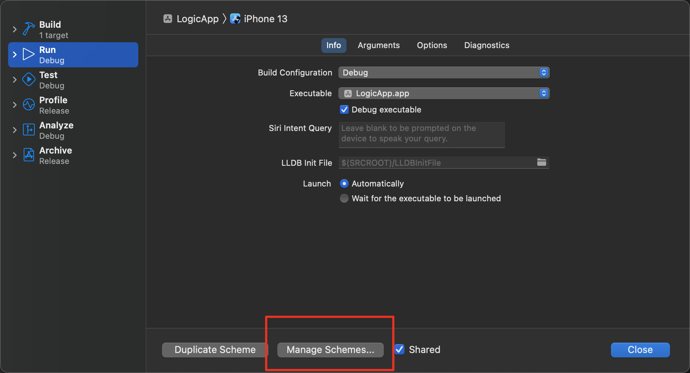

分别新增2个Scheme: Beta和Debug

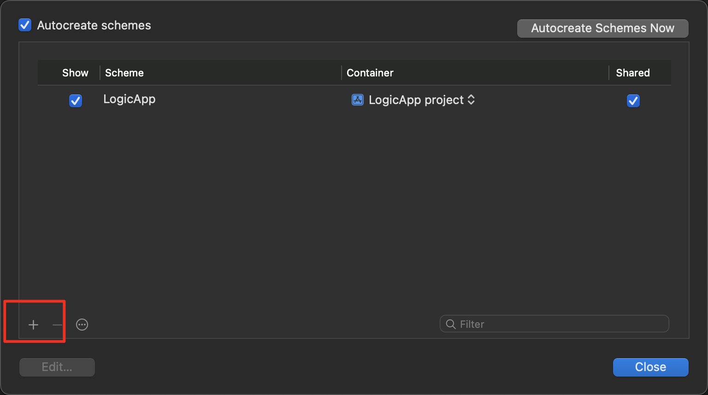

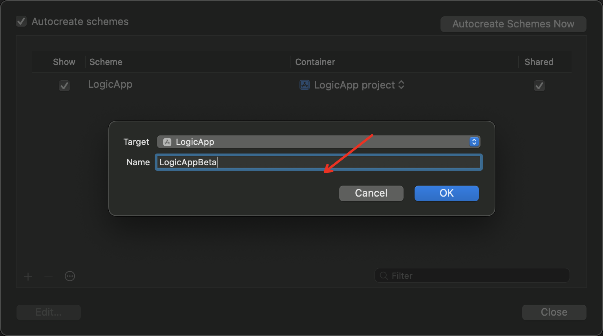

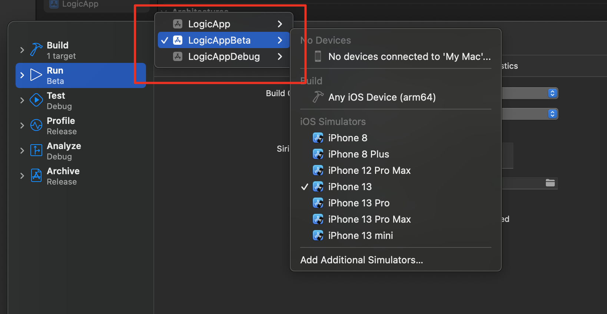

然后分别给三种Scheme设置不同的Configuration，LogicAppBeta设置为Beta，LogicDebug设置为Debug，Logic设置为Release。

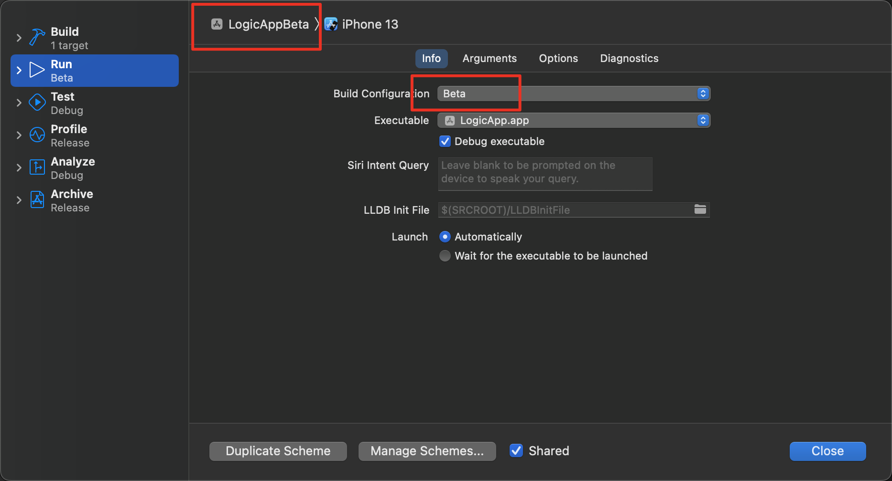

这样带来的好处是：

假设公司的网络请求在Beta环境、Debug环境和Product环境的host是不同的，此时我们可以使用多个Scheme来区分，避免在不同环境下手动去修改host。

新增*User-Defined*

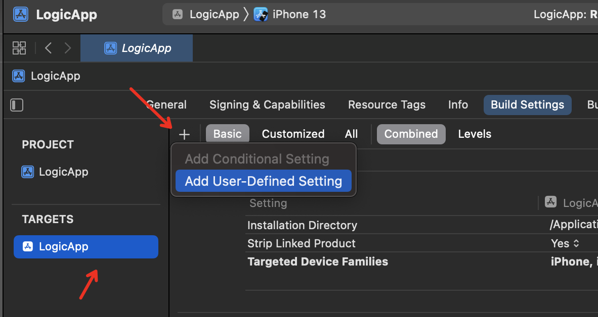

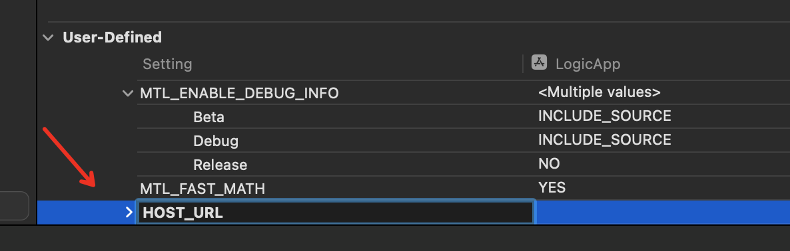

配置不同Configuration下HOST_URL不同

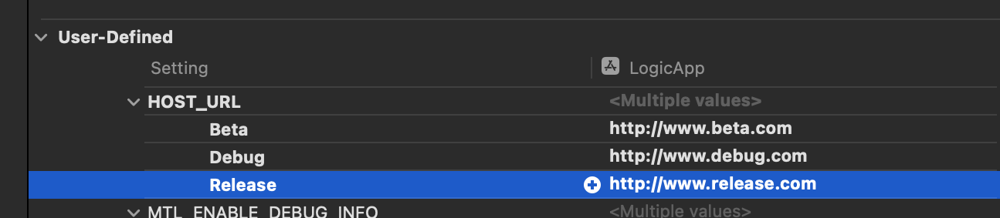

在Info.plist中配置HOST_URL

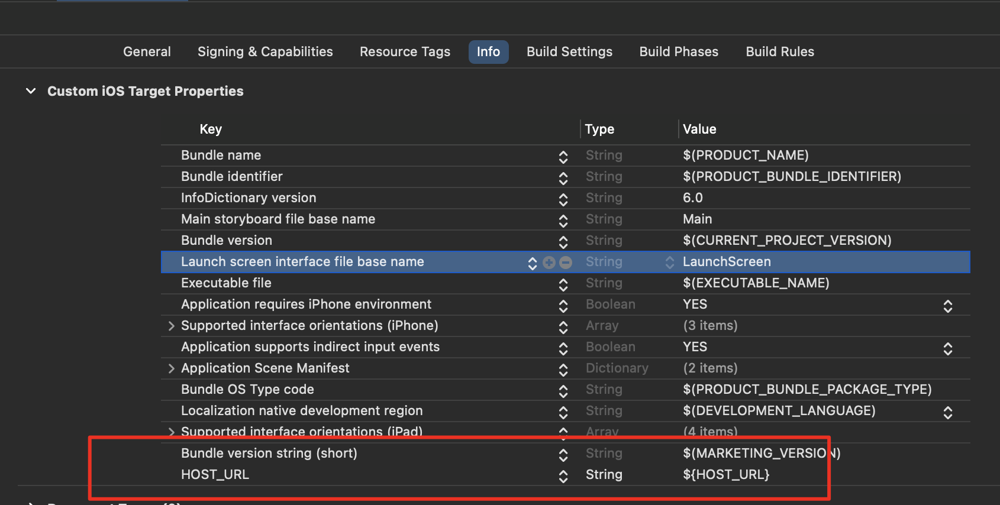

从Info.plist中读取变量名

```swift
 if let path = Bundle.main.path(forResource: "Info", ofType: "plist") {
      let infoDic = NSDictionary.init(contentsOfFile: path)
      print(infoDic!["HOST_URL"] ?? "")
 }
```

可以看到，当切换不同的Scheme时，获取到的HOST_URL是不同的

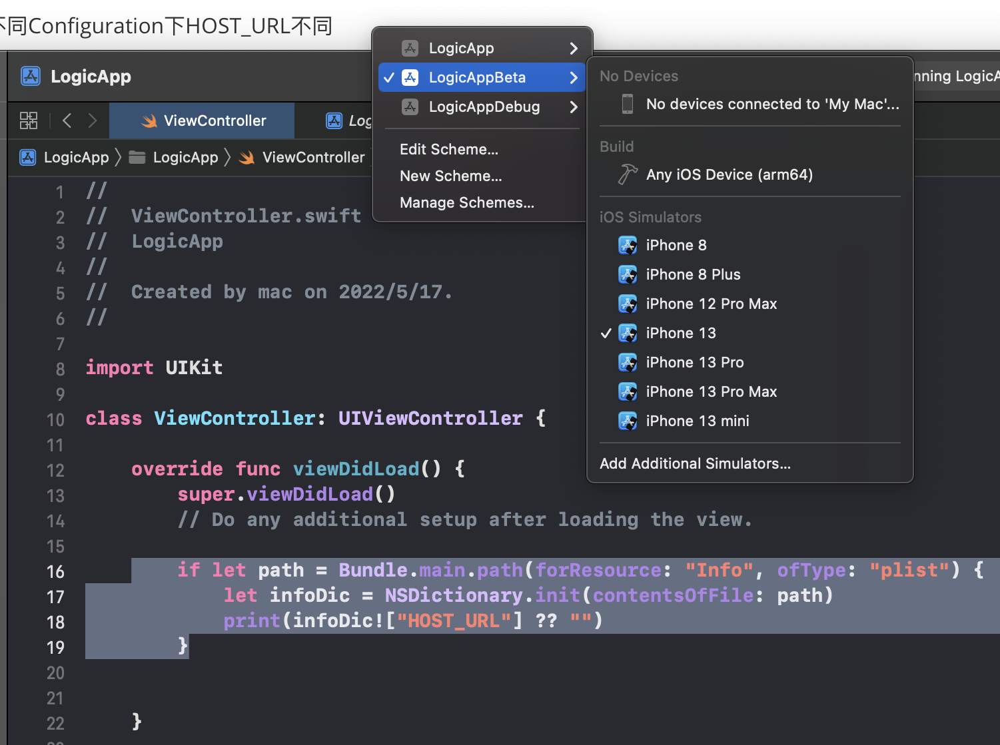


**待办**

Mach-O

[详细链接(冬瓜)](https://www.desgard.com/iOS-Source-Probe/C/mach-o/Mach-O%20%E6%96%87%E4%BB%B6%E6%A0%BC%E5%BC%8F%E6%8E%A2%E7%B4%A2.html)  

[iOS卡顿监控](https://xiaozhuanlan.com/godeye)

LLVM

Symbol

